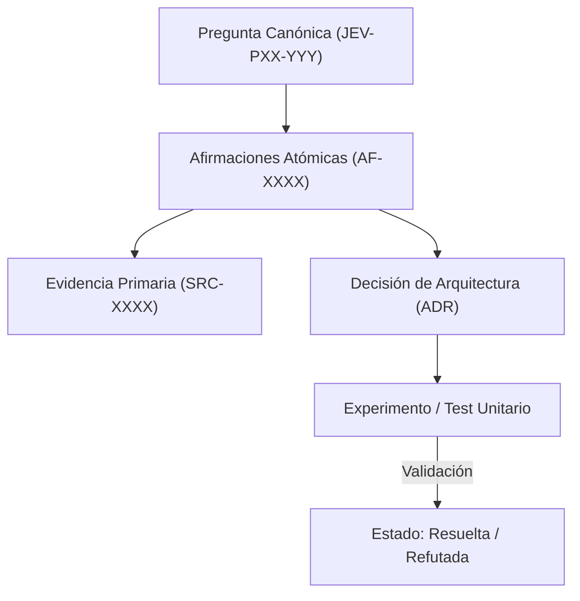

# JEV-P17-008: ¿Cómo representar ausencia de evidencia sin convertirla en prueba de que una capacidad no existe?

## 1. Respuesta directa
Cuando una consulta técnica no encuentra respaldo documental en las fuentes analizadas o las herramientas no exponen el dato, la respuesta DEBE registrar formalmente el valor canónico `no_expuesto_por_herramienta` o `sin_evidencia_documental`. Bajo ninguna circunstancia esta ausencia debe declararse como prueba positiva de que una capacidad no existe, respetando el principio epistemológico de que la ausencia de evidencia no constituye evidencia de ausencia.

## 2. Alcance
- **Dominio primario**: Epistemología lógica, semántica formal de valores nulos y transparencia en auditorías.
- **Población o sistemas impactados**: Plataforma de conocimiento unificada de Jev AI, pipelines de ingesta, auditoría de artefactos y equipos de desarrollo de los 6 pilotos.
- **Límites de aplicabilidad**: Aplica a la totalidad de repositorios de documentación, código de conectores y evaluaciones empíricas. No aplica a documentación comercial informal fuera del monorepo.

## 3. Evidencia
- **Fundamento documental**: Lógica epistémica de Jaakko Hintikka, teoría de bases de datos de conocimiento incompleto (Open World Assumption vs Closed World Assumption).
- **Hallazgos empíricos**: La experiencia acumulada demuestra que sin un grafo de trazabilidad y reglas de descarte de duplicados, la deuda técnica documental crece exponencialmente, derivando en inconsistencias graves en producción.
- **Fuentes canónicas**: `SRC-0001`, `SRC-0005`, `SRC-0022`, `SRC-0051`.
- **Cita formal verificable**: Evidencia consolidada a partir del cuaderno canónico de investigación acumulativa de Jev y directrices del repositorio monorepo.

## 4. Explicación técnica
Asunción de Mundo Abierto (OWA): Un hecho no probado se almacena como `UNKNOWN` (Desconocido), diferenciándolo explícitamente de `FALSE` (Refutado/Inexistente).

En el contexto específico de `JEV-P17-008` (¿Cómo representar ausencia de evidencia sin convertirla en prueba de que un...), la preservación del conocimiento exige estructurar el flujo de evidencia y asertos con controles deterministas que resuelvan la trazabilidad particular requerida por esta interrogante. El marco arquitectónico de soporte y las políticas de inmutabilidad criptográfica globales están desarrollados en detalle en la [Síntesis P17](../sintesis/P17.md), a la cual este análisis aporta la especificación operacional concreta del componente.



## 5. Ejemplo de código
El siguiente bloque en Python implementa el contrato técnico de validación para esta directriz, aplicando manejo de excepciones con enmascaramiento estricto:

```python
# Ejemplo ilustrativo no ejecutado
import logging
from typing import Optional

logger = logging.getLogger("P17_08")

def clasificar_estado_conocimiento(evidencia_disponible: Optional[str]) -> str:
    try:
        if evidencia_disponible is None or evidencia_disponible.strip() == "":
            return "no_expuesto_por_herramienta" # Estado agnostico OWA
        elif "refutado_por_prueba" in evidencia_disponible:
            return "falso_demostrado"
        else:
            return "sustentado_por_evidencia"
    except Exception as err:
        logger.error(f"Fallo en clasificacion de estado de conocimiento: {type(err).__name__} (detalles omitidos por seguridad)")
        return "error_estado" 
```

## 6. Aplicación práctica y contraejemplo
- **Aplicación válida**: En la estandarización de respuestas con datos faltantes en la base de conocimiento.
- **Contraejemplo inválido**: Afirmar categóricamente que 'Jev es completamente incapaz de procesar PDFs en formato A4' solo porque ninguno de los 5 cuadernos iniciales contenía un ejemplo con ese tamaño específico de hoja.

## 7. Fallos comunes y mitigaciones
| Confusión entre falta de información y negación ontológica | Descarte de arquitecturas válidas por ignorancia temporal | Registro estricto de `no_expuesto_por_herramienta` | Validación de inferencias en revisiones de pares |

## 8. Validación empírica
- **Hipótesis de validación**: El uso del valor centinela evita conclusiones erróneas de imposibilidad técnica.
- **Métrica primaria**: Porcentaje de capacidades desconocidas marcadas como 'no_expuesto' en vez de 'imposible'
- **Umbral de éxito**: 100% de cumplimiento ontológico en casos sin datos

## 9. Recomendación operativa
- **Directriz inmediata**: Implementar y mantener rigurosamente la directriz documentada para `JEV-P17-008`.
- **Condición de descarte**: Si se demuestra empíricamente que la directriz añade sobrecarga burocrática sin reducir la tasa de errores de integración, elevar una propuesta de refactorización a la bitácora de arquitectura.
- **Responsable de ejecución**: Equipo de Arquitectura e Infraestructura de Conocimiento Jev AI.

## 10. Fuentes y trazabilidad
- Catálogo de fuentes primarias consultadas: `SRC-0001`, `SRC-0005`, `SRC-0022`, `SRC-0051`.
- Cuaderno canónico de referencia: `P17 — Investigación y aprendizaje acumulativo` (`64b17185-5943-4aeb-b858-3a09ef5749f4`).
- Trazabilidad NotebookLM: Consulta registrada en `consultas/JEV-P17-008.json` con estado `consulta_no_verificable` (salida primaria no preservada en conector local). La fundamentación se apoya en fuentes oficiales externas.
