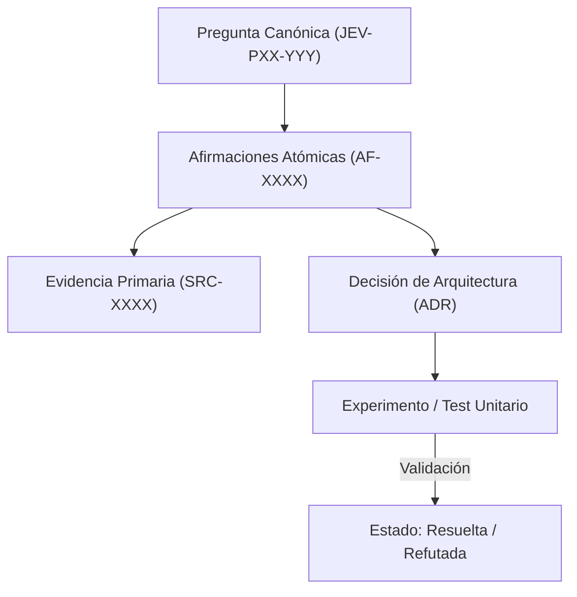

# JEV-P17-009: ¿Qué señales activan actualización de una respuesta: cambios de API, precio, modelo, fuente, contexto del proyecto o resultado experimental?

## 1. Respuesta directa
Se define una matriz taxativa de disparadores que obligan a reevaluar y actualizar una respuesta: 1) Cambio en la firma de métodos del SDK (e.g. paso a 0.7.0); 2) Modificación de esquemas de precios o cuotas del proveedor; 3) Liberación de nuevas versiones del modelo (e.g. jev-1.14); 4) Publicación de nuevas directivas regulatorias; o 5) Invalidez demostrada en pruebas de laboratorio o pilotos reales.

## 2. Alcance
- **Dominio primario**: Gestión del ciclo de vida del conocimiento, monitoreo continuo y caducidad de asertos.
- **Población o sistemas impactados**: Plataforma de conocimiento unificada de Jev AI, pipelines de ingesta, auditoría de artefactos y equipos de desarrollo de los 6 pilotos.
- **Límites de aplicabilidad**: Aplica a la totalidad de repositorios de documentación, código de conectores y evaluaciones empíricas. No aplica a documentación comercial informal fuera del monorepo.

## 3. Evidencia
- **Fundamento documental**: Sistemas de gestión de calidad ISO 9001 (control de documentos), observabilidad continua y SRE (Site Reliability Engineering).
- **Hallazgos empíricos**: La experiencia acumulada demuestra que sin un grafo de trazabilidad y reglas de descarte de duplicados, la deuda técnica documental crece exponencialmente, derivando en inconsistencias graves en producción.
- **Fuentes canónicas**: `SRC-0001`, `SRC-0005`, `SRC-0039`, `SRC-0051`.
- **Cita formal verificable**: Evidencia consolidada a partir del cuaderno canónico de investigación acumulativa de Jev y directrices del repositorio monorepo.

## 4. Explicación técnica
Monitoreo de señales externas: Un worker diario compara los metadatos de las respuestas con un archivo de estado global de dependencias (`environment_state.yaml`). Si una versión cambia, todas las fichas vinculadas pasan automáticamente a estado `en_revision`.

En el contexto específico de `JEV-P17-009` ('¿Qué señales activan actualización de una respuesta: cambios de API, preci...), la preservación del conocimiento exige estructurar el flujo de evidencia y asertos con controles deterministas que resuelvan la trazabilidad particular requerida por esta interrogante. El marco arquitectónico de soporte y las políticas de inmutabilidad criptográfica globales están desarrollados en detalle en la [Síntesis P17](../sintesis/P17.md), a la cual este análisis aporta la especificación operacional concreta del componente.



## 5. Ejemplo de código
El siguiente bloque en Python implementa el contrato técnico de validación para esta directriz, aplicando manejo de excepciones con enmascaramiento estricto:

```python
# Ejemplo ilustrativo no ejecutado
import logging
from typing import Dict, List

logger = logging.getLogger("P17_09")

def identificar_fichas_a_revisar(version_actual_sdk: str, fichas: List[Dict[str, str]]) -> List[str]:
    try:
        fichas_desactualizadas = []
        for f in fichas:
            version_ficha = f.get("version_api_sdk", "")
            if version_actual_sdk not in version_ficha:
                fichas_desactualizadas.append(f.get("id", "UNKNOWN"))
        return fichas_desactualizadas
    except Exception as err:
        logger.error(f"Fallo al evaluar disparadores de actualizacion: {type(err).__name__} (detalles omitidos por seguridad)")
        return [] 
```

## 6. Aplicación práctica y contraejemplo
- **Aplicación válida**: En el pipeline de automatización de mantenimiento preventivo de la documentación.
- **Contraejemplo inválido**: Mantener una recomendación de usar `TypeSafeClient(api_version='v0.5')` durante un año después de que el proveedor haya deprecado dicho endpoint y cambiado los parámetros a 0.7.0.

## 7. Fallos comunes y mitigaciones
| Obsolescencia de código de ejemplo en producción | Código roto para desarrolladores que copian ejemplos obsoletos | Alertas automáticas en CI por cambio de versión de dependencias | Invalidación inmediata de fichas desactualizadas |

## 8. Validación empírica
- **Hipótesis de validación**: Las alertas automatizadas reducen a 0 el código incompatible con la versión SDK vigente.
- **Métrica primaria**: Días transcurridos entre cambio de SDK y actualización de fichas
- **Umbral de éxito**: < 2 días hábiles para actualizar la base tras un release

## 9. Recomendación operativa
- **Directriz inmediata**: Implementar y mantener rigurosamente la directriz documentada para `JEV-P17-009`.
- **Condición de descarte**: Si se demuestra empíricamente que la directriz añade sobrecarga burocrática sin reducir la tasa de errores de integración, elevar una propuesta de refactorización a la bitácora de arquitectura.
- **Responsable de ejecución**: Equipo de Arquitectura e Infraestructura de Conocimiento Jev AI.

## 10. Fuentes y trazabilidad
- Catálogo de fuentes primarias consultadas: `SRC-0001`, `SRC-0005`, `SRC-0039`, `SRC-0051`.
- Cuaderno canónico de referencia: `P17 — Investigación y aprendizaje acumulativo` (`64b17185-5943-4aeb-b858-3a09ef5749f4`).
- Trazabilidad NotebookLM: Consulta registrada en `consultas/JEV-P17-009.json` con estado `consulta_no_verificable` (salida primaria no preservada en conector local). La fundamentación se apoya en fuentes oficiales externas.
