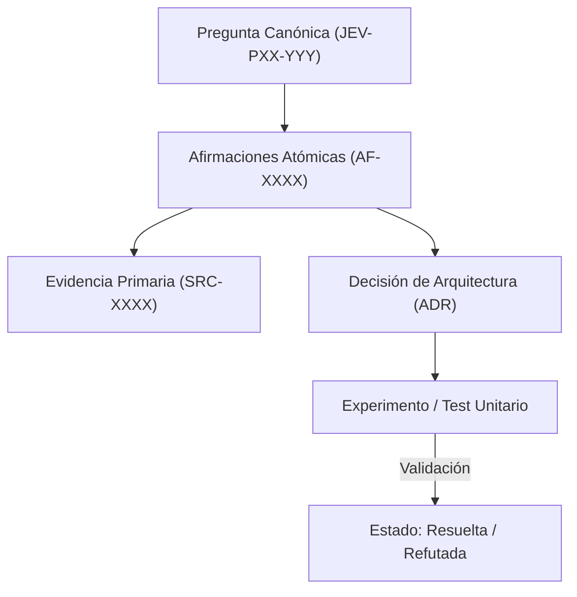

# JEV-P17-010: ¿Cómo identificar todas las recomendaciones afectadas cuando una afirmación central queda refutada o pierde vigencia?

## 1. Respuesta directa
Cuando una afirmación atómica central resulta refutada por nuevos experimentos o evidencia externa (e.g. 'la calibración de temperatura es estable ante perturbaciones de prompt'), el sistema debe identificar y marcar en cascada todas las decisiones, pilotos y recomendaciones que dependen de dicha premisa mediante un algoritmo de propagación en grafo acíclico dirigido (DAG).

## 2. Alcance
- **Dominio primario**: Análisis de impacto arquitectónico, gestión de dependencias y refactorización epistemológica.
- **Población o sistemas impactados**: Plataforma de conocimiento unificada de Jev AI, pipelines de ingesta, auditoría de artefactos y equipos de desarrollo de los 6 pilotos.
- **Límites de aplicabilidad**: Aplica a la totalidad de repositorios de documentación, código de conectores y evaluaciones empíricas. No aplica a documentación comercial informal fuera del monorepo.

## 3. Evidencia
- **Fundamento documental**: Algoritmos de ordenamiento topológico en grafos dirigidos (Kahn, Tarjan), análisis de dependencias de compiladores y teoría de propagación de cambios.
- **Hallazgos empíricos**: La experiencia acumulada demuestra que sin un grafo de trazabilidad y reglas de descarte de duplicados, la deuda técnica documental crece exponencialmente, derivando en inconsistencias graves en producción.
- **Fuentes canónicas**: `SRC-0001`, `SRC-0005`, `SRC-0022`, `SRC-0051`.
- **Cita formal verificable**: Evidencia consolidada a partir del cuaderno canónico de investigación acumulativa de Jev y directrices del repositorio monorepo.

## 4. Explicación técnica
Propagación de estado en DAG: Sea $G = (V, E)$ donde las aristas representan dependencias directas. Si un nodo raíz $v \in V$ cambia a `REFUTADA`, se ejecuta una búsqueda en anchura (BFS) sobre los nodos dependientes marcándolos con bandera `REQUIERE_REVISION_POR_REFUTACION`.

En el contexto específico de `JEV-P17-010` (¿Cómo identificar todas las recomendaciones afectadas cuando una afirmación...), la preservación del conocimiento exige estructurar el flujo de evidencia y asertos con controles deterministas que resuelvan la trazabilidad particular requerida por esta interrogante. El marco arquitectónico de soporte y las políticas de inmutabilidad criptográfica globales están desarrollados en detalle en la [Síntesis P17](../sintesis/P17.md), a la cual este análisis aporta la especificación operacional concreta del componente.



## 5. Ejemplo de código
El siguiente bloque en Python implementa el contrato técnico de validación para esta directriz, aplicando manejo de excepciones con enmascaramiento estricto:

```python
# Ejemplo ilustrativo no ejecutado
import logging
from typing import Dict, List, Set

logger = logging.getLogger("P17_10")

def propagar_refutacion(grafo_dependencias: Dict[str, List[str]], nodo_refutado: str) -> Set[str]:
    try:
        afectados = set()
        cola = [nodo_refutado]
        while cola:
            actual = cola.pop(0)
            hijos = grafo_dependencias.get(actual, [])
            for h in hijos:
                if h not in afectados:
                    afectados.add(h)
                    cola.append(h)
        return afectados
    except Exception as err:
        logger.error(f"Fallo en propagacion de refutacion: {type(err).__name__} (detalles omitidos por seguridad)")
        return set() 
```

## 6. Aplicación práctica y contraejemplo
- **Aplicación válida**: En la herramienta de auditoría global del programa Jev.
- **Contraejemplo inválido**: Demostrar que una métrica de precisión era falsa pero continuar recomendando la misma arquitectura en 15 respuestas secundarias porque nadie revisó las dependencias.

## 7. Fallos comunes y mitigaciones
| Persistencia zombi de recomendaciones desacreditadas | Construcción de sistemas sobre cimientos ya refutados | Rastreo topológico obligatorio de dependencias | Alerta inmediata a responsables de decisiones hijas |

## 8. Validación empírica
- **Hipótesis de validación**: La propagación algorítmica garantiza que ninguna recomendación huérfana mantenga supuestos refutados.
- **Métrica primaria**: Tasa de detección de decisiones dependientes tras una refutación
- **Umbral de éxito**: 100% de decisiones afectadas identificadas y notificadas

## 9. Recomendación operativa
- **Directriz inmediata**: Implementar y mantener rigurosamente la directriz documentada para `JEV-P17-010`.
- **Condición de descarte**: Si se demuestra empíricamente que la directriz añade sobrecarga burocrática sin reducir la tasa de errores de integración, elevar una propuesta de refactorización a la bitácora de arquitectura.
- **Responsable de ejecución**: Equipo de Arquitectura e Infraestructura de Conocimiento Jev AI.

## 10. Fuentes y trazabilidad
- Catálogo de fuentes primarias consultadas: `SRC-0001`, `SRC-0005`, `SRC-0022`, `SRC-0051`.
- Cuaderno canónico de referencia: `P17 — Investigación y aprendizaje acumulativo` (`64b17185-5943-4aeb-b858-3a09ef5749f4`).
- Trazabilidad NotebookLM: Consulta registrada en `consultas/JEV-P17-010.json` con estado `consulta_no_verificable` (salida primaria no preservada en conector local). La fundamentación se apoya en fuentes oficiales externas.
