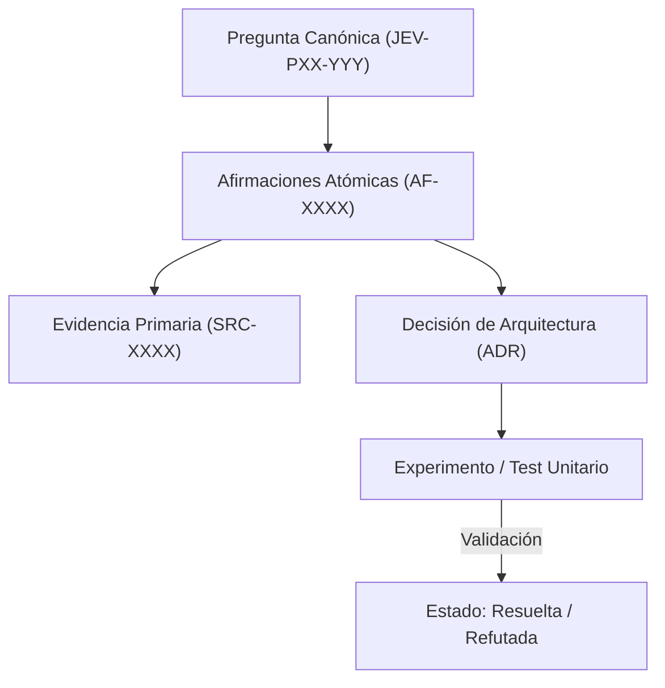

# JEV-P17-012: ¿Cómo usar desacuerdos y casos difíciles para elegir qué etiquetar o investigar después sin contaminar la evaluación final?

## 1. Respuesta directa
Las muestras donde el modelo muestra máxima incertidumbre ($p \approx 0.50$) o donde discrepa fuertemente con expertos humanos deben aislarse para nutrir el backlog de aprendizaje activo y depuración de prompts. Sin embargo, para evitar el sobreajuste y la contaminación de la evaluación final, estas muestras NUNCA deben añadirse al conjunto de prueba dorado (Golden Test Set), el cual debe permanecer sellado e inmutable.

## 2. Alcance
- **Dominio primario**: Active Learning, prevención de Data Leakage y metodología de evaluación estadística.
- **Población o sistemas impactados**: Plataforma de conocimiento unificada de Jev AI, pipelines de ingesta, auditoría de artefactos y equipos de desarrollo de los 6 pilotos.
- **Límites de aplicabilidad**: Aplica a la totalidad de repositorios de documentación, código de conectores y evaluaciones empíricas. No aplica a documentación comercial informal fuera del monorepo.

## 3. Evidencia
- **Fundamento documental**: Buenas prácticas de MLOps en separación de datos (Train/Dev/Test splits), estándares NIST sobre fiabilidad de IA.
- **Hallazgos empíricos**: La experiencia acumulada demuestra que sin un grafo de trazabilidad y reglas de descarte de duplicados, la deuda técnica documental crece exponencialmente, derivando en inconsistencias graves en producción.
- **Fuentes canónicas**: `SRC-0001`, `SRC-0005`, `SRC-0022`, `SRC-0051`.
- **Cita formal verificable**: Evidencia consolidada a partir del cuaderno canónico de investigación acumulativa de Jev y directrices del repositorio monorepo.

## 4. Explicación técnica
Estrategia de aislamiento de datos: Flujo de clasificación: Muestra con $0.40 \le p \le 0.60$ -> Enrutar a `pool_aprendizaje_activo`; Muestra con etiqueta humana validada -> Enrutar a `fine_tuning_o_few_shot_dataset`. Las métricas de reporte se calculan estrictamente sobre el `golden_benchmark_blind_v1` congelado.

En el contexto específico de `JEV-P17-012` (¿Cómo usar desacuerdos y casos difíciles para elegir qué etiquetar o invest...), la preservación del conocimiento exige estructurar el flujo de evidencia y asertos con controles deterministas que resuelvan la trazabilidad particular requerida por esta interrogante. El marco arquitectónico de soporte y las políticas de inmutabilidad criptográfica globales están desarrollados en detalle en la [Síntesis P17](../sintesis/P17.md), a la cual este análisis aporta la especificación operacional concreta del componente.



## 5. Ejemplo de código
El siguiente bloque en Python implementa el contrato técnico de validación para esta directriz, aplicando manejo de excepciones con enmascaramiento estricto:

```python
# Ejemplo ilustrativo no ejecutado
import logging
from typing import Dict, Any

logger = logging.getLogger("P17_12")

def clasificar_muestra_para_aprendizaje(p_valor: float, es_caso_dorado: bool) -> str:
    try:
        if es_caso_dorado:
            return "bloqueado_evaluacion_dorada_inmutable"
        incertidumbre = abs(p_valor - 0.5)
        if incertidumbre <= 0.10: # Casos borde de alta incertidumbre
            return "candidato_aprendizaje_activo"
        return "caso_resuelto_estándar"
    except Exception as err:
        logger.error(f"Fallo al clasificar muestra: {type(err).__name__} (detalles omitidos por seguridad)")
        return "error_clasificacion" 
```

## 6. Aplicación práctica y contraejemplo
- **Aplicación válida**: En la infraestructura de gestión de datasets de prueba y calibración.
- **Contraejemplo inválido**: Tomar los 20 contratos donde Jev se equivocó en el piloto, agregarlos al test suite de evaluación y reportar 100% de precisión al reejecutar el test suite sobre los mismos datos.

## 7. Fallos comunes y mitigaciones
| Contaminación de conjuntos de prueba con casos de entrenamiento | Falsa confianza en modelos que fallarán masivamente en datos reales | Sellado criptográfico de particiones de test | Auditoría de fuga de datos (Data Leakage) periódica |

## 8. Validación empírica
- **Hipótesis de validación**: El aislamiento estricto de conjuntos de prueba garantiza que la precisión reportada no sufra optimismo inflado.
- **Métrica primaria**: Diferencia de rendimiento entre Golden Test Suite y producción real
- **Umbral de éxito**: Divergencia de precisión < 3% entre laboratorio ciego y campo

## 9. Recomendación operativa
- **Directriz inmediata**: Implementar y mantener rigurosamente la directriz documentada para `JEV-P17-012`.
- **Condición de descarte**: Si se demuestra empíricamente que la directriz añade sobrecarga burocrática sin reducir la tasa de errores de integración, elevar una propuesta de refactorización a la bitácora de arquitectura.
- **Responsable de ejecución**: Equipo de Arquitectura e Infraestructura de Conocimiento Jev AI.

## 10. Fuentes y trazabilidad
- Catálogo de fuentes primarias consultadas: `SRC-0001`, `SRC-0005`, `SRC-0022`, `SRC-0051`.
- Cuaderno canónico de referencia: `P17 — Investigación y aprendizaje acumulativo` (`64b17185-5943-4aeb-b858-3a09ef5749f4`).
- Trazabilidad NotebookLM: Consulta registrada en `consultas/JEV-P17-012.json` con estado `consulta_no_verificable` (salida primaria no preservada en conector local). La fundamentación se apoya en fuentes oficiales externas.
