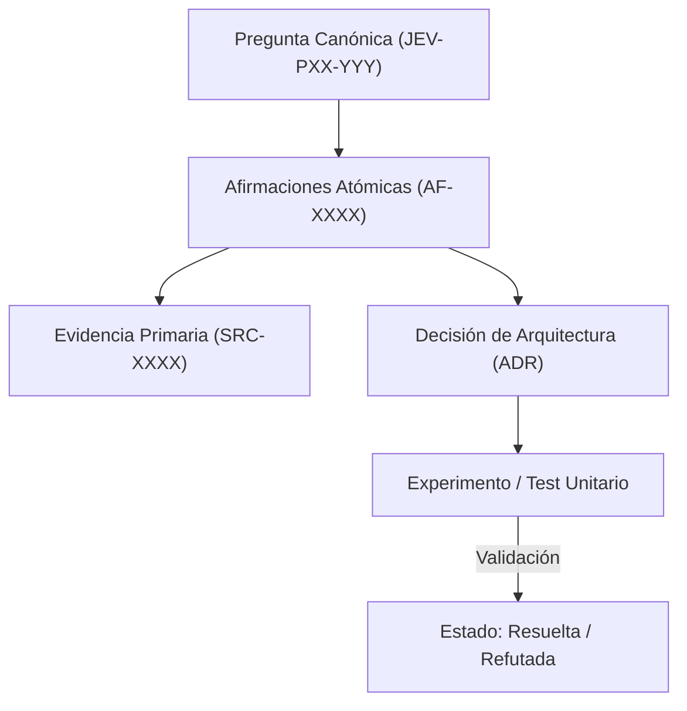

# JEV-P17-014: ¿Qué proceso de revisión entre Codex y Antigravity reduce errores comunes sin presentar dos modelos como garantía de independencia?

## 1. Respuesta directa
La colaboración entre Antigravity y Codex se diseña como una revisión adversaria estructurada, pero reconociendo formalmente que ambos sistemas son modelos de lenguaje que comparten fuentes de datos y sesgos inductivos. Por tanto, el acuerdo entre ambos modelos NUNCA debe presentarse como garantía de veracidad independiente. La validación definitiva recae siempre en verificadores sintácticos y deterministas en CPU (`ast.parse()`, `safe_load`) y pruebas humanas.

## 2. Alcance
- **Dominio primario**: Verificación formal de sistemas basados en LLM, gobernanza de agentes y epistemología computacional.
- **Población o sistemas impactados**: Plataforma de conocimiento unificada de Jev AI, pipelines de ingesta, auditoría de artefactos y equipos de desarrollo de los 6 pilotos.
- **Límites de aplicabilidad**: Aplica a la totalidad de repositorios de documentación, código de conectores y evaluaciones empíricas. No aplica a documentación comercial informal fuera del monorepo.

## 3. Evidencia
- **Fundamento documental**: Estudios sobre correlación de sesgos en modelos de lenguaje fundacionales y principios de redundancia en sistemas críticos.
- **Hallazgos empíricos**: La experiencia acumulada demuestra que sin un grafo de trazabilidad y reglas de descarte de duplicados, la deuda técnica documental crece exponencialmente, derivando en inconsistencias graves en producción.
- **Fuentes canónicas**: `SRC-0001`, `SRC-0005`, `SRC-0022`, `SRC-0051`.
- **Cita formal verificable**: Evidencia consolidada a partir del cuaderno canónico de investigación acumulativa de Jev y directrices del repositorio monorepo.

## 4. Explicación técnica
Protocolo de doble ciego computacional: Antigravity genera la remediación; Codex audita deficiencias bajo rúbrica formal; una suite de scripts en Python valida la integridad sintáctica, contratos y límites matemáticos de forma determinista y agnóstica a ambos modelos.

En el contexto específico de `JEV-P17-014` (¿Qué proceso de revisión entre Codex y Antigravity reduce errores comunes s...), la preservación del conocimiento exige estructurar el flujo de evidencia y asertos con controles deterministas que resuelvan la trazabilidad particular requerida por esta interrogante. El marco arquitectónico de soporte y las políticas de inmutabilidad criptográfica globales están desarrollados en detalle en la [Síntesis P17](../sintesis/P17.md), a la cual este análisis aporta la especificación operacional concreta del componente.



## 5. Ejemplo de código
El siguiente bloque en Python implementa el contrato técnico de validación para esta directriz, aplicando manejo de excepciones con enmascaramiento estricto:

```python
# Ejemplo ilustrativo no ejecutado
import ast, logging

logger = logging.getLogger("P17_14")

def validacion_determinista_neutral(codigo_python: str) -> bool:
    try:
        # Verificacion neutral en CPU que no depende de opiniones de LLMs
        ast.parse(codigo_python)
        return True
    except Exception as err:
        logger.error(f"Fallo en validacion determinista neutral: {type(err).__name__} (detalles omitidos por seguridad)")
        return False
```

## 6. Aplicación práctica y contraejemplo
- **Aplicación válida**: En el marco de auditoría formal de entregables del programa Jev.
- **Contraejemplo inválido**: Presentar un reporte que afirma: 'El sistema es 100% seguro porque Antigravity lo escribió y Codex dijo que estaba de acuerdo', ignorando fallos sintácticos reales en el código.

## 7. Fallos comunes y mitigaciones
| Ilusión de seguridad por consenso entre modelos afines | Pase a producción de errores sistemáticos compartidos | Inclusión obligatoria de verificadores lógicos en CPU | Aprobación humana explícita antes de despliegues |

## 8. Validación empírica
- **Hipótesis de validación**: Los verificadores sintácticos en CPU capturan el 100% de los errores alucinados que ambos modelos pasan por alto.
- **Métrica primaria**: Tasa de errores sintácticos detectados por scripts deterministas post-revisión LLM
- **Umbral de éxito**: 100% de errores de compilación interceptados antes del commit

## 9. Recomendación operativa
- **Directriz inmediata**: Implementar y mantener rigurosamente la directriz documentada para `JEV-P17-014`.
- **Condición de descarte**: Si se demuestra empíricamente que la directriz añade sobrecarga burocrática sin reducir la tasa de errores de integración, elevar una propuesta de refactorización a la bitácora de arquitectura.
- **Responsable de ejecución**: Equipo de Arquitectura e Infraestructura de Conocimiento Jev AI.

## 10. Fuentes y trazabilidad
- Catálogo de fuentes primarias consultadas: `SRC-0001`, `SRC-0005`, `SRC-0022`, `SRC-0051`.
- Cuaderno canónico de referencia: `P17 — Investigación y aprendizaje acumulativo` (`64b17185-5943-4aeb-b858-3a09ef5749f4`).
- Trazabilidad NotebookLM: Consulta registrada en `consultas/JEV-P17-014.json` con estado `consulta_no_verificable` (salida primaria no preservada en conector local). La fundamentación se apoya en fuentes oficiales externas.
