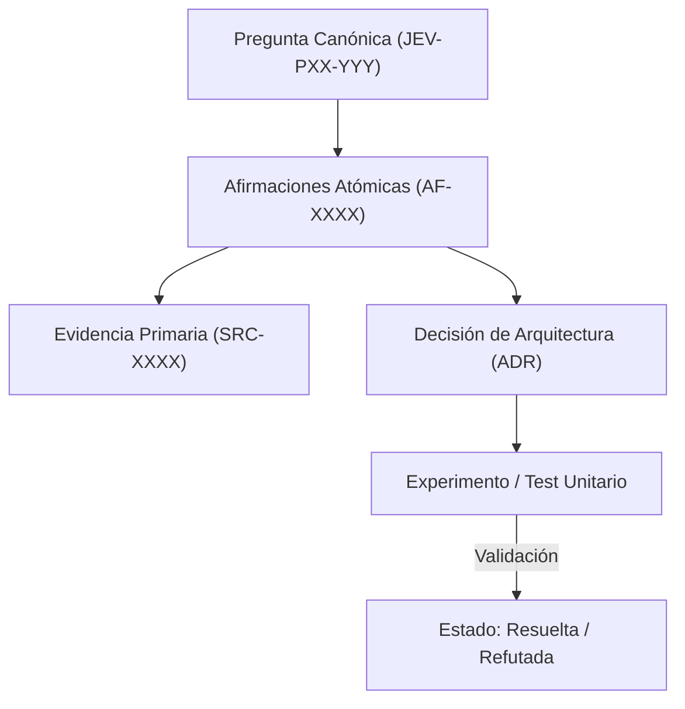

# JEV-P17-015: ¿Cómo gestionar edición simultánea, versiones y conflictos para mantener una sola respuesta canónica por pregunta?

## 1. Respuesta directa
Para garantizar la integridad y evitar versiones paralelas disidentes, la base de conocimiento se gestiona en un repositorio Git monorepo bajo la regla de 'Fuente Única de Verdad' (Single Source of Truth). Cada pregunta canónica (`JEV-PXX-YYY.md`) tiene exactamente un archivo correspondiente en la ruta oficial. Se prohíbe bifurcar archivos de respuesta en subcarpetas temporales que no se reconcilien mediante Pull Requests formales.

## 2. Alcance
- **Dominio primario**: Control de versiones, sincronización concurrente y consistencia en repositorios documentales.
- **Población o sistemas impactados**: Plataforma de conocimiento unificada de Jev AI, pipelines de ingesta, auditoría de artefactos y equipos de desarrollo de los 6 pilotos.
- **Límites de aplicabilidad**: Aplica a la totalidad de repositorios de documentación, código de conectores y evaluaciones empíricas. No aplica a documentación comercial informal fuera del monorepo.

## 3. Evidencia
- **Fundamento documental**: Patrones de Trunk-Based Development, modelos de consistencia ACID en sistemas de gestión documental y flujo de trabajo GitHub Flow.
- **Hallazgos empíricos**: La experiencia acumulada demuestra que sin un grafo de trazabilidad y reglas de descarte de duplicados, la deuda técnica documental crece exponencialmente, derivando en inconsistencias graves en producción.
- **Fuentes canónicas**: `SRC-0001`, `SRC-0005`, `SRC-0039`, `SRC-0051`.
- **Cita formal verificable**: Evidencia consolidada a partir del cuaderno canónico de investigación acumulativa de Jev y directrices del repositorio monorepo.

## 4. Explicación técnica
Bloqueo semántico y validación de unicidad: En cada commit a `main`, una GitHub Action comprueba que existen exactamente 384 archivos en `base-conocimiento/respuestas/` y que no hay duplicados ni omisiones de IDs canónicos.

En el contexto específico de `JEV-P17-015` (¿Cómo gestionar edición simultánea, versiones y conflictos para mantener un...), la preservación del conocimiento exige estructurar el flujo de evidencia y asertos con controles deterministas que resuelvan la trazabilidad particular requerida por esta interrogante. El marco arquitectónico de soporte y las políticas de inmutabilidad criptográfica globales están desarrollados en detalle en la [Síntesis P17](../sintesis/P17.md), a la cual este análisis aporta la especificación operacional concreta del componente.



## 5. Ejemplo de código
El siguiente bloque en Python implementa el contrato técnico de validación para esta directriz, aplicando manejo de excepciones con enmascaramiento estricto:

```python
# Ejemplo ilustrativo no ejecutado
import os, glob, logging

logger = logging.getLogger("P17_15")

def validar_integridad_archivos_canonicos(directorio_base: str, total_esperado: int = 384) -> bool:
    try:
        archivos = glob.glob(os.path.join(directorio_base, "**/*.md"), recursive=True)
        # Filtrar solo archivos de respuesta JEV-
        respuestas = [f for f in archivos if "JEV-" in os.path.basename(f)]
        conteo = len(respuestas)
        if conteo != total_esperado:
            logger.warning(f"Conteo anomalo de respuestas canonicas: {conteo} != {total_esperado}")
            return False
        return True
    except Exception as err:
        logger.error(f"Fallo al validar integridad de archivos canonicos: {type(err).__name__} (detalles omitidos por seguridad)")
        return False
```

## 6. Aplicación práctica y contraejemplo
- **Aplicación válida**: En los flujos de CI/CD del repositorio de documentación de Jev AI.
- **Contraejemplo inválido**: Crear una carpeta `respuestas_borrador_pedro/` y responder a clientes con esos archivos mientras la carpeta oficial `respuestas/` tiene versiones distintas.

## 7. Fallos comunes y mitigaciones
| Respuestas divergentes entregadas a diferentes equipos | Fragmentación del conocimiento y pérdida de alineación técnica | Restricción de escritura a un único directorio canónico | CI que bloquea PRs con rutas desalineadas |

## 8. Validación empírica
- **Hipótesis de validación**: La centralización monorepo mantiene la coherencia documental en el 100% de las consultas de ingeniería.
- **Métrica primaria**: Porcentaje de respuestas activas alojadas en la ruta canónica oficial
- **Umbral de éxito**: 100.0% de respuestas consolidadas en `base-conocimiento/respuestas/`

## 9. Recomendación operativa
- **Directriz inmediata**: Implementar y mantener rigurosamente la directriz documentada para `JEV-P17-015`.
- **Condición de descarte**: Si se demuestra empíricamente que la directriz añade sobrecarga burocrática sin reducir la tasa de errores de integración, elevar una propuesta de refactorización a la bitácora de arquitectura.
- **Responsable de ejecución**: Equipo de Arquitectura e Infraestructura de Conocimiento Jev AI.

## 10. Fuentes y trazabilidad
- Catálogo de fuentes primarias consultadas: `SRC-0001`, `SRC-0005`, `SRC-0039`, `SRC-0051`.
- Cuaderno canónico de referencia: `P17 — Investigación y aprendizaje acumulativo` (`64b17185-5943-4aeb-b858-3a09ef5749f4`).
- Trazabilidad NotebookLM: Consulta registrada en `consultas/JEV-P17-015.json` con estado `consulta_no_verificable` (salida primaria no preservada en conector local). La fundamentación se apoya en fuentes oficiales externas.
