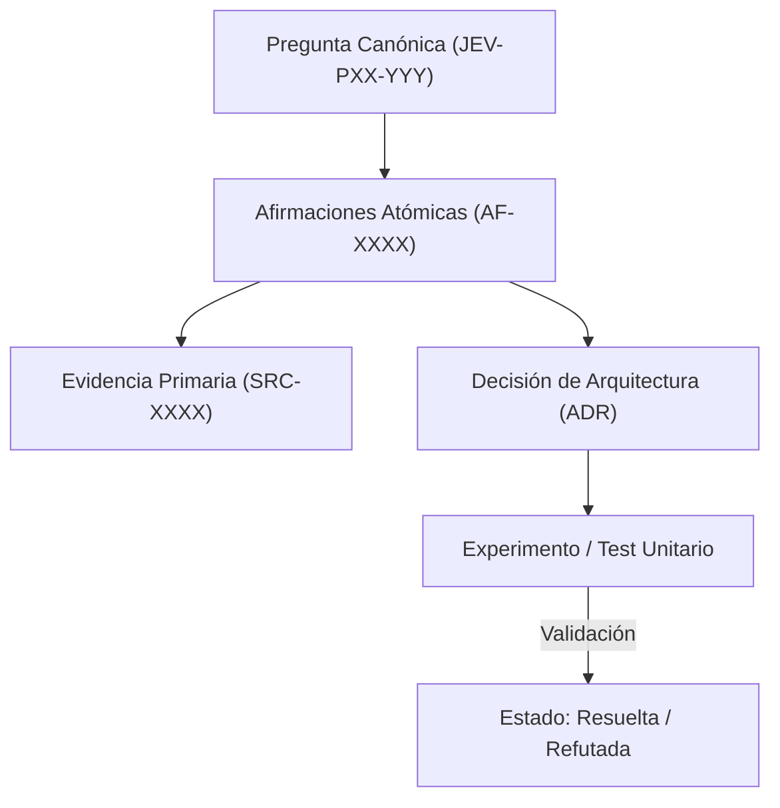

# JEV-P17-016: ¿Qué reglas impiden que resúmenes generados se reciclen como nuevas fuentes y produzcan corroboración circular?

## 1. Respuesta directa
Queda terminantemente prohibido que los resúmenes, síntesis o respuestas generadas por modelos de lenguaje (incluyendo Antigravity, Codex o NotebookLM) se incorporen como nuevas fuentes primarias (`SRC-XXXX`) en el catálogo. Este reciclaje genera fenómenos de 'eco epistemológico' y corroboración circular, donde el modelo corrobora sus propias alucinaciones previas como si fueran evidencia independiente de la realidad.

## 2. Alcance
- **Dominio primario**: Prevención del colapso de modelos (Model Autophagy / MAD), higiene de datos y procedencia de fuentes.
- **Población o sistemas impactados**: Plataforma de conocimiento unificada de Jev AI, pipelines de ingesta, auditoría de artefactos y equipos de desarrollo de los 6 pilotos.
- **Límites de aplicabilidad**: Aplica a la totalidad de repositorios de documentación, código de conectores y evaluaciones empíricas. No aplica a documentación comercial informal fuera del monorepo.

## 3. Evidencia
- **Fundamento documental**: Investigación sobre el fenómeno de Model Collapse (Shumailov et al., Nature 2024) y estándares de evidencia primaria.
- **Hallazgos empíricos**: La experiencia acumulada demuestra que sin un grafo de trazabilidad y reglas de descarte de duplicados, la deuda técnica documental crece exponencialmente, derivando en inconsistencias graves en producción.
- **Fuentes canónicas**: `SRC-0001`, `SRC-0005`, `SRC-0022`, `SRC-0051`.
- **Cita formal verificable**: Evidencia consolidada a partir del cuaderno canónico de investigación acumulativa de Jev y directrices del repositorio monorepo.

## 4. Explicación técnica
Filtro de procedencia de fuentes: Para registrar un documento en `fuentes.md`, se exige obligatoriamente un DOI, URL de documentación oficial de un tercero o hash de un archivo corporativo original preexistente. Documentos generados por prompts locales son automáticamente rechazados como fuentes.

En el contexto específico de `JEV-P17-016` (¿Qué reglas impiden que resúmenes generados se reciclen como nuevas fuentes...), la preservación del conocimiento exige estructurar el flujo de evidencia y asertos con controles deterministas que resuelvan la trazabilidad particular requerida por esta interrogante. El marco arquitectónico de soporte y las políticas de inmutabilidad criptográfica globales están desarrollados en detalle en la [Síntesis P17](../sintesis/P17.md), a la cual este análisis aporta la especificación operacional concreta del componente.



## 5. Ejemplo de código
El siguiente bloque en Python implementa el contrato técnico de validación para esta directriz, aplicando manejo de excepciones con enmascaramiento estricto:

```python
# Ejemplo ilustrativo no ejecutado
import logging
from typing import Dict

logger = logging.getLogger("P17_16")

def validar_elegibilidad_fuente_primaria(metadatos_fuente: Dict[str, str]) -> bool:
    try:
        origen = metadatos_fuente.get("origen", "").lower()
        if "generado_por_ia" in origen or "resumen_sintetico" in origen or "notebooklm_output" in origen:
            logger.error("Intento de registrar salida sintetica como fuente primaria denegado")
            return False
        return bool(metadatos_fuente.get("autor_externo") and metadatos_fuente.get("url_origen"))
    except Exception as err:
        logger.error(f"Fallo en validacion de procedencia de fuente: {type(err).__name__} (detalles omitidos por seguridad)")
        return False
```

## 6. Aplicación práctica y contraejemplo
- **Aplicación válida**: En el comité de gobernanza y auditoría del catálogo de fuentes primarias.
- **Contraejemplo inválido**: Tomar un resumen generado por NotebookLM, guardarlo como PDF, subirlo de nuevo al notebook como 'Paper sobre calibración' y usarlo para citarlo como prueba independiente.

## 7. Fallos comunes y mitigaciones
| Ingesta de datos sintéticos propios como verdad objetiva | Colapso del modelo y amplificación exponencial de errores | Prohibición absoluta de auto-citas de texto sintético | Auditoría de procedencia para cada nuevo `SRC-XXXX` |

## 8. Validación empírica
- **Hipótesis de validación**: La exclusión de fuentes sintéticas previene la degradación por alucinaciones recurrentes.
- **Métrica primaria**: Porcentaje de fuentes con autoría humana o corporativa externa verificable
- **Umbral de éxito**: 100% de fuentes con trazabilidad externa verificada

## 9. Recomendación operativa
- **Directriz inmediata**: Implementar y mantener rigurosamente la directriz documentada para `JEV-P17-016`.
- **Condición de descarte**: Si se demuestra empíricamente que la directriz añade sobrecarga burocrática sin reducir la tasa de errores de integración, elevar una propuesta de refactorización a la bitácora de arquitectura.
- **Responsable de ejecución**: Equipo de Arquitectura e Infraestructura de Conocimiento Jev AI.

## 10. Fuentes y trazabilidad
- Catálogo de fuentes primarias consultadas: `SRC-0001`, `SRC-0005`, `SRC-0022`, `SRC-0051`.
- Cuaderno canónico de referencia: `P17 — Investigación y aprendizaje acumulativo` (`64b17185-5943-4aeb-b858-3a09ef5749f4`).
- Trazabilidad NotebookLM: Consulta registrada en `consultas/JEV-P17-016.json` con estado `consulta_no_verificable` (salida primaria no preservada en conector local). La fundamentación se apoya en fuentes oficiales externas.
