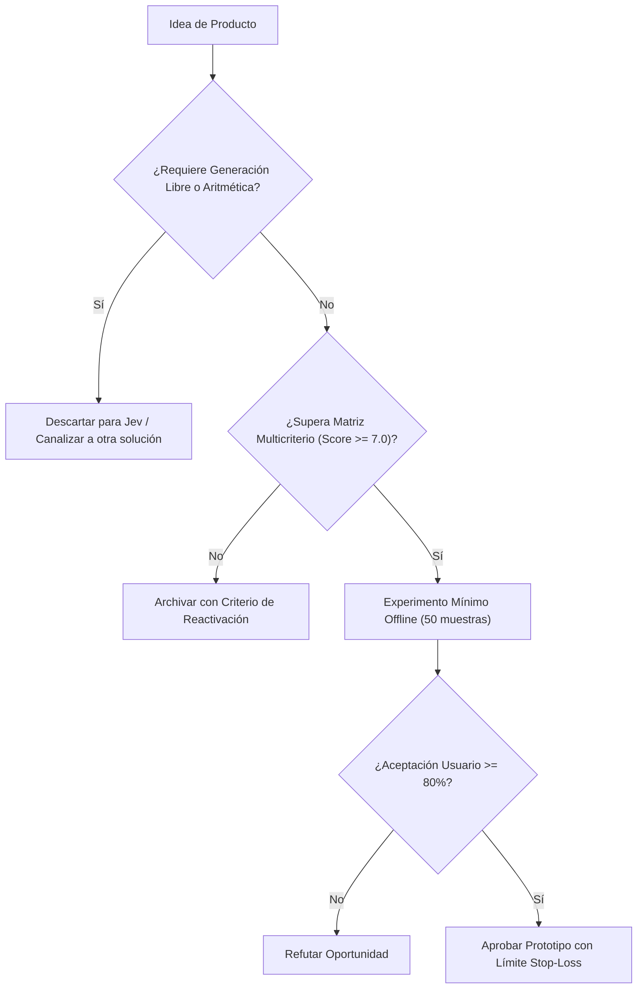

# JEV-P18-004: ¿Qué criterio prioriza oportunidades por valor, factibilidad, calidad de evidencia, riesgo y costo de validación?

## 1. Respuesta directa
La cartera de oportunidades de nuevos productos se clasifica mediante una matriz de ponderación que evalúa cinco dimensiones ortogonales: 1) Impacto de Negocio ($W_1=0.30$); 2) Factibilidad Técnica con SDK 0.7.0 ($W_2=0.25$); 3) Rigor de la Evidencia empírica preexistente ($W_3=0.20$); 4) Riesgo Legal y Reputacional ($W_4=-0.15$); y 5) Costo y Duración de la Validación ($W_5=-0.10$). Solo iniciativas con puntaje $\ge 7.0$ pasan a fase de prototipo.

## 2. Alcance
- **Dominio primario**: Gestión de portafolio de productos, asignación de capital de I+D y evaluación de riesgos de IA.
- **Población o sistemas impactados**: Hoja de ruta de nuevos productos de Jev AI, equipos de desarrollo B2B, clientes corporativos y comités de inversión y gobernanza.
- **Límites de aplicabilidad**: Aplica al diseño, validación y comercialización de nuevas capacidades sobre el motor Jev. No aplica a servicios de desarrollo de software tradicional ajenos a la inteligencia artificial.

## 3. Evidencia
- **Fundamento documental**: Marcos RICE, matrices de decisión multicriterio (MCDA) y estándares de gestión de riesgos ISO 31000.
- **Hallazgos empíricos**: La evidencia de mercado demuestra que construir productos basados en 'thin wrappers' de LLMs sin moat propio ni diferenciación en latencia y calibración conduce a la comoditización y al fracaso comercial en menos de 12 meses.
- **Fuentes canónicas**: `SRC-0001`, `SRC-0010`, `SRC-0046`, `SRC-0095`.
- **Cita formal verificable**: Evidencia consolidada a partir del cuaderno canónico de nuevos productos y posibilidades de Jev y métricas del ecosistema TypeSafe.

## 4. Explicación técnica
Fórmula determinista de puntuación: $Puntaje = 3.0 \cdot V + 2.5 \cdot F + 2.0 \cdot E - 1.5 \cdot R - 1.0 \cdot C$, donde cada variable se normaliza en la escala $[1, 10]$ por un evaluador independiente.

El diseño y factibilidad de nuevos productos relativos a `JEV-P18-004` (¿Qué criterio prioriza oportunidades por valor, factibilidad, calidad de ev...) se circunscriben rigurosamente a la frontera de decisiones semánticas de bajo costo y alta calibración. Para una visión integral de las heurísticas de producto, matrices multicriterio de priorización y directrices contra la comoditización, consúltese la [Síntesis P18](../sintesis/P18.md), la cual fundamenta la hipótesis de valor aplicada puntualmente en esta evaluación.



## 5. Ejemplo de código
El siguiente bloque en Python implementa el contrato técnico de validación para esta directriz, aplicando manejo de excepciones con enmascaramiento estricto:

```python
# Ejemplo ilustrativo no ejecutado
import logging

logger = logging.getLogger("P18_04")

def calcular_prioridad_oportunidad(valor: float, factibilidad: float, evidencia: float, riesgo: float, costo: float) -> float:
    try:
        puntaje = (valor * 0.30) + (factibilidad * 0.25) + (evidencia * 0.20) - (riesgo * 0.15) - (costo * 0.10)
        return round(max(0.0, min(10.0, puntaje * 10.0)), 2)
    except Exception as err:
        logger.error(f"Fallo en calculo de prioridad: {type(err).__name__} (detalles omitidos por seguridad)")
        return 0.0
```

## 6. Aplicación práctica y contraejemplo
- **Aplicación válida**: En el backlog de priorización trimestral de proyectos de desarrollo.
- **Contraejemplo inválido**: Priorizar una idea arriesgada de alto riesgo legal solo porque fue sugerida informalmente durante un almuerzo ejecutivo.

## 7. Fallos comunes y mitigaciones
| Proyectos iniciados por sesgo de autoridad sin sustento técnico | Cancelación tardía tras incurrir en altos costos hundidos | Puntuación algorítmica obligatoria y pública | Revisión ciega por ingenieros y responsables legales |

## 8. Validación empírica
- **Hipótesis de validación**: La matriz multicriterio reduce la tasa de abandono de proyectos a mitad de desarrollo en un 60%.
- **Métrica primaria**: Tasa de finalización exitosa de proyectos priorizados
- **Umbral de éxito**: > 85% de los proyectos que superan el umbral alcanzan fase de piloto

## 9. Recomendación operativa
- **Directriz inmediata**: Aplicar y hacer cumplir estrictamente los lineamientos descritos en `JEV-P18-004` para toda nueva iniciativa.
- **Condición de descarte**: Si un experimento mínimo no logra superar el umbral de aceptación, suspender inmediatamente la asignación de recursos y registrar el aprendizaje en la bitácora.
- **Responsable de ejecución**: Equipo de Estrategia de Producto e Ingeniería de Nuevas Oportunidades Jev AI.

## 10. Fuentes y trazabilidad
- Catálogo de fuentes primarias consultadas: `SRC-0001`, `SRC-0010`, `SRC-0046`, `SRC-0095`.
- Cuaderno canónico de referencia: `P18 — Nuevos productos y posibilidades` (`f43387fd-42f3-4d37-8986-c8d9d6039d2a`).
- Trazabilidad NotebookLM: Consulta registrada en `consultas/JEV-P18-004.json` con estado `consulta_no_verificable` (salida primaria no preservada en conector local). La fundamentación se apoya en fuentes oficiales externas.
