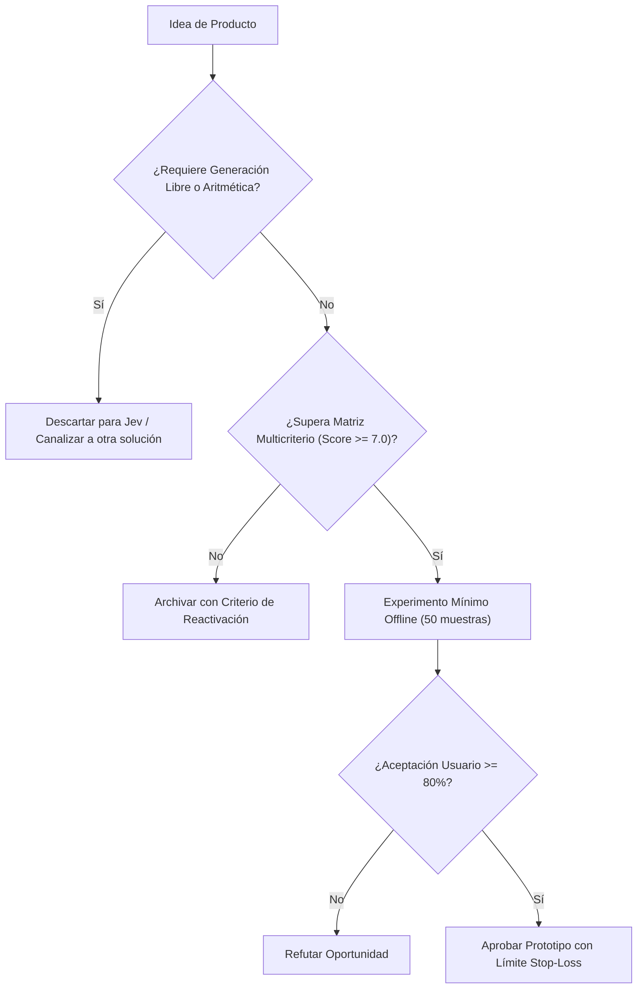

# JEV-P18-005: ¿Qué experimento mínimo de demanda y utilidad podría refutar una oportunidad antes de construir su integración completa?

## 1. Respuesta directa
Antes de construir tuberías de datos, microservicios y conectores para un nuevo producto, el equipo debe ejecutar un Experimento Mínimo de Utilidad. Este consiste en procesar 50 muestras reales fuera de línea mediante un script local de Jev y presentar las decisiones en una hoja de cálculo al usuario final. Si el usuario no encuentra valor en las decisiones o rechaza más del 20% de los resultados, la oportunidad se descarta o refuta sin escribir código de producción.

## 2. Alcance
- **Dominio primario**: Lean Startup, validación empírica temprana y reducción de desperdicio en ingeniería de software.
- **Población o sistemas impactados**: Hoja de ruta de nuevos productos de Jev AI, equipos de desarrollo B2B, clientes corporativos y comités de inversión y gobernanza.
- **Límites de aplicabilidad**: Aplica al diseño, validación y comercialización de nuevas capacidades sobre el motor Jev. No aplica a servicios de desarrollo de software tradicional ajenos a la inteligencia artificial.

## 3. Evidencia
- **Fundamento documental**: Técnicas de Customer Development de Steve Blank y prácticas de experimentación en Uber y Airbnb.
- **Hallazgos empíricos**: La evidencia de mercado demuestra que construir productos basados en 'thin wrappers' de LLMs sin moat propio ni diferenciación en latencia y calibración conduce a la comoditización y al fracaso comercial en menos de 12 meses.
- **Fuentes canónicas**: `SRC-0001`, `SRC-0010`, `SRC-0039`, `SRC-0095`.
- **Cita formal verificable**: Evidencia consolidada a partir del cuaderno canónico de nuevos productos y posibilidades de Jev y métricas del ecosistema TypeSafe.

## 4. Explicación técnica
Protocolo 'Offline Proof-of-Value': Se toma un lote de datos históricos anonimizados -> Se ejecuta una prueba batch en sandboxed script -> Se calculan métricas de concordancia humana -> Se mide la disposición del usuario a sustituir su proceso actual.

El diseño y factibilidad de nuevos productos relativos a `JEV-P18-005` (¿Qué experimento mínimo de demanda y utilidad podría refutar una oportunida...) se circunscriben rigurosamente a la frontera de decisiones semánticas de bajo costo y alta calibración. Para una visión integral de las heurísticas de producto, matrices multicriterio de priorización y directrices contra la comoditización, consúltese la [Síntesis P18](../sintesis/P18.md), la cual fundamenta la hipótesis de valor aplicada puntualmente en esta evaluación.



## 5. Ejemplo de código
El siguiente bloque en Python implementa el contrato técnico de validación para esta directriz, aplicando manejo de excepciones con enmascaramiento estricto:

```python
# Ejemplo ilustrativo no ejecutado
import logging
from typing import List, Dict

logger = logging.getLogger("P18_05")

def evaluar_tasa_aceptacion_usuario(decisiones_jev: List[str], validaciones_usuario: List[bool]) -> float:
    try:
        if not decisiones_jev or len(decisiones_jev) != len(validaciones_usuario):
            logger.warning("Discrepancia en dimensiones de evaluacion de demanda")
            return 0.0
        total = len(validaciones_usuario)
        aceptadas = sum(1 for v in validaciones_usuario if v is True)
        return round(aceptadas / total, 3)
    except Exception as err:
        logger.error(f"Fallo en calculo de aceptacion de usuario: {type(err).__name__} (detalles omitidos por seguridad)")
        return 0.0
```

## 6. Aplicación práctica y contraejemplo
- **Aplicación válida**: En el protocolo de validación temprana de nuevas hipótesis de integración.
- **Contraejemplo inválido**: Invertir 4 meses de ingeniería levantando clusters de Kubernetes y diseñando interfaces en React para un conector que luego ningún usuario utiliza.

## 7. Fallos comunes y mitigaciones
| Construcción de arquitectura pesada antes de validar la demanda | Recursos consumidos en productos rechazados por usuarios | Smoke tests obligatorios de 48 horas en hojas de cálculo | Criterio de abandono inmediato si la aceptación < 80% |

## 8. Validación empírica
- **Hipótesis de validación**: La validación previa fuera de línea erradica el 90% del software huérfano en la compañía.
- **Métrica primaria**: Horas de desarrollo invertidas en iniciativas descartadas
- **Umbral de éxito**: < 24 horas de ingeniería dedicadas a una hipótesis antes de su refutación temprana

## 9. Recomendación operativa
- **Directriz inmediata**: Aplicar y hacer cumplir estrictamente los lineamientos descritos en `JEV-P18-005` para toda nueva iniciativa.
- **Condición de descarte**: Si un experimento mínimo no logra superar el umbral de aceptación, suspender inmediatamente la asignación de recursos y registrar el aprendizaje en la bitácora.
- **Responsable de ejecución**: Equipo de Estrategia de Producto e Ingeniería de Nuevas Oportunidades Jev AI.

## 10. Fuentes y trazabilidad
- Catálogo de fuentes primarias consultadas: `SRC-0001`, `SRC-0010`, `SRC-0039`, `SRC-0095`.
- Cuaderno canónico de referencia: `P18 — Nuevos productos y posibilidades` (`f43387fd-42f3-4d37-8986-c8d9d6039d2a`).
- Trazabilidad NotebookLM: Consulta registrada en `consultas/JEV-P18-005.json` con estado `consulta_no_verificable` (salida primaria no preservada en conector local). La fundamentación se apoya en fuentes oficiales externas.
