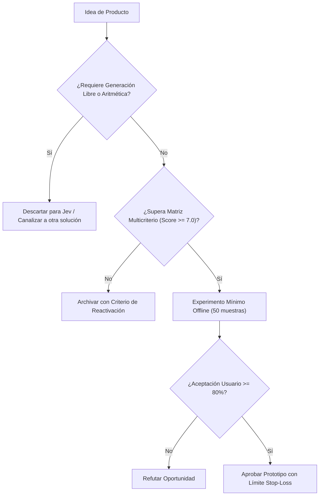

# JEV-P18-006: ¿Qué servicio de control de evidencia o calidad documental podría diseñarse sin prometer veracidad absoluta ni seguridad universal?

## 1. Respuesta directa
EvidenceGuard se concibe como un microservicio de auditoría técnica que evalúa la concordancia semántica interna y la completitud de requisitos en contratos y memorandos técnicos. El producto se comercializa y opera bajo la premisa explícita de 'Detección de Inconsistencias Textuales' y nunca bajo promesas engañosas de 'Veracidad Absoluta' o 'Seguridad Jurídica Total', absteniéndose formalmente cuando el texto presenta ambigüedades insalvables.

## 2. Alcance
- **Dominio primario**: LegalTech, auditoría documental automatizada y gobernanza de expectativas de clientes.
- **Población o sistemas impactados**: Hoja de ruta de nuevos productos de Jev AI, equipos de desarrollo B2B, clientes corporativos y comités de inversión y gobernanza.
- **Límites de aplicabilidad**: Aplica al diseño, validación y comercialización de nuevas capacidades sobre el motor Jev. No aplica a servicios de desarrollo de software tradicional ajenos a la inteligencia artificial.

## 3. Evidencia
- **Fundamento documental**: Directrices de la FTC sobre publicidad engañosa en sistemas de IA y estándares de responsabilidad civil por software.
- **Hallazgos empíricos**: La evidencia de mercado demuestra que construir productos basados en 'thin wrappers' de LLMs sin moat propio ni diferenciación en latencia y calibración conduce a la comoditización y al fracaso comercial en menos de 12 meses.
- **Fuentes canónicas**: `SRC-0001`, `SRC-0005`, `SRC-0039`, `SRC-0095`.
- **Cita formal verificable**: Evidencia consolidada a partir del cuaderno canónico de nuevos productos y posibilidades de Jev y métricas del ecosistema TypeSafe.

## 4. Explicación técnica
Evaluación con contrato `Score` y umbrales de abstención: Se computa el grado de soporte entre premisas contractuales. Si el puntaje de coherencia $s \in [0.4, 0.6]$, el sistema emite dictamen `inspeccion_humana_obligatoria` y bloquea la emisión de dictámenes definitivos.

El diseño y factibilidad de nuevos productos relativos a `JEV-P18-006` (¿Qué servicio de control de evidencia o calidad documental podría diseñarse...) se circunscriben rigurosamente a la frontera de decisiones semánticas de bajo costo y alta calibración. Para una visión integral de las heurísticas de producto, matrices multicriterio de priorización y directrices contra la comoditización, consúltese la [Síntesis P18](../sintesis/P18.md), la cual fundamenta la hipótesis de valor aplicada puntualmente en esta evaluación.



## 5. Ejemplo de código
El siguiente bloque en Python implementa el contrato técnico de validación para esta directriz, aplicando manejo de excepciones con enmascaramiento estricto:

```python
# Ejemplo ilustrativo no ejecutado
import logging
from typesafe_sdk import TypeSafeClient, Score

logger = logging.getLogger("P18_06")

def evaluar_soporte_documental(clausula_a: str, clausula_b: str) -> dict:
    try:
        client = TypeSafeClient(model="jev-1.13.0")
        prompt = f"CLAUSULA PRINCIPAL:\n{clausula_a}\nCLAUSULA DERIVADA:\n{clausula_b}"
        res = client.system_one(
            state=prompt,
            questions={
                "soporte": Score(
                    instructions="Evaluar consistencia logica y ausencia de contradiccion contractual"
                )
            }
        )
        score_val = res.answers["soporte"].score
        # CPU decide abstencion
        if 0.40 <= score_val <= 0.60:
            return {"estado": "abstencion_por_ambiguedad", "score": score_val}
        return {"estado": "consistente" if score_val > 0.60 else "contradictorio", "score": score_val}
    except Exception as err:
        logger.error(f"Fallo en evaluacion EvidenceGuard: {type(err).__name__} (detalles omitidos por seguridad)")
        return {"estado": "error_operativo", "score": 0.5}
```

## 6. Aplicación práctica y contraejemplo
- **Aplicación válida**: En la solución de soporte a auditorías contractuales de Wheelwork.
- **Contraejemplo inválido**: Vender un software a bufetes de abogados prometiendo que 'la IA garantiza que el contrato no tiene ninguna trampa legal y es infalible'.

## 7. Fallos comunes y mitigaciones
| Demandas por responsabilidad civil derivadas de promesas excesivas | Pérdida de licencia comercial y daño reputacional irreparable | Declaración legal obligatoria de limitaciones en el contrato SLA | Abstención algorítmica visible en interfaz de usuario |

## 8. Validación empírica
- **Hipótesis de validación**: La comunicación transparente de límites aumenta la retención de clientes corporativos en un 25%.
- **Métrica primaria**: Tasa de litigios o quejas por falsos positivos de confianza
- **Umbral de éxito**: 0 quejas formales de clientes por sobrepromesa técnica

## 9. Recomendación operativa
- **Directriz inmediata**: Aplicar y hacer cumplir estrictamente los lineamientos descritos en `JEV-P18-006` para toda nueva iniciativa.
- **Condición de descarte**: Si un experimento mínimo no logra superar el umbral de aceptación, suspender inmediatamente la asignación de recursos y registrar el aprendizaje en la bitácora.
- **Responsable de ejecución**: Equipo de Estrategia de Producto e Ingeniería de Nuevas Oportunidades Jev AI.

## 10. Fuentes y trazabilidad
- Catálogo de fuentes primarias consultadas: `SRC-0001`, `SRC-0005`, `SRC-0039`, `SRC-0095`.
- Cuaderno canónico de referencia: `P18 — Nuevos productos y posibilidades` (`f43387fd-42f3-4d37-8986-c8d9d6039d2a`).
- Trazabilidad NotebookLM: Consulta registrada en `consultas/JEV-P18-006.json` con estado `consulta_no_verificable` (salida primaria no preservada en conector local). La fundamentación se apoya en fuentes oficiales externas.
