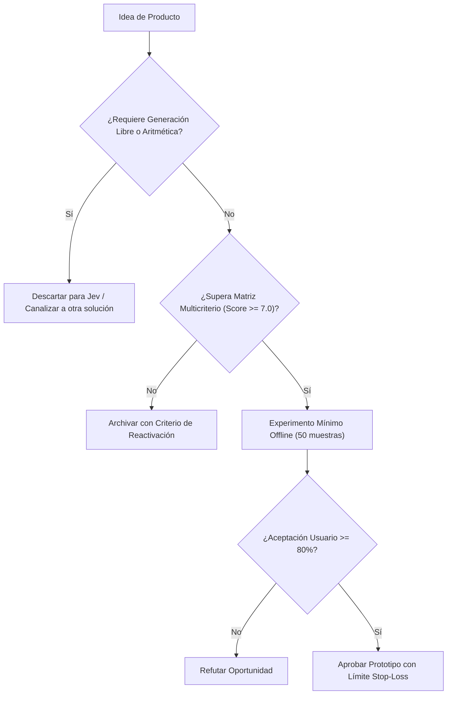

# JEV-P18-008: ¿Qué solución de limpieza, clasificación o enriquecimiento documental aporta algo que reglas y búsqueda no resuelven suficientemente bien?

## 1. Respuesta directa
Jev aporta valor real en limpieza de datos no estructurados cuando existen variaciones semánticas, errores tipográficos o expresiones idiomáticas que rompen las expresiones regulares clásicas, pero donde la salida esperada es un código o categoría estándar de un esquema cerrado (e.g. mapeo de cargos laborales a códigos ISCO-08 o industrias a CIIU). Si el problema se resuelve con un `regex` determinista de 3 líneas, usar Jev es un error de sobreingeniería.

## 2. Alcance
- **Dominio primario**: Data Engineering, normalización de datos maestros (MDM) y pipelines ETL semánticos.
- **Población o sistemas impactados**: Hoja de ruta de nuevos productos de Jev AI, equipos de desarrollo B2B, clientes corporativos y comités de inversión y gobernanza.
- **Límites de aplicabilidad**: Aplica al diseño, validación y comercialización de nuevas capacidades sobre el motor Jev. No aplica a servicios de desarrollo de software tradicional ajenos a la inteligencia artificial.

## 3. Evidencia
- **Fundamento documental**: Estándares internacionales de clasificación (OIT ISCO-08, ONU CIIU Rev. 4) y límites teóricos de autómatas finitos regulares.
- **Hallazgos empíricos**: La evidencia de mercado demuestra que construir productos basados en 'thin wrappers' de LLMs sin moat propio ni diferenciación en latencia y calibración conduce a la comoditización y al fracaso comercial en menos de 12 meses.
- **Fuentes canónicas**: `SRC-0001`, `SRC-0010`, `SRC-0046`, `SRC-0095`.
- **Cita formal verificable**: Evidencia consolidada a partir del cuaderno canónico de nuevos productos y posibilidades de Jev y métricas del ecosistema TypeSafe.

## 4. Explicación técnica
Clasificador categórico cerrado: Se suministra el texto ruidoso como estado y un conjunto controlado de 10-20 categorías normalizadas mediante `Choice`. El sistema retorna la clave exacta sin riesgo de alucinaciones de formato.

El diseño y factibilidad de nuevos productos relativos a `JEV-P18-008` (¿Qué solución de limpieza, clasificación o enriquecimiento documental aport...) se circunscriben rigurosamente a la frontera de decisiones semánticas de bajo costo y alta calibración. Para una visión integral de las heurísticas de producto, matrices multicriterio de priorización y directrices contra la comoditización, consúltese la [Síntesis P18](../sintesis/P18.md), la cual fundamenta la hipótesis de valor aplicada puntualmente en esta evaluación.



## 5. Ejemplo de código
El siguiente bloque en Python implementa el contrato técnico de validación para esta directriz, aplicando manejo de excepciones con enmascaramiento estricto:

```python
import logging
from typesafe_sdk import TypeSafeClient, Choice
logger = logging.getLogger('P18_08')

def normalizar_cargo_laboral(texto_cargo_cv: str) -> str:
    try:
        client = TypeSafeClient(model='jev-1.13.0')
        res = client.system_one(state=texto_cargo_cv, questions={'categoria_isco': Choice(instructions='Mapear a categoria ocupacional estandarizada', criteria={'desarrollador_software': 'Profesional de ingeniería y desarrollo de software', 'analista_datos': 'Especialista en análisis, modelado y ciencia de datos', 'gerente_proyectos': 'Líder de gestión, planificación y ejecución de proyectos', 'otro_no_listado': 'Ocupación no comprendida en las categorías primarias'})})
        return res.answers['categoria_isco'].choice
    except Exception as err:
        logger.error(f'Fallo al normalizar cargo: {type(err).__name__} (detalles omitidos por seguridad)')
        return 'otro_no_listado'
```

## 6. Aplicación práctica y contraejemplo
- **Aplicación válida**: En el módulo de ingesta de perfiles y estandarización de bases de talento.
- **Contraejemplo inválido**: Usar Jev para extraer el código postal de un texto cuando todos los códigos postales en el país tienen exactamente 7 dígitos numéricos correlativos.

## 7. Fallos comunes y mitigaciones
| Despilfarro de llamadas de API en tareas puramente sintácticas | Mayor latencia innecesaria y costo de computación | Uso de Regex para sintaxis fija; Jev solo para semántica abierta | Profiling previo de datos para elegir el método más simple |

## 8. Validación empírica
- **Hipótesis de validación**: Reservar Jev para casos de ambigüedad semántica maximiza la precisión sin inflar el presupuesto.
- **Métrica primaria**: Exactitud en normalización de cargos ambiguos no capturados por regex
- **Umbral de éxito**: > 92% de precisión en casos donde regex falla

## 9. Recomendación operativa
- **Directriz inmediata**: Aplicar y hacer cumplir estrictamente los lineamientos descritos en `JEV-P18-008` para toda nueva iniciativa.
- **Condición de descarte**: Si un experimento mínimo no logra superar el umbral de aceptación, suspender inmediatamente la asignación de recursos y registrar el aprendizaje en la bitácora.
- **Responsable de ejecución**: Equipo de Estrategia de Producto e Ingeniería de Nuevas Oportunidades Jev AI.

## 10. Fuentes y trazabilidad
- Catálogo de fuentes primarias consultadas: `SRC-0001`, `SRC-0010`, `SRC-0046`, `SRC-0095`.
- Cuaderno canónico de referencia: `P18 — Nuevos productos y posibilidades` (`f43387fd-42f3-4d37-8986-c8d9d6039d2a`).
- Trazabilidad NotebookLM: Consulta registrada en `consultas/JEV-P18-008.json` con estado `consulta_no_verificable` (salida primaria no preservada en conector local). La fundamentación se apoya en fuentes oficiales externas.
