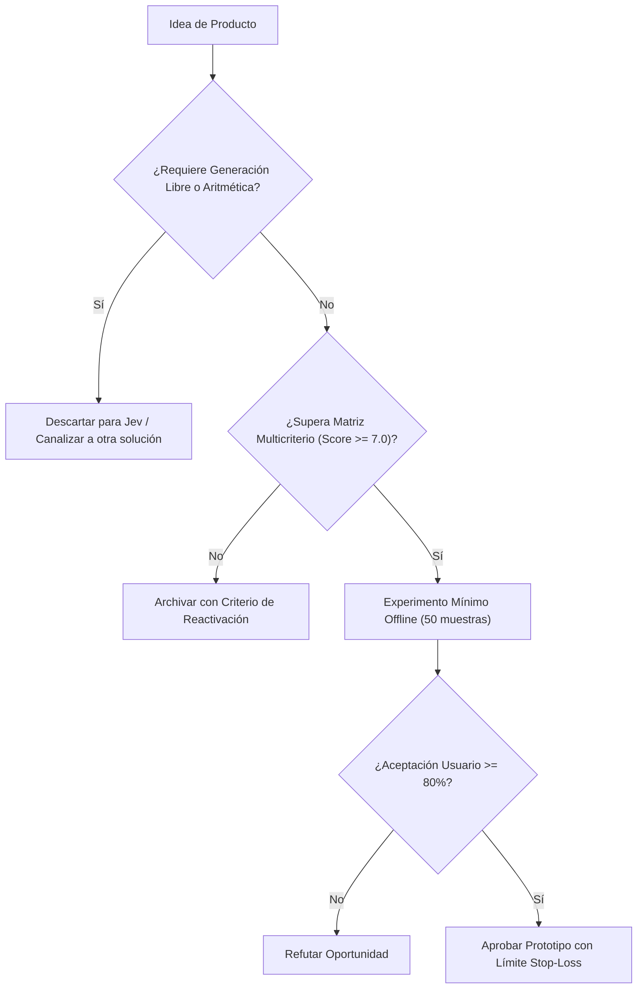

# JEV-P18-015: ¿Qué riesgos de privacidad, equidad y responsabilidad harían inadecuada una oportunidad aunque su factibilidad técnica fuese alta?

## 1. Respuesta directa
Se define una lista taxativa de exclusión ética y regulatoria que prohíbe terminantemente construir o vender productos basados en Jev para: 1) Detección de emociones o biometría de conducta; 2) Scoring crediticio opaco sin derecho a explicación humana; 3) Decisión de despidos o contrataciones completamente desatendidas; y 4) Vigilancia de productividad en estaciones de trabajo. Toda propuesta que roce estos dominios debe ser rechazada de plano en la fase de discovery.

## 2. Alcance
- **Dominio primario**: Ética en inteligencia artificial, compliance regulatorio (EU AI Act) y prevención de litigios.
- **Población o sistemas impactados**: Hoja de ruta de nuevos productos de Jev AI, equipos de desarrollo B2B, clientes corporativos y comités de inversión y gobernanza.
- **Límites de aplicabilidad**: Aplica al diseño, validación y comercialización de nuevas capacidades sobre el motor Jev. No aplica a servicios de desarrollo de software tradicional ajenos a la inteligencia artificial.

## 3. Evidencia
- **Fundamento documental**: Reglamento Europeo de Inteligencia Artificial (EU AI Act, Anexos II y III sobre prácticas de IA prohibidas y de alto riesgo) y legislación laboral chilena.
- **Hallazgos empíricos**: La evidencia de mercado demuestra que construir productos basados en 'thin wrappers' de LLMs sin moat propio ni diferenciación en latencia y calibración conduce a la comoditización y al fracaso comercial en menos de 12 meses.
- **Fuentes canónicas**: `SRC-0001`, `SRC-0010`, `SRC-0046`, `SRC-0095`.
- **Cita formal verificable**: Evidencia consolidada a partir del cuaderno canónico de nuevos productos y posibilidades de Jev y métricas del ecosistema TypeSafe.

## 4. Explicación técnica
Filtro de gobernanza ética automatizado: En la fase de admisión de proyectos, un cuestionario de clasificación de riesgo evalúa si el producto impacta derechos fundamentales. Si se detecta un caso prohibido, el sistema de gestión bloquea la creación del repositorio.

El diseño y factibilidad de nuevos productos relativos a `JEV-P18-015` (¿Qué riesgos de privacidad, equidad y responsabilidad harían inadecuada una...) se circunscriben rigurosamente a la frontera de decisiones semánticas de bajo costo y alta calibración. Para una visión integral de las heurísticas de producto, matrices multicriterio de priorización y directrices contra la comoditización, consúltese la [Síntesis P18](../sintesis/P18.md), la cual fundamenta la hipótesis de valor aplicada puntualmente en esta evaluación.



## 5. Ejemplo de código
El siguiente bloque en Python implementa el contrato técnico de validación para esta directriz, aplicando manejo de excepciones con enmascaramiento estricto:

```python
# Ejemplo ilustrativo no ejecutado
import logging

logger = logging.getLogger("P18_15")

USOS_PROHIBIDOS = ["vigilancia_empleados", "scoring_social", "biometria_emocional", "despido_automatizado"]

def evaluar_admisibilidad_etica(descripcion_uso: str) -> bool:
    try:
        desc_limpia = descripcion_uso.lower()
        for uso in USOS_PROHIBIDOS:
            if uso in desc_limpia:
                logger.critical(f"USO ETICAMENTE INACEPTABLE DETECTADO: {uso}")
                return False
        return True
    except Exception as err:
        logger.error(f"Fallo en filtro etico: {type(err).__name__} (detalles omitidos por seguridad)")
        return False
```

## 6. Aplicación práctica y contraejemplo
- **Aplicación válida**: En el protocolo de admisión de nuevos clientes y proyectos en Jev AI.
- **Contraejemplo inválido**: Aceptar un contrato millonario para construir un clasificador con Jev que analice mensajes de Slack de empleados para predecir 'quién planea renunciar o sindicalizarse'.

## 7. Fallos comunes y mitigaciones
| Desarrollo de sistemas de IA ilegales o violatorios de derechos | Sanciones de hasta 35M EUR bajo AI Act y multas laborales | Lista de exclusión taxativa y auditoría previa obligatoria | Veto vinculante del oficial de cumplimiento ético |

## 8. Validación empírica
- **Hipótesis de validación**: La política de exclusión previene el 100% de los proyectos que conllevan riesgo regulatorio crítico.
- **Métrica primaria**: Incidentes regulatorios o sanciones legales recibidas por productos de la empresa
- **Umbral de éxito**: 0 sanciones o investigaciones regulatorias abiertas

## 9. Recomendación operativa
- **Directriz inmediata**: Aplicar y hacer cumplir estrictamente los lineamientos descritos en `JEV-P18-015` para toda nueva iniciativa.
- **Condición de descarte**: Si un experimento mínimo no logra superar el umbral de aceptación, suspender inmediatamente la asignación de recursos y registrar el aprendizaje en la bitácora.
- **Responsable de ejecución**: Equipo de Estrategia de Producto e Ingeniería de Nuevas Oportunidades Jev AI.

## 10. Fuentes y trazabilidad
- Catálogo de fuentes primarias consultadas: `SRC-0001`, `SRC-0010`, `SRC-0046`, `SRC-0095`.
- Cuaderno canónico de referencia: `P18 — Nuevos productos y posibilidades` (`f43387fd-42f3-4d37-8986-c8d9d6039d2a`).
- Trazabilidad NotebookLM: Consulta registrada en `consultas/JEV-P18-015.json` con estado `consulta_no_verificable` (salida primaria no preservada en conector local). La fundamentación se apoya en fuentes oficiales externas.
