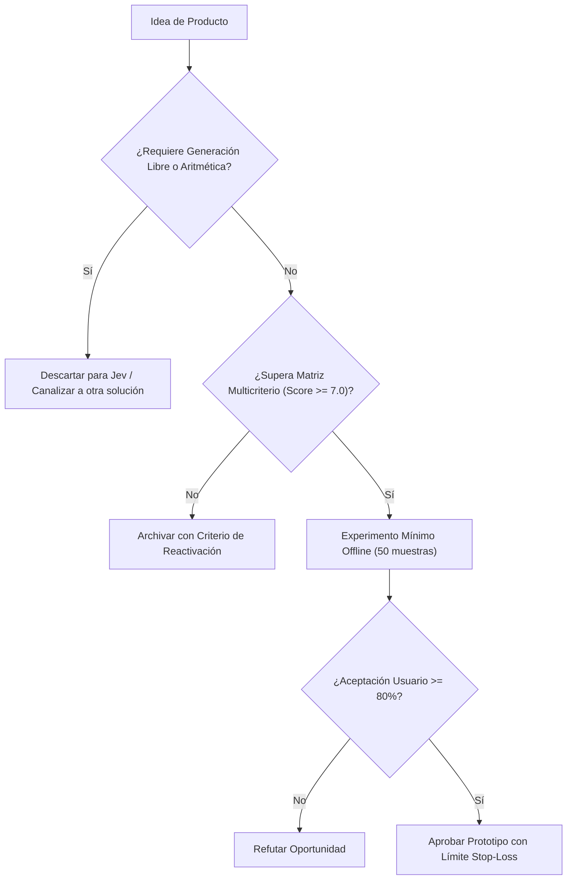

# JEV-P18-018: ¿Cómo preparar fichas comparables para al menos diez oportunidades incluyendo alternativa actual, evidencia, piloto y condición de descarte?

## 1. Respuesta directa
Para comparar y priorizar objetivamente el portafolio de ideas, cada propuesta debe redactarse bajo la plantilla estandarizada 'Product Opportunity Brief (POB)', la cual contiene exactamente 8 secciones auditables: 1) Nombre del producto y usuario responsable; 2) Decisión semántica específica; 3) Alternativa actual y costo del error; 4) Nivel de evidencia preexistente; 5) Contrato de API requerido; 6) Experimento mínimo fuera de línea; 7) Umbral de éxito; y 8) Condición de descarte o abandono.

## 2. Alcance
- **Dominio primario**: Gobierno de producto, estandarización de propuestas de innovación y gestión de portafolio.
- **Población o sistemas impactados**: Hoja de ruta de nuevos productos de Jev AI, equipos de desarrollo B2B, clientes corporativos y comités de inversión y gobernanza.
- **Límites de aplicabilidad**: Aplica al diseño, validación y comercialización de nuevas capacidades sobre el motor Jev. No aplica a servicios de desarrollo de software tradicional ajenos a la inteligencia artificial.

## 3. Evidencia
- **Fundamento documental**: Metodologías de Product Opportunity Assessment (Marty Cagan, Silicon Valley Product Group) y marcos de inversión de capital de riesgo corporativo.
- **Hallazgos empíricos**: La evidencia de mercado demuestra que construir productos basados en 'thin wrappers' de LLMs sin moat propio ni diferenciación en latencia y calibración conduce a la comoditización y al fracaso comercial en menos de 12 meses.
- **Fuentes canónicas**: `SRC-0001`, `SRC-0010`, `SRC-0039`, `SRC-0095`.
- **Cita formal verificable**: Evidencia consolidada a partir del cuaderno canónico de nuevos productos y posibilidades de Jev y métricas del ecosistema TypeSafe.

## 4. Explicación técnica
Estructura de datos normalizada para POBs en Markdown: Cada ficha se versiona en Git dentro de `docs/oportunidades/` y es evaluada algorítmicamente para verificar que todos los campos requeridos estén completos antes de admitirla a votación.

El diseño y factibilidad de nuevos productos relativos a `JEV-P18-018` (¿Cómo preparar fichas comparables para al menos diez oportunidades incluyen...) se circunscriben rigurosamente a la frontera de decisiones semánticas de bajo costo y alta calibración. Para una visión integral de las heurísticas de producto, matrices multicriterio de priorización y directrices contra la comoditización, consúltese la [Síntesis P18](../sintesis/P18.md), la cual fundamenta la hipótesis de valor aplicada puntualmente en esta evaluación.



## 5. Ejemplo de código
El siguiente bloque en Python implementa el contrato técnico de validación para esta directriz, aplicando manejo de excepciones con enmascaramiento estricto:

```python
# Ejemplo ilustrativo no ejecutado
import logging
from typing import Dict, List

logger = logging.getLogger("P18_18")

CAMPOS_POB_OBLIGATORIOS = [
    "usuario_responsable", "decision_semantica", "baseline_actual", 
    "costo_error", "evidencia_existente", "contrato_api", 
    "experimento_minimo", "condicion_descarte"
]

def validar_completitud_pob(ficha_dict: Dict[str, str]) -> bool:
    try:
        for campo in CAMPOS_POB_OBLIGATORIOS:
            if not ficha_dict.get(campo):
                logger.warning(f"Campo obligatorio faltante en ficha POB: {campo}")
                return False
        return True
    except Exception as err:
        logger.error(f"Fallo en validacion de ficha POB: {type(err).__name__} (detalles omitidos por seguridad)")
        return False
```

## 6. Aplicación práctica y contraejemplo
- **Aplicación válida**: En la documentación de iniciativas en el repositorio de producto de Jev AI.
- **Contraejemplo inválido**: Presentar una propuesta de producto en una servilleta o presentación de 3 diapositivas sin métricas, sin costos y sin condición explícita de cuándo apagar el proyecto.

## 7. Fallos comunes y mitigaciones
| Evaluación sesgada de ideas debido a formatos heterogéneos y dispersos | Aprobación de proyectos mediocres por falta de comparación estandarizada | Plantilla POB obligatoria para toda iniciativa | Descarte automático de propuestas incompletas |

## 8. Validación empírica
- **Hipótesis de validación**: El uso de fichas estandarizadas reduce el tiempo de deliberación del comité en un 50%.
- **Métrica primaria**: Tiempo medio de decisión del comité de producto por iniciativa
- **Umbral de éxito**: < 30 minutos para aprobar o descartar una propuesta formalizada en POB

## 9. Recomendación operativa
- **Directriz inmediata**: Aplicar y hacer cumplir estrictamente los lineamientos descritos en `JEV-P18-018` para toda nueva iniciativa.
- **Condición de descarte**: Si un experimento mínimo no logra superar el umbral de aceptación, suspender inmediatamente la asignación de recursos y registrar el aprendizaje en la bitácora.
- **Responsable de ejecución**: Equipo de Estrategia de Producto e Ingeniería de Nuevas Oportunidades Jev AI.

## 10. Fuentes y trazabilidad
- Catálogo de fuentes primarias consultadas: `SRC-0001`, `SRC-0010`, `SRC-0039`, `SRC-0095`.
- Cuaderno canónico de referencia: `P18 — Nuevos productos y posibilidades` (`f43387fd-42f3-4d37-8986-c8d9d6039d2a`).
- Trazabilidad NotebookLM: Consulta registrada en `consultas/JEV-P18-018.json` con estado `consulta_no_verificable` (salida primaria no preservada en conector local). La fundamentación se apoya en fuentes oficiales externas.
