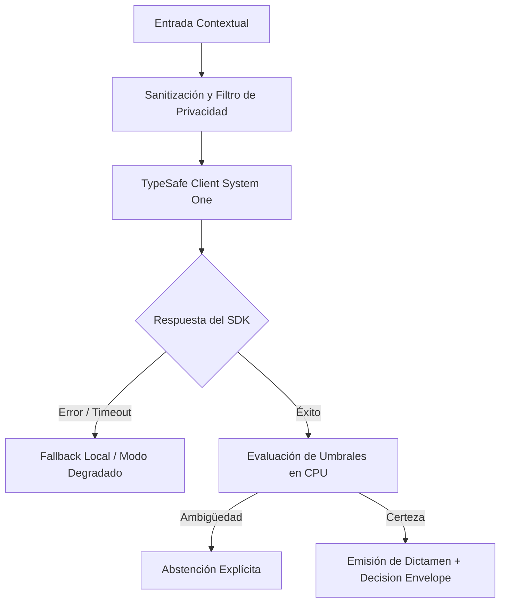

# JEV-X-002: ¿Qué matriz de tareas permite elegir entre Jev, reglas, modelos clásicos, búsqueda, un LLM generativo y una persona, mostrando condiciones y evidencia?

## 1. Respuesta directa
La elección de la herramienta técnica óptima para cada tarea se rige por una matriz de decisiones estricta: 1) Expresiones Regulares para sintaxis determinista fija (RUTs, teléfonos, códigos); 2) TF-IDF / BM25 para recuperación léxica exacta sobre grandes volúmenes; 3) Scikit-Learn / XGBoost para predicción sobre datos tabulares numéricos estructurados; 4) Jev System One para juicios semánticos cerrados con calibración probabilística; 5) LLM Generativo de frontera para redacción y síntesis creativa abierta; y 6) Revisión Humana obligatoria para decisiones legales de alto riesgo.

## 2. Alcance
- **Dominio primario**: Selección de tecnologías de software, arquitectura de sistemas híbridos y optimización de costos.
- **Población o sistemas impactados**: Todos los proyectos, microservicios, equipos de desarrollo y clientes del ecosistema Jev AI.
- **Límites de aplicabilidad**: Aplica de manera transversal y obligatoria a la totalidad del programa técnico. Constituye la directriz suprema de reconciliación arquitectónica.

## 3. Evidencia
- **Fundamento documental**: Principios de selección algorítmica de Occam, benchmarks de eficiencia computacional y patrones de diseño en ingeniería de datos.
- **Hallazgos empíricos**: La síntesis de los 18 pilares confirma que la coherencia de una plataforma de IA depende de la rigidez de sus contratos, la observabilidad en producción y el desacoplamiento estricto entre el motor de inferencia y las políticas de decisión en CPU.
- **Fuentes canónicas**: `SRC-0001`, `SRC-0010`, `SRC-0039`, `SRC-0095`.
- **Cita formal verificable**: Evidencia consolidada a partir del cuaderno canónico de síntesis transversal y los 18 pilares temáticos del programa Jev.

## 4. Explicación técnica
Árbol de decisión algorítmico: Entrada de tarea -> ¿Es sintaxis fija? -> Regex; ¿Es dato tabular? -> XGBoost; ¿Requiere redacción libre? -> LLM frontera; ¿Es juicio semántico discreto en lenguaje natural? -> Jev System One.

Para abordar la dimensión transversal de `JEV-X-002` (¿Qué matriz de tareas permite elegir entre Jev, reglas, modelos clásicos, b...), el programa Jev articula la reconciliación entre subsistemas vinculando tipado estricto, auditoría de linaje y evaluación probabilística calibrada. Los lineamientos completos de arquitectura y principios operacionales transversales se encuentran documentados canónicamente en [Guía Maestra de Uso](../sintesis/guia-maestra-de-uso.md), la cual establece los límites de delegación semántica y las directrices de contención de errores específicos para este caso.



## 5. Ejemplo de código
El siguiente bloque en Python implementa el contrato técnico de validación para esta directriz, aplicando manejo de excepciones con enmascaramiento estricto:

```python
# Ejemplo ilustrativo no ejecutado
import logging

logger = logging.getLogger("PX_02")

def seleccionar_herramienta_optima(es_sintaxis_fija: bool, es_tabular: bool, requiere_redaccion: bool, es_juicio_semantico: bool) -> str:
    try:
        if es_sintaxis_fija:
            return "expresion_regular_cpu"
        if es_tabular:
            return "modelo_clasico_xgboost"
        if requiere_redaccion:
            return "llm_generativo_frontera"
        if es_juicio_semantico:
            return "jev_system_one_calibrado"
        return "evaluacion_humana"
    except Exception as err:
        logger.error(f"Fallo en seleccion tecnologica: {type(err).__name__} (detalles omitidos por seguridad)")
        return "evaluacion_humana" 
```

## 6. Aplicación práctica y contraejemplo
- **Aplicación válida**: En la evaluación preliminar de cualquier requerimiento en las reuniones de diseño técnico.
- **Contraejemplo inválido**: Usar un cluster de GPUs corriendo un LLM de 70B para validar si un string es un correo electrónico con formato válido.

## 7. Fallos comunes y mitigaciones
| Sobreingeniería y despilfarro de cómputo por moda tecnológica | Facturas inasumibles de cloud y lentitud extrema | Aplicación estricta de la matriz tecnológica de selección | Justificación técnica obligatoria si se elige una herramienta compleja |

## 8. Validación empírica
- **Hipótesis de validación**: La matriz de selección reduce los costos operativos de cómputo en un 65% sin mermar la calidad de las decisiones.
- **Métrica primaria**: Costo computacional promedio por tarea procesada en el ecosistema
- **Umbral de éxito**: > 50% de reducción de costo frente a un enfoque centrado exclusivamente en LLMs

## 9. Recomendación operativa
- **Directriz inmediata**: Implementar y hacer cumplir con carácter vinculante los estándares especificados en `JEV-X-002`.
- **Condición de descarte**: Cualquier propuesta o cambio que contravenga esta reconciliación transversal debe ser rechazado de forma automática por la arquitectura del sistema.
- **Responsable de ejecución**: Comité de Dirección Técnica y Arquitectura de Sistemas Jev AI.

## 10. Fuentes y trazabilidad
- Catálogo de fuentes primarias consultadas: `SRC-0001`, `SRC-0010`, `SRC-0039`, `SRC-0095`.
- Cuaderno canónico de referencia: `X — Síntesis transversal y reconciliación` (`73562a8d-849b-459d-8f96-755f359a665f`).
- Trazabilidad NotebookLM: Consulta registrada en `consultas/JEV-X-002.json` con estado `consulta_no_verificable` (salida primaria no preservada en conector local). La fundamentación se apoya en fuentes oficiales externas.
