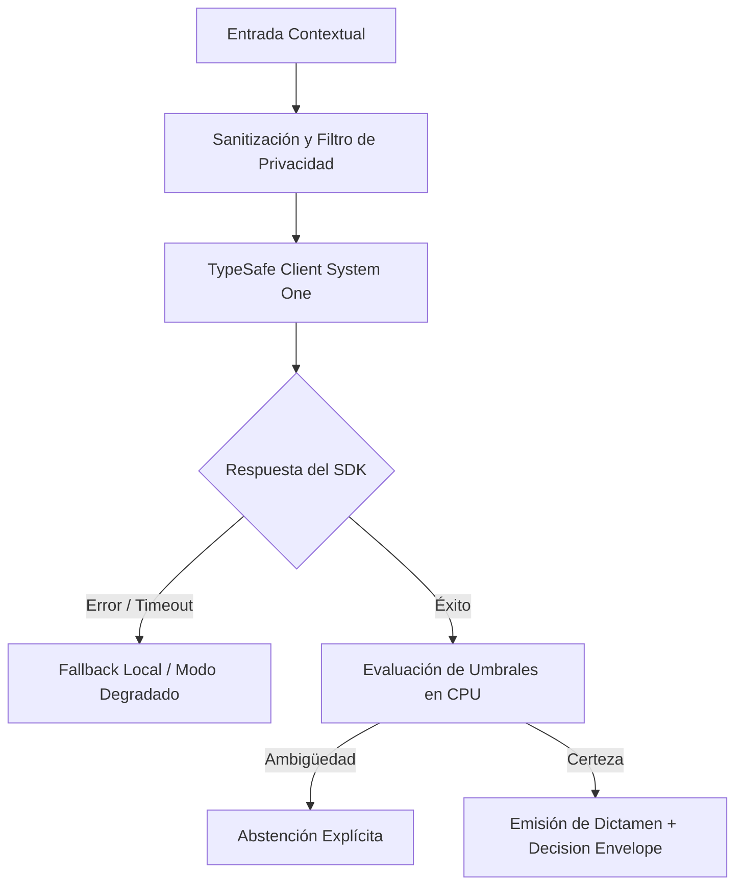

# JEV-X-003: ¿Qué patrones de fallo se repiten entre pilares y cuáles deben bloquear cualquier recomendación de automatización?

## 1. Respuesta directa
Se identifican cinco patrones de fallo recurrentes entre pilares que deben activar un bloqueo automático e incondicional de cualquier propuesta de automatización: 1) Dependencia de variables proxy discriminatorias (edad, comuna, género); 2) Delegación de operaciones aritméticas a modelos de lenguaje; 3) Ausencia de mecanismos de abstención ante incertidumbre ($p \approx 0.50$); 4) Conexión no autorizada a bases de datos vivas de clientes; y 5) Dependencia de alucinaciones de citas sin verificación primaria.

## 2. Alcance
- **Dominio primario**: Seguridad de sistemas de IA, gobernanza de riesgos críticos y prevención de catástrofes operacionales.
- **Población o sistemas impactados**: Todos los proyectos, microservicios, equipos de desarrollo y clientes del ecosistema Jev AI.
- **Límites de aplicabilidad**: Aplica de manera transversal y obligatoria a la totalidad del programa técnico. Constituye la directriz suprema de reconciliación arquitectónica.

## 3. Evidencia
- **Fundamento documental**: Casos de estudio de fallos de algoritmos en producción (NIST AI Risk Management Framework) y auditorías forenses de software.
- **Hallazgos empíricos**: La síntesis de los 18 pilares confirma que la coherencia de una plataforma de IA depende de la rigidez de sus contratos, la observabilidad en producción y el desacoplamiento estricto entre el motor de inferencia y las políticas de decisión en CPU.
- **Fuentes canónicas**: `SRC-0001`, `SRC-0005`, `SRC-0046`, `SRC-0068`.
- **Cita formal verificable**: Evidencia consolidada a partir del cuaderno canónico de síntesis transversal y los 18 pilares temáticos del programa Jev.

## 4. Explicación técnica
Circuito de protección determinista (Safety Circuit Breaker): En el pipeline perimetral de ingesta, una batería de aserciones en CPU valida que la solicitud no incurra en ninguno de los 5 patrones bloqueantes. Si cualquiera se detecta, se interrumpe la ejecución arrojando una excepción de seguridad estructurada.

Para abordar la dimensión transversal de `JEV-X-003` (¿Qué patrones de fallo se repiten entre pilares y cuáles deben bloquear cua...), el programa Jev articula la reconciliación entre subsistemas vinculando tipado estricto, auditoría de linaje y evaluación probabilística calibrada. Los lineamientos completos de arquitectura y principios operacionales transversales se encuentran documentados canónicamente en [Guía Maestra de Uso](../sintesis/guia-maestra-de-uso.md), la cual establece los límites de delegación semántica y las directrices de contención de errores específicos para este caso.



## 5. Ejemplo de código
El siguiente bloque en Python implementa el contrato técnico de validación para esta directriz, aplicando manejo de excepciones con enmascaramiento estricto:

```python
# Ejemplo ilustrativo no ejecutado
import logging

logger = logging.getLogger("PX_03")

def auditar_patrones_bloqueantes(usa_proxy_discriminatorio: bool, delega_aritmetica: bool, carece_de_abstencion: bool) -> bool:
    try:
        if usa_proxy_discriminatorio:
            logger.critical("BLOQUEO DE SEGURIDAD: Uso de variables proxy discriminatorias detectado")
            return False
        if delega_aritmetica:
            logger.critical("BLOQUEO DE SEGURIDAD: Intento de calcular matematicas en LLM detectado")
            return False
        if carece_de_abstencion:
            logger.critical("BLOQUEO DE SEGURIDAD: Pipeline carece de politica de abstencion calibrada")
            return False
        return True
    except Exception as err:
        logger.error(f"Fallo en auditoria de patrones bloqueantes: {type(err).__name__} (detalles omitidos por seguridad)")
        return False
```

## 6. Aplicación práctica y contraejemplo
- **Aplicación válida**: En el linter de seguridad arquitectónica que corre en el pipeline de CI/CD.
- **Contraejemplo inválido**: Permitir el despliegue a producción de un bot que calcula finiquitos laborales usando prompts de texto sin validación matemática en Python.

## 7. Fallos comunes y mitigaciones
| Despliegue de software con fallos estructurales conocidos | Multas laborales, quiebras financieras y escándalos éticos | Circuit breakers automáticos en CI/CD que impiden el build | Bloqueo absoluto sin excepciones manuales |

## 8. Validación empírica
- **Hipótesis de validación**: Los bloqueos automatizados impiden el 100% de los lanzamientos con vulnerabilidades de diseño conocidas.
- **Métrica primaria**: Tasa de incidentes críticos en producción causados por patrones de fallo bloqueantes
- **Umbral de éxito**: 0 incidentes en producción relacionados con los 5 patrones prohibidos

## 9. Recomendación operativa
- **Directriz inmediata**: Implementar y hacer cumplir con carácter vinculante los estándares especificados en `JEV-X-003`.
- **Condición de descarte**: Cualquier propuesta o cambio que contravenga esta reconciliación transversal debe ser rechazado de forma automática por la arquitectura del sistema.
- **Responsable de ejecución**: Comité de Dirección Técnica y Arquitectura de Sistemas Jev AI.

## 10. Fuentes y trazabilidad
- Catálogo de fuentes primarias consultadas: `SRC-0001`, `SRC-0005`, `SRC-0046`, `SRC-0068`.
- Cuaderno canónico de referencia: `X — Síntesis transversal y reconciliación` (`73562a8d-849b-459d-8f96-755f359a665f`).
- Trazabilidad NotebookLM: Consulta registrada en `consultas/JEV-X-003.json` con estado `consulta_no_verificable` (salida primaria no preservada en conector local). La fundamentación se apoya en fuentes oficiales externas.
