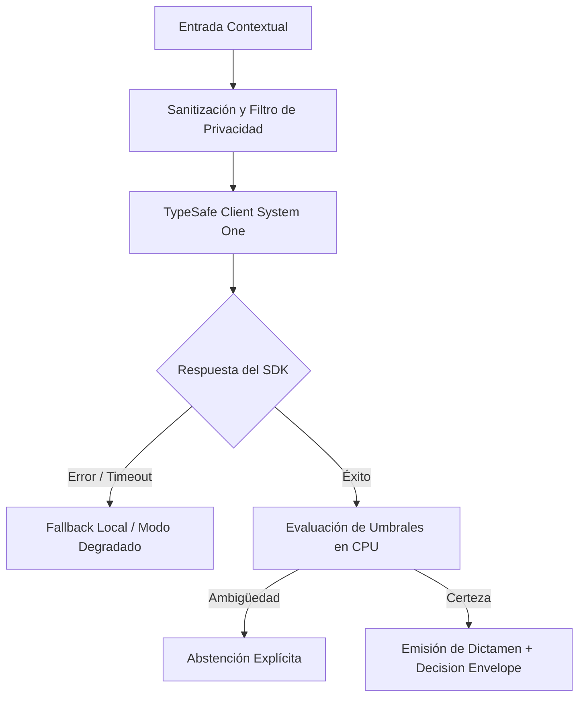

# JEV-X-004: ¿Qué lista de descubrimiento debe aplicarse a cada desarrollo actual para determinar problema, datos, decisiones, impacto y alternativas antes de proponer Jev?

## 1. Respuesta directa
Todo nuevo proyecto que evalúe incorporar Jev debe completar y firmar el 'Checklist de Discovery Técnico' antes de iniciar la fase de desarrollo. El documento exige: 1) Definición del usuario responsable final; 2) Existencia de un dataset histórico representativo ($N \ge 200$) con etiquetas humanas auditadas; 3) Medición del baseline actual y costo de falsos positivos/negativos; 4) Mapeo a contratos TypeSafe cerrados; y 5) Justificación formal de valor de la información (VoI) positivo.

## 2. Alcance
- **Dominio primario**: Ingeniería de software preliminar, gestión de requerimientos y control de calidad inicial.
- **Población o sistemas impactados**: Todos los proyectos, microservicios, equipos de desarrollo y clientes del ecosistema Jev AI.
- **Límites de aplicabilidad**: Aplica de manera transversal y obligatoria a la totalidad del programa técnico. Constituye la directriz suprema de reconciliación arquitectónica.

## 3. Evidencia
- **Fundamento documental**: Buenas prácticas de evaluación de proyectos en ingeniería de sistemas y estándares CMMI de gestión de requerimientos.
- **Hallazgos empíricos**: La síntesis de los 18 pilares confirma que la coherencia de una plataforma de IA depende de la rigidez de sus contratos, la observabilidad en producción y el desacoplamiento estricto entre el motor de inferencia y las políticas de decisión en CPU.
- **Fuentes canónicas**: `SRC-0001`, `SRC-0005`, `SRC-0010`, `SRC-0095`.
- **Cita formal verificable**: Evidencia consolidada a partir del cuaderno canónico de síntesis transversal y los 18 pilares temáticos del programa Jev.

## 4. Explicación técnica
Evaluación estructurada de prefactibilidad: El checklist se almacena como un archivo JSON/YAML en el repositorio del proyecto y debe ser aprobado por el comité técnico de arquitectura antes de crear credenciales de acceso a la API.

Para abordar la dimensión transversal de `JEV-X-004` (¿Qué lista de descubrimiento debe aplicarse a cada desarrollo actual para d...), el programa Jev articula la reconciliación entre subsistemas vinculando tipado estricto, auditoría de linaje y evaluación probabilística calibrada. Los lineamientos completos de arquitectura y principios operacionales transversales se encuentran documentados canónicamente en [Guía Maestra de Uso](../sintesis/guia-maestra-de-uso.md), la cual establece los límites de delegación semántica y las directrices de contención de errores específicos para este caso.



## 5. Ejemplo de código
El siguiente bloque en Python implementa el contrato técnico de validación para esta directriz, aplicando manejo de excepciones con enmascaramiento estricto:

```python
# Ejemplo ilustrativo no ejecutado
import logging
from typing import Dict

logger = logging.getLogger("PX_04")

def validar_checklist_discovery(datos_proyecto: Dict[str, Any]) -> bool:
    try:
        requisitos = [
            datos_proyecto.get("tamano_dataset_historico", 0) >= 200,
            datos_proyecto.get("baseline_medido", False) is True,
            datos_proyecto.get("contrato_typesafe_definido", False) is True,
            datos_proyecto.get("voi_positivo", False) is True
        ]
        return all(requisitos)
    except Exception as err:
        logger.error(f"Fallo al validar checklist de discovery: {type(err).__name__} (detalles omitidos por seguridad)")
        return False
```

## 6. Aplicación práctica y contraejemplo
- **Aplicación válida**: En la compuerta de inicio (Phase Gate 0) de todo proyecto en Jev AI.
- **Contraejemplo inválido**: Empezar a programar microservicios con Jev para un cliente basándose en una llamada de 15 minutos donde el cliente dijo 'quiero que la IA me ayude con los documentos'.

## 7. Fallos comunes y mitigaciones
| Inicio de proyectos sin datos etiquetados ni métricas de éxito | Desperdicio de meses de trabajo y cancelación del proyecto | Aprobación formal del checklist antes de emitir API keys | Auditoría semanal de proyectos en incubación |

## 8. Validación empírica
- **Hipótesis de validación**: El checklist obligatorio reduce la tasa de proyectos inviables iniciados en un 75%.
- **Métrica primaria**: Porcentaje de proyectos que alcanzan producción exitosa tras superar el checklist
- **Umbral de éxito**: > 85% de proyectos aprobados en discovery completan su despliegue

## 9. Recomendación operativa
- **Directriz inmediata**: Implementar y hacer cumplir con carácter vinculante los estándares especificados en `JEV-X-004`.
- **Condición de descarte**: Cualquier propuesta o cambio que contravenga esta reconciliación transversal debe ser rechazado de forma automática por la arquitectura del sistema.
- **Responsable de ejecución**: Comité de Dirección Técnica y Arquitectura de Sistemas Jev AI.

## 10. Fuentes y trazabilidad
- Catálogo de fuentes primarias consultadas: `SRC-0001`, `SRC-0005`, `SRC-0010`, `SRC-0095`.
- Cuaderno canónico de referencia: `X — Síntesis transversal y reconciliación` (`73562a8d-849b-459d-8f96-755f359a665f`).
- Trazabilidad NotebookLM: Consulta registrada en `consultas/JEV-X-004.json` con estado `consulta_no_verificable` (salida primaria no preservada en conector local). La fundamentación se apoya en fuentes oficiales externas.
