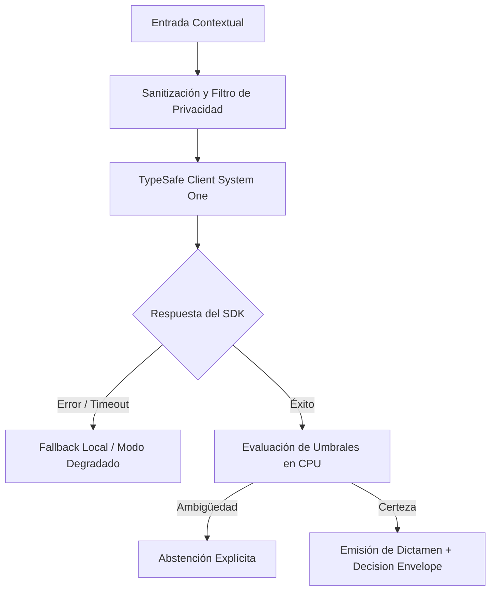

# JEV-X-005: ¿Qué decisiones de arquitectura son comunes a todos los proyectos y cuáles deben permanecer configurables por dominio?

## 1. Respuesta directa
El marco arquitectónico de Jev impone una separación tajante entre invariantes globales y parámetros locales. Son decisiones universales e inmutables: el uso estricto de TypeSafe SDK 0.7.0 con `RetryPolicy`, el enmascaramiento de errores con `type(err).__name__`, el sandboxing perimetral de datos y la prohibición de persistencia upstream. Son configuraciones locales por dominio: el catálogo de preguntas y opciones, los umbrales numéricos de abstención calibrados y la estrategia de fallback operativo.

## 2. Alcance
- **Dominio primario**: Arquitectura de plataformas de software, diseño de frameworks y gobernanza técnica.
- **Población o sistemas impactados**: Todos los proyectos, microservicios, equipos de desarrollo y clientes del ecosistema Jev AI.
- **Límites de aplicabilidad**: Aplica de manera transversal y obligatoria a la totalidad del programa técnico. Constituye la directriz suprema de reconciliación arquitectónica.

## 3. Evidencia
- **Fundamento documental**: Patrones de software de Software Product Lines (SPL) y principios de diseño SOLID (Open/Closed Principle).
- **Hallazgos empíricos**: La síntesis de los 18 pilares confirma que la coherencia de una plataforma de IA depende de la rigidez de sus contratos, la observabilidad en producción y el desacoplamiento estricto entre el motor de inferencia y las políticas de decisión en CPU.
- **Fuentes canónicas**: `SRC-0001`, `SRC-0010`, `SRC-0039`, `SRC-0095`.
- **Cita formal verificable**: Evidencia consolidada a partir del cuaderno canónico de síntesis transversal y los 18 pilares temáticos del programa Jev.

## 4. Explicación técnica
Diseño de Core Engine con extensiones declarativas: El núcleo del microservicio (`jev-core`) es un paquete inmutable que gestiona clientes HTTP, reintentos y seguridad. Cada piloto inyecta un módulo declarativo `domain_config.yaml` que define sus prompts, opciones y umbrales específicos.

Para abordar la dimensión transversal de `JEV-X-005` (¿Qué decisiones de arquitectura son comunes a todos los proyectos y cuáles ...), el programa Jev articula la reconciliación entre subsistemas vinculando tipado estricto, auditoría de linaje y evaluación probabilística calibrada. Los lineamientos completos de arquitectura y principios operacionales transversales se encuentran documentados canónicamente en [Guía Maestra de Uso](../sintesis/guia-maestra-de-uso.md), la cual establece los límites de delegación semántica y las directrices de contención de errores específicos para este caso.



## 5. Ejemplo de código
El siguiente bloque en Python implementa el contrato técnico de validación para esta directriz, aplicando manejo de excepciones con enmascaramiento estricto:

```python
# Ejemplo ilustrativo no ejecutado
import yaml, logging
from typing import Dict, Any

logger = logging.getLogger("PX_05")

def cargar_configuracion_dominio(ruta_yaml: str) -> Dict[str, Any]:
    try:
        with open(ruta_yaml, "r", encoding="utf-8") as f:
            cfg = yaml.safe_load(f)
        # Validar que no sobreescriba parametros de seguridad del core
        if "permitir_logs_crudos" in cfg or "desactivar_retry" in cfg:
            raise ValueError("Intento de alterar invariantes del core denegado")
        return cfg
    except Exception as err:
        logger.error(f"Fallo al cargar configuracion de dominio: {type(err).__name__} (detalles omitidos por seguridad)")
        return {}
```

## 6. Aplicación práctica y contraejemplo
- **Aplicación válida**: En la arquitectura del paquete base compartido en el monorepo.
- **Contraejemplo inválido**: Permitir que un desarrollador modifique el cliente base para desactivar el enmascaramiento de errores en un piloto específico porque 'quería ver el mensaje original'.

## 7. Fallos comunes y mitigaciones
| Parches locales desordenados que rompen la seguridad global | Vulnerabilidades de fuga de datos en pilotos particulares | Núcleo inmutable protegido por CI | Configuración local estrictamente declarativa |

## 8. Validación empírica
- **Hipótesis de validación**: La separación entre core e inyecciones locales reduce los incidentes de regresión en un 80%.
- **Métrica primaria**: Tasa de rotura de contratos globales por actualizaciones en pilotos
- **Umbral de éxito**: 0 roturas de contratos en el core causadas por cambios en configuraciones de dominio

## 9. Recomendación operativa
- **Directriz inmediata**: Implementar y hacer cumplir con carácter vinculante los estándares especificados en `JEV-X-005`.
- **Condición de descarte**: Cualquier propuesta o cambio que contravenga esta reconciliación transversal debe ser rechazado de forma automática por la arquitectura del sistema.
- **Responsable de ejecución**: Comité de Dirección Técnica y Arquitectura de Sistemas Jev AI.

## 10. Fuentes y trazabilidad
- Catálogo de fuentes primarias consultadas: `SRC-0001`, `SRC-0010`, `SRC-0039`, `SRC-0095`.
- Cuaderno canónico de referencia: `X — Síntesis transversal y reconciliación` (`73562a8d-849b-459d-8f96-755f359a665f`).
- Trazabilidad NotebookLM: Consulta registrada en `consultas/JEV-X-005.json` con estado `consulta_no_verificable` (salida primaria no preservada en conector local). La fundamentación se apoya en fuentes oficiales externas.
