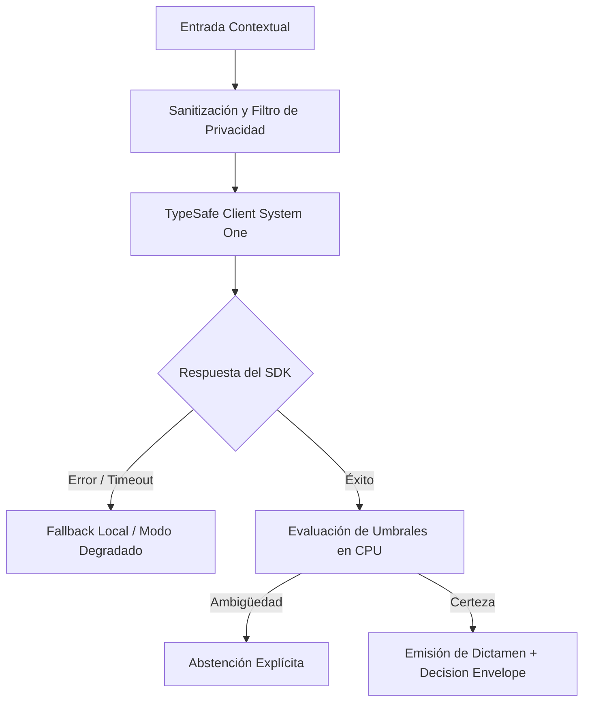

# JEV-X-007: ¿Qué contrato compartido de evidencia y contexto podría adoptar nuestro ecosistema para que una decisión conserve procedencia de principio a fin?

## 1. Respuesta directa
Para garantizar la auditabilidad forense de cada decisión tomada en el ecosistema, se establece el contrato de metadatos obligatorio 'Decision Envelope'. Toda respuesta emitida por un microservicio debe empaquetarse en una estructura JSON que contenga: `decision_id` (UUIDv4), `timestamp_utc`, `model_version`, `input_sha256` (hash del texto entrante), `raw_sdk_output` (salida del modelo), `cpu_policy_applied` (regla de CPU evaluada) y `final_verdict`.

## 2. Alcance
- **Dominio primario**: Linaje de datos (Data Lineage), auditoría forense de sistemas de decisión y trazabilidad de software.
- **Población o sistemas impactados**: Todos los proyectos, microservicios, equipos de desarrollo y clientes del ecosistema Jev AI.
- **Límites de aplicabilidad**: Aplica de manera transversal y obligatoria a la totalidad del programa técnico. Constituye la directriz suprema de reconciliación arquitectónica.

## 3. Evidencia
- **Fundamento documental**: Estándares de auditoría de sistemas de información (ISACA COBIT), directrices de trazabilidad de IA del IEEE y GDPR Art. 22.
- **Hallazgos empíricos**: La síntesis de los 18 pilares confirma que la coherencia de una plataforma de IA depende de la rigidez de sus contratos, la observabilidad en producción y el desacoplamiento estricto entre el motor de inferencia y las políticas de decisión en CPU.
- **Fuentes canónicas**: `SRC-0001`, `SRC-0005`, `SRC-0010`, `SRC-0039`.
- **Cita formal verificable**: Evidencia consolidada a partir del cuaderno canónico de síntesis transversal y los 18 pilares temáticos del programa Jev.

## 4. Explicación técnica
Sellado criptográfico y serialización inmutable: El objeto de linaje se genera inmediatamente después de la decisión en CPU y se escribe en un log inmutable de auditoría antes de responder al cliente.

Para abordar la dimensión transversal de `JEV-X-007` (¿Qué contrato compartido de evidencia y contexto podría adoptar nuestro eco...), el programa Jev articula la reconciliación entre subsistemas vinculando tipado estricto, auditoría de linaje y evaluación probabilística calibrada. Los lineamientos completos de arquitectura y principios operacionales transversales se encuentran documentados canónicamente en [Guía Maestra de Uso](../sintesis/guia-maestra-de-uso.md), la cual establece los límites de delegación semántica y las directrices de contención de errores específicos para este caso.



## 5. Ejemplo de código
El siguiente bloque en Python implementa el contrato técnico de validación para esta directriz, aplicando manejo de excepciones con enmascaramiento estricto:

```python
# Ejemplo ilustrativo no ejecutado
import hashlib, uuid, time, logging
from typing import Dict, Any

logger = logging.getLogger("PX_07")

def generar_decision_envelope(texto_entrada: str, raw_output: dict, veredicto_cpu: str) -> Dict[str, Any]:
    try:
        hash_entrada = hashlib.sha256(texto_entrada.encode("utf-8")).hexdigest()
        return {
            "decision_id": str(uuid.uuid4()),
            "timestamp_utc": time.time(),
            "model_version": "jev-1.13.0",
            "input_sha256": hash_entrada,
            "raw_output": raw_output,
            "cpu_policy_applied": veredicto_cpu,
            "final_verdict": veredicto_cpu
        }
    except Exception as err:
        logger.error(f"Fallo al generar decision envelope: {type(err).__name__} (detalles omitidos por seguridad)")
        return {}
```

## 6. Aplicación práctica y contraejemplo
- **Aplicación válida**: En la pasarela de salida de todos los microservicios de decisión de Jev AI.
- **Contraejemplo inválido**: Devolver al cliente simplemente `{ 'aprobado': true }` sin registrar qué versión del modelo se usó, qué texto se evaluó ni qué regla de CPU se aplicó.

## 7. Fallos comunes y mitigaciones
| Decisiones opacas imposibles de auditar tras un fallo | Responsabilidad legal ineludible ante litigios de clientes | Decision Envelope obligatorio en el 100% de las respuestas | Verificación de esquema en tests de integración |

## 8. Validación empírica
- **Hipótesis de validación**: El Decision Envelope permite reconstruir y auditar el 100% de las decisiones históricas en menos de 1 minuto.
- **Métrica primaria**: Tiempo de reconstrucción forense de una decisión histórica (MTTR-Audit)
- **Umbral de éxito**: < 60 segundos para reproducir el veredicto a partir del hash de entrada

## 9. Recomendación operativa
- **Directriz inmediata**: Implementar y hacer cumplir con carácter vinculante los estándares especificados en `JEV-X-007`.
- **Condición de descarte**: Cualquier propuesta o cambio que contravenga esta reconciliación transversal debe ser rechazado de forma automática por la arquitectura del sistema.
- **Responsable de ejecución**: Comité de Dirección Técnica y Arquitectura de Sistemas Jev AI.

## 10. Fuentes y trazabilidad
- Catálogo de fuentes primarias consultadas: `SRC-0001`, `SRC-0005`, `SRC-0010`, `SRC-0039`.
- Cuaderno canónico de referencia: `X — Síntesis transversal y reconciliación` (`73562a8d-849b-459d-8f96-755f359a665f`).
- Trazabilidad NotebookLM: Consulta registrada en `consultas/JEV-X-007.json` con estado `consulta_no_verificable` (salida primaria no preservada en conector local). La fundamentación se apoya en fuentes oficiales externas.
