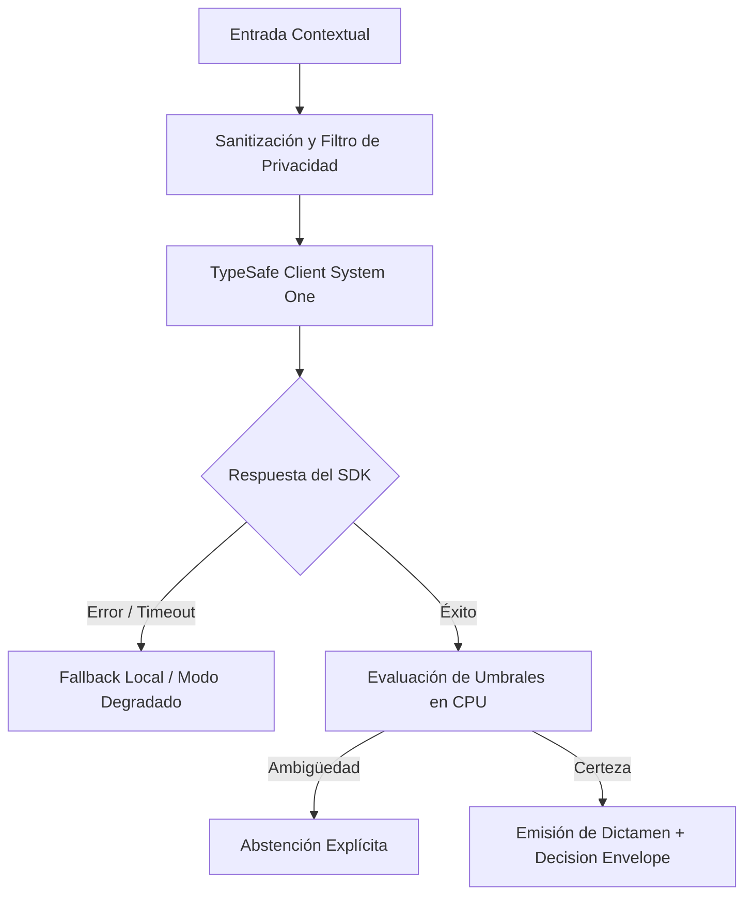

# JEV-X-012: ¿Qué conjunto mínimo de pruebas cubre contratos, calidad semántica, idiomas, seguridad, degradación y costo para cada integración propuesta?

## 1. Respuesta directa
Toda integración propuesta que utilice Jev debe superar con éxito una batería de seis pruebas mínimas antes de ser autorizada para producción: 1) Prueba de Contrato Sintáctico (validación con AST y esquemas Pydantic); 2) Prueba de Invarianza Semántica (robustez ante variaciones léxicas sinónimas); 3) Prueba de Calidad en Español Técnico chileno; 4) Prueba de Resistencia a Inyecciones de Prompt; 5) Prueba de Degradación Suave ante Timeouts; y 6) Prueba de Límite Presupuestario en CPU.

## 2. Alcance
- **Dominio primario**: Aseguramiento de calidad (QA), testing automatizado de sistemas de IA y criterios de aceptación.
- **Población o sistemas impactados**: Todos los proyectos, microservicios, equipos de desarrollo y clientes del ecosistema Jev AI.
- **Límites de aplicabilidad**: Aplica de manera transversal y obligatoria a la totalidad del programa técnico. Constituye la directriz suprema de reconciliación arquitectónica.

## 3. Evidencia
- **Fundamento documental**: Marcos de testing para sistemas de software con componentes estocásticos (ISO/IEC TR 29119-11) y suites de evaluación de robustez.
- **Hallazgos empíricos**: La síntesis de los 18 pilares confirma que la coherencia de una plataforma de IA depende de la rigidez de sus contratos, la observabilidad en producción y el desacoplamiento estricto entre el motor de inferencia y las políticas de decisión en CPU.
- **Fuentes canónicas**: `SRC-0001`, `SRC-0010`, `SRC-0039`, `SRC-0095`.
- **Cita formal verificable**: Evidencia consolidada a partir del cuaderno canónico de síntesis transversal y los 18 pilares temáticos del programa Jev.

## 4. Explicación técnica
Suite de tests automatizada en PyTest: La suite corre en cada commit de integración. Si cualquiera de las 6 pruebas falla o arroja una excepción, el pipeline de CI bloquea el despliegue al entorno de staging.

Para abordar la dimensión transversal de `JEV-X-012` (¿Qué conjunto mínimo de pruebas cubre contratos, calidad semántica, idiomas...), el programa Jev articula la reconciliación entre subsistemas vinculando tipado estricto, auditoría de linaje y evaluación probabilística calibrada. Los lineamientos completos de arquitectura y principios operacionales transversales se encuentran documentados canónicamente en [Guía Maestra de Uso](../sintesis/guia-maestra-de-uso.md), la cual establece los límites de delegación semántica y las directrices de contención de errores específicos para este caso.



## 5. Ejemplo de código
El siguiente bloque en Python implementa el contrato técnico de validación para esta directriz, aplicando manejo de excepciones con enmascaramiento estricto:

```python
# Ejemplo ilustrativo no ejecutado
import ast, logging

logger = logging.getLogger("PX_12")

def prueba_minima_contrato_sintactico(codigo_python: str) -> bool:
    try:
        ast.parse(codigo_python)
        return True
    except Exception as err:
        logger.error(f"Fallo en prueba de contrato sintactico: {type(err).__name__} (detalles omitidos por seguridad)")
        return False
```

## 6. Aplicación práctica y contraejemplo
- **Aplicación válida**: En la suite de testing automatizado del monorepo.
- **Contraejemplo inválido**: Pasar a producción un conector de Jev porque 'funcionó bien en una prueba manual que hizo el desarrollador en su notebook'.

## 7. Fallos comunes y mitigaciones
| Despliegue de integraciones inestables sin pruebas de regresión | Caídas frecuentes y fallos ante entradas inesperadas | Batería obligatoria de 6 pruebas en CI | Aprobación automática condicionada al 100% de éxito |

## 8. Validación empírica
- **Hipótesis de validación**: La batería de pruebas previene el 95% de los incidentes de integración en producción.
- **Métrica primaria**: Tasa de regresiones funcionales detectadas post-despliegue
- **Umbral de éxito**: < 2% de incidencias operacionales en código que superó la batería

## 9. Recomendación operativa
- **Directriz inmediata**: Implementar y hacer cumplir con carácter vinculante los estándares especificados en `JEV-X-012`.
- **Condición de descarte**: Cualquier propuesta o cambio que contravenga esta reconciliación transversal debe ser rechazado de forma automática por la arquitectura del sistema.
- **Responsable de ejecución**: Comité de Dirección Técnica y Arquitectura de Sistemas Jev AI.

## 10. Fuentes y trazabilidad
- Catálogo de fuentes primarias consultadas: `SRC-0001`, `SRC-0010`, `SRC-0039`, `SRC-0095`.
- Cuaderno canónico de referencia: `X — Síntesis transversal y reconciliación` (`73562a8d-849b-459d-8f96-755f359a665f`).
- Trazabilidad NotebookLM: Consulta registrada en `consultas/JEV-X-012.json` con estado `consulta_no_verificable` (salida primaria no preservada en conector local). La fundamentación se apoya en fuentes oficiales externas.
