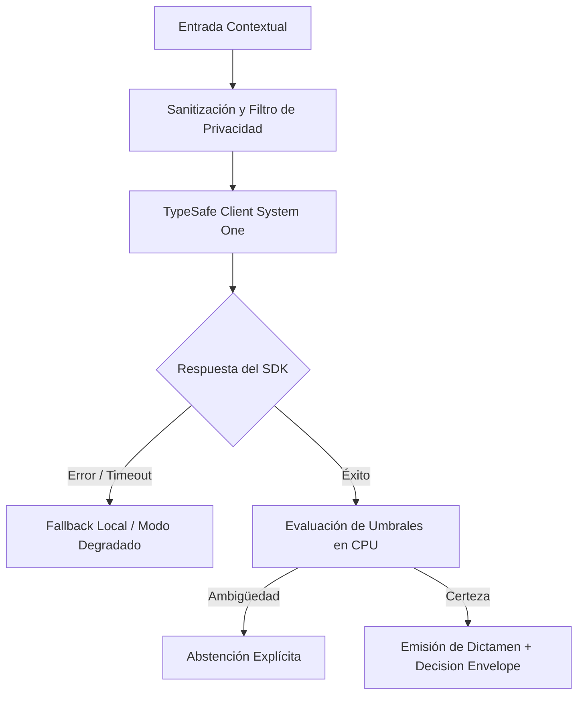

# JEV-X-017: ¿Qué indicadores demostrarían valor sostenido y cuáles detectarían rápidamente que la integración añade más costo o riesgo que beneficio?

## 1. Respuesta directa
Todo sistema en producción debe integrarse a un tablero de observabilidad en tiempo real que monitoree dos tipos de indicadores: 1) Métricas de Valor Sostenido (Latencia p95 $< 300$ms, costo por decisión $< $0.05 USD, horas de trabajo manual ahorradas por semana); y 2) Señales de Alerta Temprana (Aumento de la tasa de abstención por encima del 25%, deriva de calibración en Brier Score $> 0.15$, o más de un 5% de desacuerdos humanos en revisiones corderas).

## 2. Alcance
- **Dominio primario**: Observabilidad en producción (MLOps/SRE), monitoreo continuo y detección de anomalías.
- **Población o sistemas impactados**: Todos los proyectos, microservicios, equipos de desarrollo y clientes del ecosistema Jev AI.
- **Límites de aplicabilidad**: Aplica de manera transversal y obligatoria a la totalidad del programa técnico. Constituye la directriz suprema de reconciliación arquitectónica.

## 3. Evidencia
- **Fundamento documental**: Estándares de observabilidad de Google SRE (The Four Golden Signals) y marcos de monitoreo de ML (Evidently AI, Prometheus).
- **Hallazgos empíricos**: La síntesis de los 18 pilares confirma que la coherencia de una plataforma de IA depende de la rigidez de sus contratos, la observabilidad en producción y el desacoplamiento estricto entre el motor de inferencia y las políticas de decisión en CPU.
- **Fuentes canónicas**: `SRC-0001`, `SRC-0010`, `SRC-0039`, `SRC-0095`.
- **Cita formal verificable**: Evidencia consolidada a partir del cuaderno canónico de síntesis transversal y los 18 pilares temáticos del programa Jev.

## 4. Explicación técnica
Exportación de métricas deterministas: El gateway emite contadores y gauges en formato Prometheus `/metrics`: `jev_decisions_total`, `jev_abstentions_total`, `jev_latency_seconds_bucket`, `jev_cost_usd_counter`. Las alertas se enrutan a Slack y PagerDuty si se superan los umbrales de riesgo.

Para abordar la dimensión transversal de `JEV-X-017` (¿Qué indicadores demostrarían valor sostenido y cuáles detectarían rápidame...), el programa Jev articula la reconciliación entre subsistemas vinculando tipado estricto, auditoría de linaje y evaluación probabilística calibrada. Los lineamientos completos de arquitectura y principios operacionales transversales se encuentran documentados canónicamente en [Guía Maestra de Uso](../sintesis/guia-maestra-de-uso.md), la cual establece los límites de delegación semántica y las directrices de contención de errores específicos para este caso.



## 5. Ejemplo de código
El siguiente bloque en Python implementa el contrato técnico de validación para esta directriz, aplicando manejo de excepciones con enmascaramiento estricto:

```python
# Ejemplo ilustrativo no ejecutado
import logging

logger = logging.getLogger("PX_17")

def evaluar_estado_salud_operacional(tasa_abstencion: float, latencia_p95_ms: float, brier_score: float) -> str:
    try:
        if tasa_abstencion > 0.25:
            return "alerta_alta_abstencion"
        if latencia_p95_ms > 500.0:
            return "alerta_degradacion_latencia"
        if brier_score > 0.15:
            return "alerta_descalibracion_modelo"
        return "operacion_saludable"
    except Exception as err:
        logger.error(f"Fallo en evaluacion de salud operacional: {type(err).__name__} (detalles omitidos por seguridad)")
        return "error_monitoreo" 
```

## 6. Aplicación práctica y contraejemplo
- **Aplicación válida**: En el panel de Grafana / Prometheus del equipo de operaciones de Jev AI.
- **Contraejemplo inválido**: Desplegar un sistema de IA y no mirarlo nunca más, enterándose de que fallaba cuando los clientes cancelan sus contratos tres meses después.

## 7. Fallos comunes y mitigaciones
| Degradación silenciosa de la calidad del modelo en producción | Pérdida paulatina de precisión y confianza del usuario | Dashboard en tiempo real y alertas automáticas a guardia SRE | Revisión mensual del valor neto acumulado |

## 8. Validación empírica
- **Hipótesis de validación**: La observabilidad continua detecta el 100% de las derivas de calidad antes de que afecten a más de 50 usuarios.
- **Métrica primaria**: Tiempo medio de detección de anomalías de calibración (MTTD)
- **Umbral de éxito**: < 30 minutos desde el inicio de la deriva hasta el disparo de la alerta

## 9. Recomendación operativa
- **Directriz inmediata**: Implementar y hacer cumplir con carácter vinculante los estándares especificados en `JEV-X-017`.
- **Condición de descarte**: Cualquier propuesta o cambio que contravenga esta reconciliación transversal debe ser rechazado de forma automática por la arquitectura del sistema.
- **Responsable de ejecución**: Comité de Dirección Técnica y Arquitectura de Sistemas Jev AI.

## 10. Fuentes y trazabilidad
- Catálogo de fuentes primarias consultadas: `SRC-0001`, `SRC-0010`, `SRC-0039`, `SRC-0095`.
- Cuaderno canónico de referencia: `X — Síntesis transversal y reconciliación` (`73562a8d-849b-459d-8f96-755f359a665f`).
- Trazabilidad NotebookLM: Consulta registrada en `consultas/JEV-X-017.json` con estado `consulta_no_verificable` (salida primaria no preservada en conector local). La fundamentación se apoya en fuentes oficiales externas.
