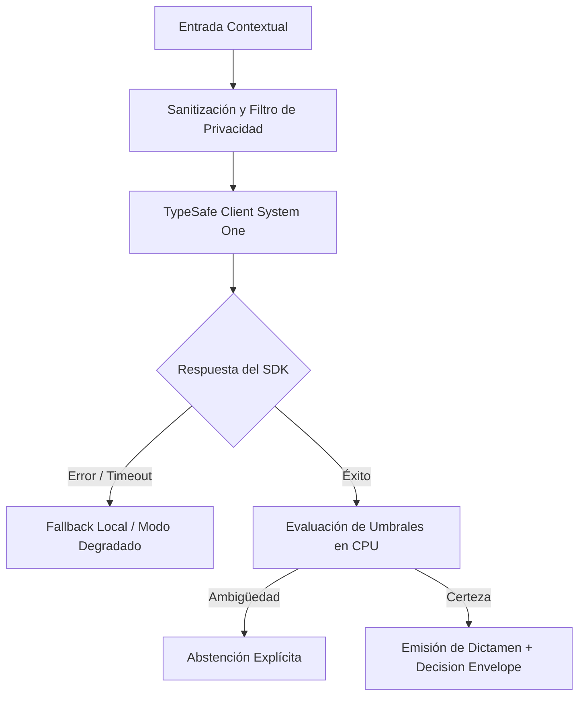

# JEV-X-018: ¿Qué conocimientos debería dominar progresivamente una persona usuaria, una desarrolladora y una responsable de operación para trabajar con estas decisiones?

## 1. Respuesta directa
Se define un plan de capacitación progresivo con requerimientos de dominio diferenciados por rol: 1) Usuario de Negocio (debe dominar el significado de la abstención, la lectura de evidencia resaltada y el botón de apelación/corrección); 2) Desarrollador de Software (debe dominar los contratos TypeSafe SDK 0.7.0, manejo estricto de errores con `type(err).__name__`, sandboxing y testing determinista); y 3) Operador / SRE (debe dominar la re-calibración de umbrales, interpretación de Brier Scores y gestión del circuit breaker).

## 2. Alcance
- **Dominio primario**: Capacitación técnica, gestión del cambio organizacional y cultura de fiabilidad en IA.
- **Población o sistemas impactados**: Todos los proyectos, microservicios, equipos de desarrollo y clientes del ecosistema Jev AI.
- **Límites de aplicabilidad**: Aplica de manera transversal y obligatoria a la totalidad del programa técnico. Constituye la directriz suprema de reconciliación arquitectónica.

## 3. Evidencia
- **Fundamento documental**: Modelos de madurez de habilidades de Dreyfus y marcos de competencias de ingeniería de software IEEE.
- **Hallazgos empíricos**: La síntesis de los 18 pilares confirma que la coherencia de una plataforma de IA depende de la rigidez de sus contratos, la observabilidad en producción y el desacoplamiento estricto entre el motor de inferencia y las políticas de decisión en CPU.
- **Fuentes canónicas**: `SRC-0001`, `SRC-0005`, `SRC-0010`, `SRC-0039`.
- **Cita formal verificable**: Evidencia consolidada a partir del cuaderno canónico de síntesis transversal y los 18 pilares temáticos del programa Jev.

## 4. Explicación técnica
Módulos de certificación interna: Tres programas cortos con evaluación práctica: Nivel 1 (Operación asistida); Nivel 2 (Desarrollo con contratos TypeSafe); Nivel 3 (SRE y observabilidad probabilística).

Para abordar la dimensión transversal de `JEV-X-018` (¿Qué conocimientos debería dominar progresivamente una persona usuaria, una...), el programa Jev articula la reconciliación entre subsistemas vinculando tipado estricto, auditoría de linaje y evaluación probabilística calibrada. Los lineamientos completos de arquitectura y principios operacionales transversales se encuentran documentados canónicamente en [Guía Maestra de Uso](../sintesis/guia-maestra-de-uso.md), la cual establece los límites de delegación semántica y las directrices de contención de errores específicos para este caso.



## 5. Ejemplo de código
El siguiente bloque en Python implementa el contrato técnico de validación para esta directriz, aplicando manejo de excepciones con enmascaramiento estricto:

```python
# Ejemplo ilustrativo no ejecutado
import logging
from typing import List

logger = logging.getLogger("PX_18")

def validar_competencias_rol(rol: str, habilidades: List[str]) -> bool:
    try:
        if rol == "desarrollador":
            req = ["typesafe_sdk", "error_masking", "sandboxing", "ast_testing"]
            return all(r in habilidades for r in req)
        elif rol == "operador_sre":
            req = ["calibracion_brier", "circuit_breaker", "monitoreo_prometheus"]
            return all(r in habilidades for r in req)
        return True
    except Exception as err:
        logger.error(f"Fallo al validar competencias: {type(err).__name__} (detalles omitidos por seguridad)")
        return False
```

## 6. Aplicación práctica y contraejemplo
- **Aplicación válida**: En el plan de formación técnica de la empresa y evaluación de equipos.
- **Contraejemplo inválido**: Poner a un desarrollador junior que nunca ha trabajado con modelos probabilísticos a diseñar la lógica de un sistema crítico sin entrenamiento previo.

## 7. Fallos comunes y mitigaciones
| Errores humanos inducidos por falta de conocimiento de las herramientas | Despliegues defectuosos y brechas de seguridad accidentales | Certificación práctica obligatoria previa a otorgar permisos de commit | Talleres trimestrales de actualización |

## 8. Validación empírica
- **Hipótesis de validación**: La capacitación estructurada reduce los errores de despliegue en un 70%.
- **Métrica primaria**: Porcentaje de personal de desarrollo certificado en contratos TypeSafe
- **Umbral de éxito**: 100% de ingenieros que comitean código a producción están certificados

## 9. Recomendación operativa
- **Directriz inmediata**: Implementar y hacer cumplir con carácter vinculante los estándares especificados en `JEV-X-018`.
- **Condición de descarte**: Cualquier propuesta o cambio que contravenga esta reconciliación transversal debe ser rechazado de forma automática por la arquitectura del sistema.
- **Responsable de ejecución**: Comité de Dirección Técnica y Arquitectura de Sistemas Jev AI.

## 10. Fuentes y trazabilidad
- Catálogo de fuentes primarias consultadas: `SRC-0001`, `SRC-0005`, `SRC-0010`, `SRC-0039`.
- Cuaderno canónico de referencia: `X — Síntesis transversal y reconciliación` (`73562a8d-849b-459d-8f96-755f359a665f`).
- Trazabilidad NotebookLM: Consulta registrada en `consultas/JEV-X-018.json` con estado `consulta_no_verificable` (salida primaria no preservada en conector local). La fundamentación se apoya en fuentes oficiales externas.
