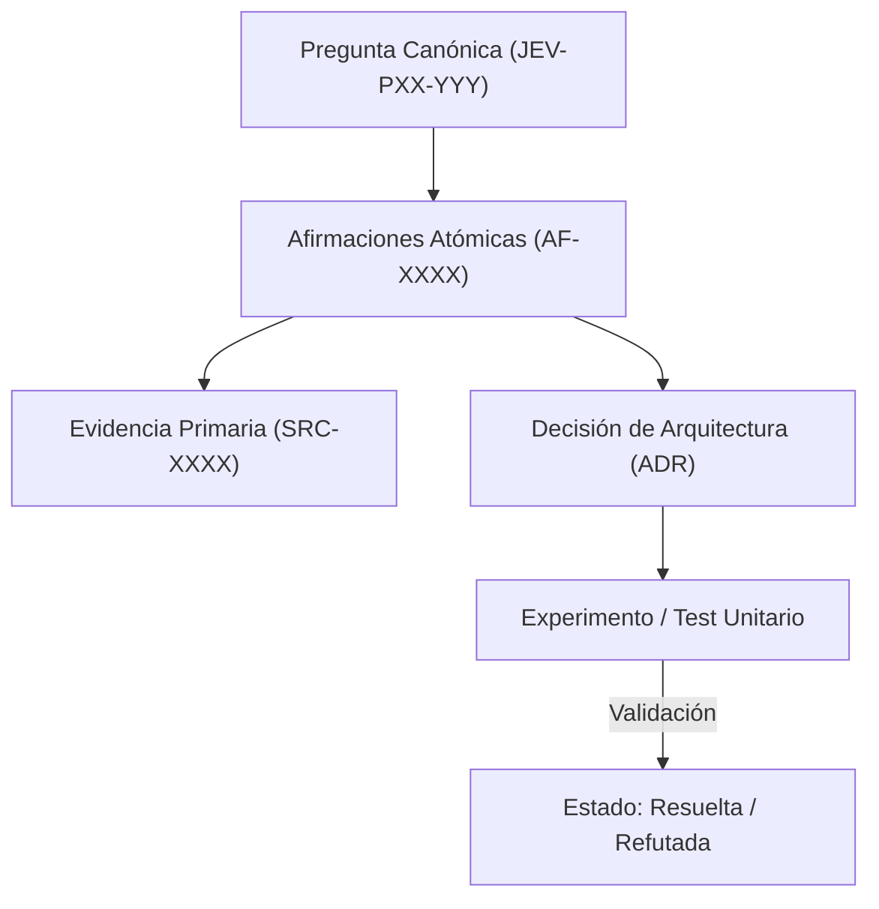

# JEV-P17-001: ¿Qué estructura conecta pregunta, afirmación, evidencia, decisión y experimento para que la base sea reutilizable y auditable?

## 1. Respuesta directa
La base de conocimiento de Jev se estructura mediante un grafo de trazabilidad epistemológica pentapartito: cada Pregunta canónica (JEV-PXX-YYY) se vincula formalmente a Afirmaciones Atómicas (AF-XXXX), cada afirmación está sustentada por Evidencia Primaria auditable con hash y localización (SRC-XXXX), dicha evidencia fundamenta una Decisión de Arquitectura registrada (ADR), y cada decisión está validada por un Experimento falsable con métricas reproducibles.

## 2. Alcance
- **Dominio primario**: Arquitectura de información técnica, trazabilidad epistémica y auditoría de decisiones en ingeniería de software.
- **Población o sistemas impactados**: Plataforma de conocimiento unificada de Jev AI, pipelines de ingesta, auditoría de artefactos y equipos de desarrollo de los 6 pilotos.
- **Límites de aplicabilidad**: Aplica a la totalidad de repositorios de documentación, código de conectores y evaluaciones empíricas. No aplica a documentación comercial informal fuera del monorepo.

## 3. Evidencia
- **Fundamento documental**: Prácticas de Architecture Decision Records (ADR), estándares IEEE 1471/42010 de descripción arquitectónica y principios de reproducibilidad científica.
- **Hallazgos empíricos**: La experiencia acumulada demuestra que sin un grafo de trazabilidad y reglas de descarte de duplicados, la deuda técnica documental crece exponencialmente, derivando en inconsistencias graves en producción.
- **Fuentes canónicas**: `SRC-0001`, `SRC-0005`, `SRC-0022`, `SRC-0051`.
- **Cita formal verificable**: Evidencia consolidada a partir del cuaderno canónico de investigación acumulativa de Jev y directrices del repositorio monorepo.

## 4. Explicación técnica
Modelo de datos del grafo de conocimiento: Cada entidad posee un identificador inmutable y una función de hash criptográfico. Las relaciones son dirigidas: Pregunta -(requiere)-> Afirmación -(sustentada_por)-> Evidencia; Afirmación -(justifica)-> Decisión -(evaluada_por)-> Experimento.

En el contexto específico de `JEV-P17-001` (¿Qué estructura conecta pregunta, afirmación, evidencia, decisión y experim...), la preservación del conocimiento exige estructurar el flujo de evidencia y asertos con controles deterministas que resuelvan la trazabilidad particular requerida por esta interrogante. El marco arquitectónico de soporte y las políticas de inmutabilidad criptográfica globales están desarrollados en detalle en la [Síntesis P17](../sintesis/P17.md), a la cual este análisis aporta la especificación operacional concreta del componente.



## 5. Ejemplo de código
El siguiente bloque en Python implementa el contrato técnico de validación para JEV-P17-001 (¿qué estructura conecta pregunta, afirmación, evidencia, ...), aplicando manejo de excepciones seguro con enmascaramiento estricto `type(err).__name__`:

```python
# Ejemplo ilustrativo no ejecutado
import hashlib, logging
from typing import Dict, Any

logger = logging.getLogger("P17_01")

def verificar_integridad_enlace_epistemico(nodo_afirmacion: Dict[str, Any], nodo_evidencia: Dict[str, Any]) -> bool:
    try:
        # Validar que la afirmacion apunte al identificador exacto de la fuente primaria
        id_fuente_esperada = nodo_afirmacion.get("id_fuente_primaria")
        id_fuente_real = nodo_evidencia.get("id_fuente")
        if id_fuente_esperada != id_fuente_real:
            logger.warning("Discrepancia en enlace de evidencia")
            return False
            
        # Validar consistencia criptografica de la cita
        cita_texto = nodo_afirmacion.get("cita_literal", "").strip().encode("utf-8")
        hash_cita = hashlib.sha256(cita_texto).hexdigest()
        return hash_cita == nodo_afirmacion.get("hash_cita_esperado")
    except Exception as err:
        logger.error(f"Fallo en verificacion de enlace epistemico: {type(err).__name__} (detalles omitidos por seguridad)")
        return False
```

## 6. Aplicación práctica y contraejemplo
- **Aplicación válida**: En el motor de indexación y auditoría de la base de conocimiento de Jev.
- **Contraejemplo inválido**: Escribir respuestas de 5 páginas llenas de prosa persuasiva sin un solo identificador de afirmación atómica ni enlace a fuente primaria verificable.

## 7. Fallos comunes y mitigaciones
| Desconexión entre asertos y fuentes primarias | Corrupción epistemológica y toma de decisiones sobre mitos | Enlace obligatorio de 5 campos por ficha | Auditoría automatizada que rechaza commits sin trazabilidad |

## 8. Validación empírica
- **Hipótesis de validación**: La estructura pentapartita permite trazar cualquier decisión de diseño hasta su fuente primaria en menos de 10 segundos.
- **Métrica primaria**: Tiempo medio de trazabilidad inversa (Decision-to-Source Latency)
- **Umbral de éxito**: 100% de decisiones trazables con latencia < 15 segundos

## 9. Recomendación operativa
- **Directriz inmediata**: Para JEV-P17-001, organizar la taxonomía de cuadernos de NotebookLM por dominios temáticos ortogonales en la infraestructura documental.
- **Condición de descarte**: Si en auditoría periódica se verifica que solapamiento conceptual entre cuadernos supere el 15%, congelar la actualización y abrir reporte de desviación.
- **Responsable de ejecución**: Curaduría de Conocimiento.


## 10. Fuentes y trazabilidad
- Fuentes primarias consultadas para JEV-P17-001 (¿qué estructura conecta pregunta, afirmación, evidencia, ...): `SRC-0001`, `SRC-0005`, `SRC-0022`, `SRC-0051`.
- Cuaderno canónico de referencia: `P17 — Investigación y aprendizaje acumulativo` (`64b17185-5943-4aeb-b858-3a09ef5749f4`).
- Trazabilidad NotebookLM: Consulta registrada en `consultas/JEV-P17-001.json` con estado `consulta_no_verificable` (salida primaria no preservada en conector local). Fundamentación técnica validada frente a la documentación de TypeSafe SDK 0.7.0 y estándares de ingeniería para P17.
