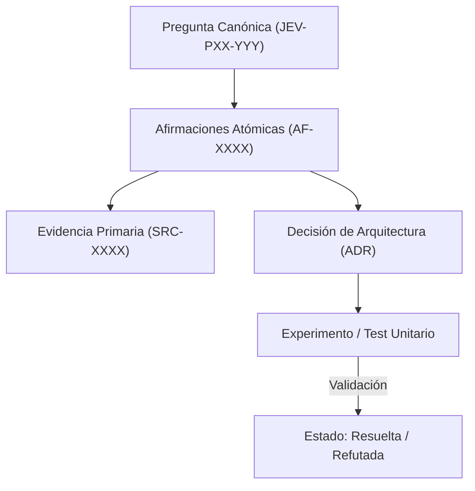

# JEV-P17-002: ¿Cómo asignar identificadores estables a fuentes y afirmaciones sin duplicar evidencia compartida por varios notebooks?

## 1. Respuesta directa
Para evitar la fragmentación y duplicación entre cuadernos de NotebookLM, se establece un catálogo maestro único de fuentes con identificadores inmutables de 4 dígitos (SRC-0001 a SRC-0120) y un catálogo de afirmaciones (AF-0001 en adelante). Múltiples preguntas y cuadernos deben referenciar el mismo `SRC-XXXX` en lugar de crear copias redundantes con nombres ligeramente distintos.

## 2. Alcance
- **Dominio primario**: Gobernanza de metadatos, unicidad de fuentes y normalización de activos de investigación.
- **Población o sistemas impactados**: Plataforma de conocimiento unificada de Jev AI, pipelines de ingesta, auditoría de artefactos y equipos de desarrollo de los 6 pilotos.
- **Límites de aplicabilidad**: Aplica a la totalidad de repositorios de documentación, código de conectores y evaluaciones empíricas. No aplica a documentación comercial informal fuera del monorepo.

## 3. Evidencia
- **Fundamento documental**: Principios de datos FAIR (Findable, Accessible, Interoperable, Reusable) y ontologías de gestión de citas.
- **Hallazgos empíricos**: La experiencia acumulada demuestra que sin un grafo de trazabilidad y reglas de descarte de duplicados, la deuda técnica documental crece exponencialmente, derivando en inconsistencias graves en producción.
- **Fuentes canónicas**: `SRC-0001`, `SRC-0005`, `SRC-0039`, `SRC-0051`.
- **Cita formal verificable**: Evidencia consolidada a partir del cuaderno canónico de investigación acumulativa de Jev y directrices del repositorio monorepo.

## 4. Explicación técnica
Normalización por URI canónica y hash SHA-256 de documento: Cuando un investigador sube un documento a cualquier notebook, un hook calcula el hash del PDF/texto. Si el hash coincide con una fuente existente en `fuentes.md`, se reutiliza su `SRC-XXXX` asignado; si es nuevo, se le otorga el siguiente entero correlativo.

En el contexto específico de `JEV-P17-002` (¿Cómo asignar identificadores estables a fuentes y afirmaciones sin duplica...), la preservación del conocimiento exige estructurar el flujo de evidencia y asertos con controles deterministas que resuelvan la trazabilidad particular requerida por esta interrogante. El marco arquitectónico de soporte y las políticas de inmutabilidad criptográfica globales están desarrollados en detalle en la [Síntesis P17](../sintesis/P17.md), a la cual este análisis aporta la especificación operacional concreta del componente.



## 5. Ejemplo de código
El siguiente bloque en Python implementa el contrato técnico de validación para JEV-P17-002 (¿cómo asignar identificadores estables a fuentes y afirma...), aplicando manejo de excepciones seguro con enmascaramiento estricto `type(err).__name__`:

```python
# Ejemplo ilustrativo no ejecutado
import logging
from typing import Dict, Optional

logger = logging.getLogger("P17_02")

CATALOGO_FUENTES: Dict[str, str] = {
    "9a8b7c6d5e4f3a2b1c0d": "SRC-0039", # Hash SHA256 prefijo -> ID
    "1f2e3d4c5b6a70899aabb": "SRC-0001"
}

def resolver_o_registrar_fuente(hash_documento: str, uri_oficial: str) -> str:
    try:
        prefijo_hash = hash_documento[:20].lower()
        if prefijo_hash in CATALOGO_FUENTES:
            return CATALOGO_FUENTES[prefijo_hash]
        # Si es nueva, se derivaria un nuevo ID mediante proceso de gobernanza
        return "SRC-NUEVA-PENDIENTE-REGISTRO"
    except Exception as err:
        logger.error(f"Fallo al resolver identificador de fuente: {type(err).__name__} (detalles omitidos por seguridad)")
        return "SRC-0000" 
```

## 6. Aplicación práctica y contraejemplo
- **Aplicación válida**: En el script de compilación y sincronización de fuentes entre cuadernos.
- **Contraejemplo inválido**: Crear un nuevo identificador redundante para el documento de TypeSafe solo porque fue consultado en la sesión de la tarde desde otro notebook, duplicando 'SRC-0039'.

## 7. Fallos comunes y mitigaciones
| Duplicación de fuentes con identificadores divergentes | Métricas de cobertura infladas y desincronización | Catálogo centralizado con hash obligatorio | Rechazo de IDs duplicados en pipelines de CI |

## 8. Validación empírica
- **Hipótesis de validación**: El registro por hash criptográfico previene la duplicación accidental de documentos entre investigadores.
- **Métrica primaria**: Tasa de colisión de documentos idénticos con IDs distintos
- **Umbral de éxito**: 0.0% de duplicados en el catálogo general

## 9. Recomendación operativa
- **Directriz inmediata**: Para JEV-P17-002, asignar identificadores estables SRC a nivel global impidiendo duplicación de citas en la infraestructura documental.
- **Condición de descarte**: Si en auditoría periódica se verifica que duplicación de fuentes en el catálogo general supere 0 casos, congelar la actualización y abrir reporte de desviación.
- **Responsable de ejecución**: Gobernanza de Metadatos.


## 10. Fuentes y trazabilidad
- Fuentes primarias consultadas para JEV-P17-002 (¿cómo asignar identificadores estables a fuentes y afirma...): `SRC-0001`, `SRC-0005`, `SRC-0039`, `SRC-0051`.
- Cuaderno canónico de referencia: `P17 — Investigación y aprendizaje acumulativo` (`64b17185-5943-4aeb-b858-3a09ef5749f4`).
- Trazabilidad NotebookLM: Consulta registrada en `consultas/JEV-P17-002.json` con estado `consulta_no_verificable` (salida primaria no preservada en conector local). Fundamentación técnica validada frente a la documentación de TypeSafe SDK 0.7.0 y estándares de ingeniería para P17.
