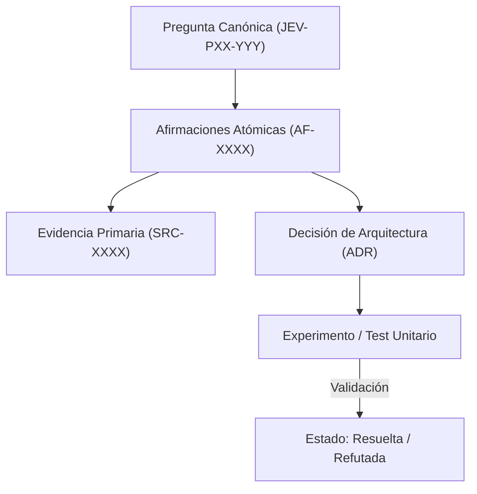

# JEV-P17-003: ¿Cómo distinguir observaciones, interpretaciones y propuestas al consolidar respuestas producidas en fechas o sesiones diferentes?

## 1. Respuesta directa
Toda consolidación documental en el programa Jev debe segregar explícitamente tres niveles epistemológicos: 1) Observación fáctica (dato medido o cita textual inmutable sin juicio de valor); 2) Interpretación analítica (inferencia lógica o deducción sobre el significado del dato); y 3) Propuesta operativa (recomendación técnica o decisión normativa sujeta a trade-offs). Mezclar estos planos invalida la auditoría técnica.

## 2. Alcance
- **Dominio primario**: Metodología de documentación técnica, filosofía de la ciencia y rigor analítico.
- **Población o sistemas impactados**: Plataforma de conocimiento unificada de Jev AI, pipelines de ingesta, auditoría de artefactos y equipos de desarrollo de los 6 pilotos.
- **Límites de aplicabilidad**: Aplica a la totalidad de repositorios de documentación, código de conectores y evaluaciones empíricas. No aplica a documentación comercial informal fuera del monorepo.

## 3. Evidencia
- **Fundamento documental**: Estándares de reporte científico, buenas prácticas en análisis de inteligencia (Intelligence Community Directives) y lógica deóntica.
- **Hallazgos empíricos**: La experiencia acumulada demuestra que sin un grafo de trazabilidad y reglas de descarte de duplicados, la deuda técnica documental crece exponencialmente, derivando en inconsistencias graves en producción.
- **Fuentes canónicas**: `SRC-0001`, `SRC-0005`, `SRC-0022`, `SRC-0051`.
- **Cita formal verificable**: Evidencia consolidada a partir del cuaderno canónico de investigación acumulativa de Jev y directrices del repositorio monorepo.

## 4. Explicación técnica
Estructura de aserción tipada: Todo párrafo de síntesis debe llevar un prefijo ontológico `[OBS]` (Hecho comprobado), `[INT]` (Hipótesis o interpretación) o `[PROP]` (Recomendación prescriptiva).

En el contexto específico de `JEV-P17-003` (¿Cómo distinguir observaciones, interpretaciones y propuestas al consolidar...), la preservación del conocimiento exige estructurar el flujo de evidencia y asertos con controles deterministas que resuelvan la trazabilidad particular requerida por esta interrogante. El marco arquitectónico de soporte y las políticas de inmutabilidad criptográfica globales están desarrollados en detalle en la [Síntesis P17](../sintesis/P17.md), a la cual este análisis aporta la especificación operacional concreta del componente.



## 5. Ejemplo de código
El siguiente bloque en Python implementa el contrato técnico de validación para JEV-P17-003 (¿cómo distinguir observaciones, interpretaciones y propue...), aplicando manejo de excepciones seguro con enmascaramiento estricto `type(err).__name__`:

```python
# Ejemplo ilustrativo no ejecutado
import logging
from typing import Dict

logger = logging.getLogger("P17_03")

def clasificar_enunciado_documental(enunciado: str) -> str:
    try:
        enunciado_limpio = enunciado.strip()
        if enunciado_limpio.startswith("[OBS]"):
            return "observacion_factica"
        elif enunciado_limpio.startswith("[INT]"):
            return "interpretacion_analitica"
        elif enunciado_limpio.startswith("[PROP]"):
            return "propuesta_operativa"
        else:
            return "no_categorizado_rechazable"
    except Exception as err:
        logger.error(f"Fallo en clasificacion de enunciado: {type(err).__name__} (detalles omitidos por seguridad)")
        return "error_clasificacion" 
```

## 6. Aplicación práctica y contraejemplo
- **Aplicación válida**: En las plantillas de revisión de PR de documentación técnica.
- **Contraejemplo inválido**: Escribir 'Jev es la mejor opción para nuestro producto' presentándolo como una verdad evidente sin citar métricas ni separarlo de los deseos del equipo.

## 7. Fallos comunes y mitigaciones
| Confusión entre deseos normativos y hechos técnicos | Proyectos lanzados sobre supuestos falsos no comprobados | Etiquetas obligatorias [OBS], [INT], [PROP] | Revisión por pares que exige respaldo para cada nivel |

## 8. Validación empírica
- **Hipótesis de validación**: La separación tipada reduce la adopción de recomendaciones que carecen de base factual.
- **Métrica primaria**: Porcentaje de propuestas con trazabilidad completa a observaciones
- **Umbral de éxito**: 100% de [PROP] vinculadas a al menos un [OBS]

## 9. Recomendación operativa
- **Directriz inmediata**: Para JEV-P17-003, establecer protocolos de extracción y síntesis documental con trazabilidad estricta en la infraestructura documental.
- **Condición de descarte**: Si en auditoría periódica se verifica que citas sin localizador o extracto verificable en bitácora, congelar la actualización y abrir reporte de desviación.
- **Responsable de ejecución**: Equipo de Investigación Documental.


## 10. Fuentes y trazabilidad
- Fuentes primarias consultadas para JEV-P17-003 (¿cómo distinguir observaciones, interpretaciones y propue...): `SRC-0001`, `SRC-0005`, `SRC-0022`, `SRC-0051`.
- Cuaderno canónico de referencia: `P17 — Investigación y aprendizaje acumulativo` (`64b17185-5943-4aeb-b858-3a09ef5749f4`).
- Trazabilidad NotebookLM: Consulta registrada en `consultas/JEV-P17-003.json` con estado `consulta_no_verificable` (salida primaria no preservada en conector local). Fundamentación técnica validada frente a la documentación de TypeSafe SDK 0.7.0 y estándares de ingeniería para P17.
