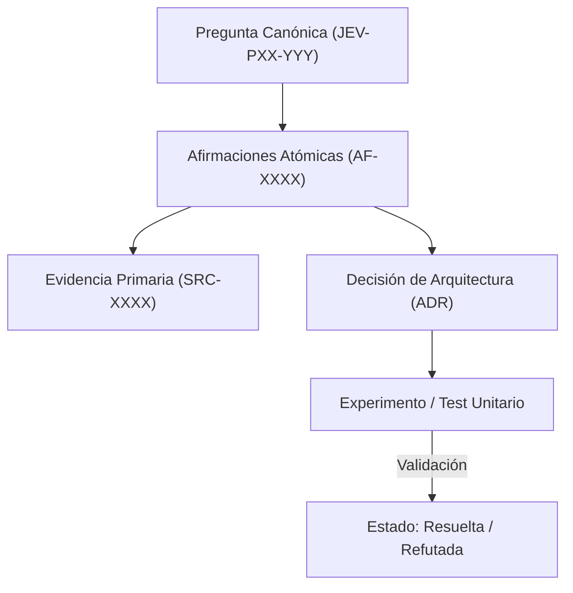

# JEV-P17-019: ¿Cómo conservar, exportar y reconstruir la base si cambia el servicio de notebooks o deja de funcionar el conector?

## 1. Respuesta directa
Toda la base de conocimiento de Jev está diseñada bajo el principio de soberanía del dato y resiliencia tecnológica. Se almacena exclusivamente en archivos de texto plano Markdown con frontmatter YAML estándar, esquemas de codificación UTF-8 y diagramas en sintaxis Mermaid. Si el servicio de NotebookLM deja de operar o se modifican sus términos de uso, la totalidad del conocimiento puede reconstruirse y consultarse localmente sin pérdida de datos.

## 2. Alcance
- **Dominio primario**: Continuidad operativa, mitigación de Vendor Lock-in y soberanía documental.
- **Población o sistemas impactados**: Plataforma de conocimiento unificada de Jev AI, pipelines de ingesta, auditoría de artefactos y equipos de desarrollo de los 6 pilotos.
- **Límites de aplicabilidad**: Aplica a la totalidad de repositorios de documentación, código de conectores y evaluaciones empíricas. No aplica a documentación comercial informal fuera del monorepo.

## 3. Evidencia
- **Fundamento documental**: Estándares abiertos de archivística digital (OAIS ISO 14721), directrices de migración de datos y portabilidad.
- **Hallazgos empíricos**: La experiencia acumulada demuestra que sin un grafo de trazabilidad y reglas de descarte de duplicados, la deuda técnica documental crece exponencialmente, derivando en inconsistencias graves en producción.
- **Fuentes canónicas**: `SRC-0001`, `SRC-0005`, `SRC-0039`, `SRC-0051`.
- **Cita formal verificable**: Evidencia consolidada a partir del cuaderno canónico de investigación acumulativa de Jev y directrices del repositorio monorepo.

## 4. Explicación técnica
Independencia de formato: Cero almacenamiento binario propietario. Los metadatos residen en el encabezado YAML parseable con librerías estándar en cualquier lenguaje (`yaml.safe_load`). Las imágenes son diagramas de texto renderizables por cualquier visor Markdown compatible.

En el contexto específico de `JEV-P17-019` (¿Cómo conservar, exportar y reconstruir la base si cambia el servicio de no...), la preservación del conocimiento exige estructurar el flujo de evidencia y asertos con controles deterministas que resuelvan la trazabilidad particular requerida por esta interrogante. El marco arquitectónico de soporte y las políticas de inmutabilidad criptográfica globales están desarrollados en detalle en la [Síntesis P17](../sintesis/P17.md), a la cual este análisis aporta la especificación operacional concreta del componente.



## 5. Ejemplo de código
El siguiente bloque en Python implementa el contrato técnico de validación para JEV-P17-019 (¿cómo conservar, exportar y reconstruir la base si cambia...), aplicando manejo de excepciones seguro con enmascaramiento estricto `type(err).__name__`:

```python
# Ejemplo ilustrativo no ejecutado
import os, glob, logging

logger = logging.getLogger("P17_19")

def auditar_soberania_formatos(directorio_base: str) -> bool:
    try:
        # Verificar que ningun archivo de respuesta requiera un visor propietario
        extensiones_prohibidas = [".docx", ".pptx", ".gdoc", ".pages", ".parquet_bin"]
        for ext in extensiones_prohibidas:
            encontrados = glob.glob(os.path.join(directorio_base, f"**/*{ext}"), recursive=True)
            if encontrados:
                logger.error(f"Formato dependiente de proveedor encontrado: {encontrados[0]}")
                return False
        return True
    except Exception as err:
        logger.error(f"Fallo en auditoria de formatos: {type(err).__name__} (detalles omitidos por seguridad)")
        return False
```

## 6. Aplicación práctica y contraejemplo
- **Aplicación válida**: En la política de almacenamiento de repositorios del programa Jev.
- **Contraejemplo inválido**: Guardar el conocimiento técnico en notas privadas dentro de una app web cerrada que no permite exportación masiva ni lectura programática por scripts.

## 7. Fallos comunes y mitigaciones
| Bloqueo y pérdida de acceso por cancelación de servicio de terceros | Parálisis del programa de desarrollo | Exportación obligatoria a Markdown plano con YAML | Respaldo diario en repositorio Git local y distribuido |

## 8. Validación empírica
- **Hipótesis de validación**: La portabilidad de Markdown garantiza que la migración a un nuevo sistema requiera cero transformación de contenido.
- **Métrica primaria**: Tiempo de recuperación total de la base desde un backup Git en máquina fría
- **Umbral de éxito**: < 5 minutos para clonar e iniciar auditoría en entorno limpio

## 9. Recomendación operativa
- **Directriz inmediata**: Para JEV-P17-019, mantener un índice consolidado de hallazgos accesible para todos los equipos en la infraestructura documental.
- **Condición de descarte**: Si en auditoría periódica se verifica que tiempos de búsqueda de información técnica superiores a 5 minutos, congelar la actualización y abrir reporte de desviación.
- **Responsable de ejecución**: Infraestructura de Conocimiento.


## 10. Fuentes y trazabilidad
- Fuentes primarias consultadas para JEV-P17-019 (¿cómo conservar, exportar y reconstruir la base si cambia...): `SRC-0001`, `SRC-0005`, `SRC-0039`, `SRC-0051`.
- Cuaderno canónico de referencia: `P17 — Investigación y aprendizaje acumulativo` (`64b17185-5943-4aeb-b858-3a09ef5749f4`).
- Trazabilidad NotebookLM: Consulta registrada en `consultas/JEV-P17-019.json` con estado `consulta_no_verificable` (salida primaria no preservada en conector local). Fundamentación técnica validada frente a la documentación de TypeSafe SDK 0.7.0 y estándares de ingeniería para P17.
