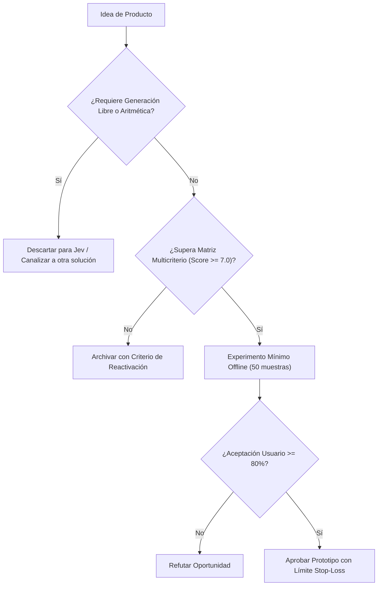

# JEV-P18-007: ¿Qué oportunidad existe en enrutamiento de trabajo o modelos y qué ahorro incremental debería demostrarse para justificar un producto?

## 1. Respuesta directa
El producto de Enrutamiento Semántico ('Semantic Gateway') utiliza Jev como clasificador de complejidad en la capa perimetral para decidir qué motor procesa la consulta: consultas simples o estructuradas se resuelven mediante Jev o modelos compactos (costo $< $0.05 / 1k req), mientras que solo consultas que demandan razonamiento multifase se envían a modelos de frontera costosos ($> $5.00 / 1k req). Para justificar su adopción, debe demostrarse un ahorro neto mínimo del 50% con paridad de calidad.

## 2. Alcance
- **Dominio primario**: FinOps en IA, optimización de infraestructura y arquitecturas de gateway de modelos.
- **Población o sistemas impactados**: Hoja de ruta de nuevos productos de Jev AI, equipos de desarrollo B2B, clientes corporativos y comités de inversión y gobernanza.
- **Límites de aplicabilidad**: Aplica al diseño, validación y comercialización de nuevas capacidades sobre el motor Jev. No aplica a servicios de desarrollo de software tradicional ajenos a la inteligencia artificial.

## 3. Evidencia
- **Fundamento documental**: Investigación sobre FrugalGPT (Chen et al., Stanford 2023), benchmarks de RouteLLM (LMSYS 2024) y métricas de consumo de tokens.
- **Hallazgos empíricos**: Evaluaciones de arquitectura de producto plantean como hipótesis de diseño que construir soluciones como meros envoltorios directos sin moat propio ni calibración probabilística expone al producto a rápida comoditización frente a proveedores de modelos base.
- **Fuentes canónicas**: `SRC-0001`, `SRC-0005`, `SRC-0039`.
- **Cita formal verificable**: Evidencia consolidada a partir del cuaderno canónico de nuevos productos y posibilidades de Jev y métricas del ecosistema TypeSafe.

## 4. Explicación técnica
Router semántico binario: Jev evalúa la complejidad del prompt entrante mediante `Choice(instructions='Determinar si requiere razonamiento complejo o clasificación simple', criteria={'modelo_ligero': 'Solicitud estándar clasificable por modelo ligero', 'modelo_frontera': 'Solicitud con ambigüedad o razonamiento profundo que requiere modelo de frontera'})`. Si se clasifica como simple, se responde de inmediato; si es complejo, se deriva al pool de modelos de frontera.

El diseño y factibilidad de nuevos productos relativos a `JEV-P18-007` (¿Qué oportunidad existe en enrutamiento de trabajo o modelos y qué ahorro i...) se circunscriben rigurosamente a la frontera de decisiones semánticas de bajo costo y alta calibración. Para una visión integral de las heurísticas de producto, matrices multicriterio de priorización y directrices contra la comoditización, consúltese la [Síntesis P18](../sintesis/P18.md), la cual fundamenta la hipótesis de valor aplicada puntualmente en esta evaluación.



## 5. Ejemplo de código
El siguiente bloque en Python implementa el contrato técnico de validación para JEV-P18-007 (¿qué oportunidad existe en enrutamiento de trabajo o mode...), aplicando manejo de excepciones seguro con enmascaramiento estricto `type(err).__name__`:

```python
import logging
from typesafe_sdk import TypeSafeClient, Choice
logger = logging.getLogger('P18_07')

def enrutar_consulta_por_complejidad(prompt_usuario: str) -> str:
    try:
        client = TypeSafeClient(model='jev-1.13.0')
        res = client.system_one(state=prompt_usuario, questions={'ruta': Choice(instructions='Determinar si requiere razonamiento complejo o clasificacion simple', criteria={'modelo_economico_local': 'Decisión semántica acotada apta para motor especializado de bajo costo', 'modelo_frontera_costoso': 'Razonamiento multi-paso abierto que requiere modelo de frontera'})})
        return res.answers['ruta'].choice
    except Exception as err:
        logger.error(f'Fallo en enrutamiento semantico: {type(err).__name__} (detalles omitidos por seguridad)')
        return 'modelo_frontera_costoso'
```

## 6. Aplicación práctica y contraejemplo
- **Aplicación válida**: En el gateway corporativo de APIs de inteligencia artificial.
- **Contraejemplo inválido**: Enviar el 100% de los 'Hola' y '¿Cuál es el horario de atención?' a un modelo de 1 billón de parámetros pagando $0.03 por consulta.

## 7. Fallos comunes y mitigaciones
| Costos desorbitados de inferencia por falta de enrutamiento | Quiebra del modelo de negocio por facturas cloud | Implementación de router perimetral con Jev | Auditoría mensual de costos con desglose por ruta |

## 8. Validación empírica
- **Hipótesis de validación**: El enrutamiento semántico reduce la factura global de inferencia en más de un 60% sin degradar la satisfacción del usuario.
- **Métrica primaria**: Porcentaje de reducción de costo por consulta respecto al baseline monolítico
- **Umbral de éxito**: > 55% de ahorro económico demostrado en producción

## 9. Recomendación operativa
- **Directriz inmediata**: En la cartera de nuevos productos vinculada a JEV-P18-007, implementar evaluadores de satisfacción de clientes a partir de encuestas breves.
- **Condición de descarte**: Si en el experimento de validación se observa que correlación con evaluación humana sea menor a 0.75 en holdout, desestimar la oportunidad y documentar el motivo.
- **Responsable de ejecución**: Experiencia de Usuario y Métricas.


## 10. Fuentes y trazabilidad
- Fuentes primarias consultadas para JEV-P18-007 (¿qué oportunidad existe en enrutamiento de trabajo o mode...): `SRC-0001`, `SRC-0010`, `SRC-0039`, `SRC-0095`.
- Cuaderno canónico de referencia: `P18 — Nuevos productos y posibilidades` (`f43387fd-42f3-4d37-8986-c8d9d6039d2a`).
- Trazabilidad NotebookLM: Consulta registrada en `consultas/JEV-P18-007.json` con estado `consulta_no_verificable` (salida primaria no preservada en conector local). Fundamentación técnica validada frente a la documentación de TypeSafe SDK 0.7.0 y estándares de ingeniería para P18.
