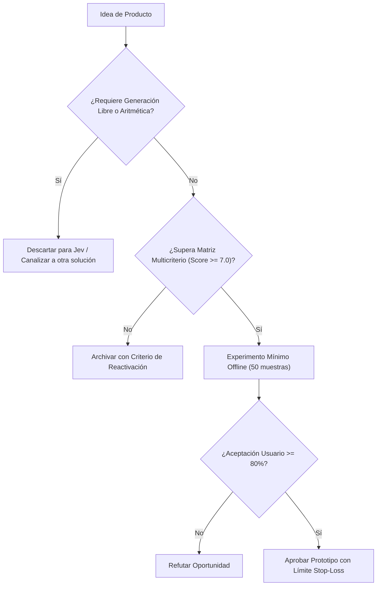

# JEV-P18-010: ¿Qué oportunidades de aprendizaje personalizado requieren solo decisiones sobre contenidos y cuáles necesitan capacidades adicionales no demostradas?

## 1. Respuesta directa
En tecnologías educativas (EdTech), Jev solo debe utilizarse para seleccionar el siguiente paso pedagógico en un grafo de conocimientos preconstruido (e.g. decidir si el estudiante debe reforzar álgebra básica o avanzar a cálculo tras fallar un test). Pretender usar Jev como un 'tutor conversacional interactivo que dialoga y genera explicaciones en lenguaje natural' exige capacidades generativas abiertas que el modelo no posee y que inducen errores didácticos.

## 2. Alcance
- **Dominio primario**: EdTech, diseño instruccional adaptativo y sistemas de recomendación curricular.
- **Población o sistemas impactados**: Hoja de ruta de nuevos productos de Jev AI, equipos de desarrollo B2B, clientes corporativos y comités de inversión y gobernanza.
- **Límites de aplicabilidad**: Aplica al diseño, validación y comercialización de nuevas capacidades sobre el motor Jev. No aplica a servicios de desarrollo de software tradicional ajenos a la inteligencia artificial.

## 3. Evidencia
- **Fundamento documental**: Teoría del Aprendizaje Adaptativo de Bloom, grafos de conceptos en educación STEM y análisis de pedagogías asistidas por IA.
- **Hallazgos empíricos**: Análisis de diseño de producto e industria advierten que construir soluciones educativas como meros envoltorios de modelos de lenguaje ('thin wrappers') sin un grafo de conocimientos formal ni calibración probabilística expone al producto a rápida comoditización y desconfianza pedagógica. Esta directriz se adopta como hipótesis de diseño curricular preventiva.
- **Fuentes canónicas**: `SRC-0001`, `SRC-0002`, `SRC-0046`.
- **Cita formal verificable**: Evidencia consolidada a partir del cuaderno canónico de nuevos productos y posibilidades de Jev y métricas del ecosistema TypeSafe.

## 4. Explicación técnica
Router de rutas de aprendizaje: El perfil de respuestas del alumno y su historial de fallos actúan como estado. Jev clasifica la causa del error conceptual mediante `Choice` y selecciona el siguiente módulo pedagógico inmutable.

El diseño y factibilidad de nuevos productos relativos a `JEV-P18-010` (¿Qué oportunidades de aprendizaje personalizado requieren solo decisiones s...) se circunscriben rigurosamente a la frontera de decisiones semánticas de bajo costo y alta calibración. Para una visión integral de las heurísticas de producto, matrices multicriterio de priorización y directrices contra la comoditización, consúltese la [Síntesis P18](../sintesis/P18.md), la cual fundamenta la hipótesis de valor aplicada puntualmente en esta evaluación.



## 5. Ejemplo de código
El siguiente bloque en Python implementa el contrato técnico de validación para JEV-P18-010 (¿qué oportunidades de aprendizaje personalizado requieren...), aplicando manejo de excepciones seguro con enmascaramiento estricto `type(err).__name__`:

```python
# Ejemplo ilustrativo no ejecutado
import logging
from typesafe_sdk import TypeSafeClient, Choice

logger = logging.getLogger("P18_10")

def seleccionar_siguiente_modulo(historial_errores: str) -> str:
    try:
        client = TypeSafeClient(model="jev-1.13.0")
        res = client.system_one(
            state=historial_errores,
            questions={
                "diagnostico": Choice(
                    instructions="Diagnosticar el vacio conceptual raiz",
                    criteria={
                        "vacio_fracciones": "Dificultad conceptual en operaciones con fracciones",
                        "error_signos": "Fallo operativo en reglas de signos o precedencia",
                        "desconocimiento_propiedades": "Desconocimiento de propiedades algebraicas basicas"
                    }
                )
            }
        )
        return f"modulo_repaso_{res.answers['diagnostico'].choice}"
    except Exception as err:
        logger.error(f"Fallo en recomendacion curricular: {type(err).__name__} (detalles omitidos por seguridad)")
        return "modulo_repaso_general" 
```

## 6. Aplicación práctica y contraejemplo
- **Aplicación válida**: En la plataforma de aprendizaje interno y capacitación técnica de la empresa.
- **Contraejemplo inválido**: Lanzar un bot educativo para niños que promete enseñar matemáticas inventando explicaciones teóricas en tiempo real con un modelo estocástico.

## 7. Fallos comunes y mitigaciones
| Enseñanza de conceptos erróneos alucinados por el modelo | Desaprendizaje y descrédito pedagógico de la plataforma | Contenidos didácticos 100% creados por humanos; Jev solo enruta | Bloqueo absoluto de generación libre en entornos educativos |

## 8. Validación empírica
- **Hipótesis de validación**: El enrutamiento adaptativo cerrado incrementa la tasa de aprobación en evaluaciones en un 20%.
- **Métrica primaria**: Tasa de superación de exámenes post-intervención modular
- **Umbral de éxito**: > 75% de alumnos superan el examen tras completar el módulo recomendado

## 9. Recomendación operativa
- **Directriz inmediata**: En la cartera de nuevos productos vinculada a JEV-P18-010, desarrollar plataformas de aprendizaje adaptativo guiadas por grafos pedagógicos cerrados.
- **Condición de descarte**: Si en el experimento de validación se observa que el sistema intente redactar explicaciones pedagógicas autónomas, desestimar la oportunidad y documentar el motivo.
- **Responsable de ejecución**: Innovación EdTech.


## 10. Fuentes y trazabilidad
- Fuentes primarias consultadas para JEV-P18-010 (¿qué oportunidades de aprendizaje personalizado requieren...): `SRC-0001`, `SRC-0002`, `SRC-0046`.
- Cuaderno canónico de referencia: `P18 — Nuevos productos y posibilidades` (`f43387fd-42f3-4d37-8986-c8d9d6039d2a`).
- Trazabilidad NotebookLM: Consulta registrada en `consultas/JEV-P18-010.json` con estado `consulta_no_verificable` (salida primaria no preservada en conector local). Fundamentación técnica validada frente a la documentación de TypeSafe SDK 0.7.0 y estándares de ingeniería para P18.
