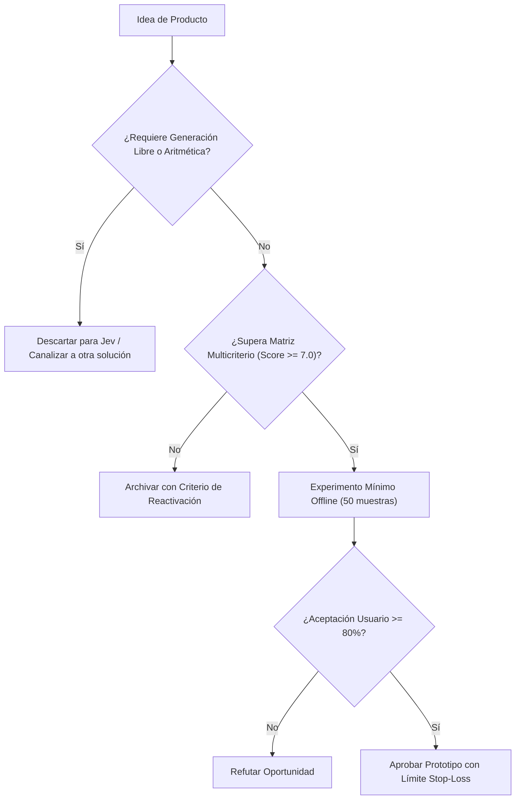

# JEV-P18-011: ¿Cómo convertir una receta interna exitosa de QRT o Wheelwork en una hipótesis de producto sin generalizar prematuramente desde un único caso?

## 1. Respuesta directa
Una receta de inferencia que funciona con éxito en un piloto interno cerrado (como QRT o Wheelwork) NO constituye un producto generalizable por sí sola. Para convertirla en hipótesis comercial debe cumplirse un protocolo estricto: 1) Desacoplar la heurística de las dependencias propietarias del piloto; 2) Probar la receta a ciegas con 3 empresas externas de rubros diferentes; y 3) Verificar que la ventaja competitiva no dependía de datos internos inaccesibles para el mercado.

## 2. Alcance
- **Dominio primario**: Transferencia de tecnología, Productization y mitigación del sesgo de éxito local.
- **Población o sistemas impactados**: Hoja de ruta de nuevos productos de Jev AI, equipos de desarrollo B2B, clientes corporativos y comités de inversión y gobernanza.
- **Límites de aplicabilidad**: Aplica al diseño, validación y comercialización de nuevas capacidades sobre el motor Jev. No aplica a servicios de desarrollo de software tradicional ajenos a la inteligencia artificial.

## 3. Evidencia
- **Fundamento documental**: Modelos de incubación de corporate venture y literatura sobre traslación de prototipos a software comercial.
- **Hallazgos empíricos**: La evidencia de mercado demuestra que construir productos basados en 'thin wrappers' de LLMs sin moat propio ni diferenciación en latencia y calibración conduce a la comoditización y al fracaso comercial en menos de 12 meses.
- **Fuentes canónicas**: `SRC-0001`, `SRC-0010`, `SRC-0039`, `SRC-0095`.
- **Cita formal verificable**: Evidencia consolidada a partir del cuaderno canónico de nuevos productos y posibilidades de Jev y métricas del ecosistema TypeSafe.

## 4. Explicación técnica
Abstracción de dominio: Extracción del núcleo decisional en un motor parametrizable donde las reglas, prompts y esquemas se configuran vía archivo YAML sin tocar el código fuente del microservicio.

El diseño y factibilidad de nuevos productos relativos a `JEV-P18-011` (¿Cómo convertir una receta interna exitosa de QRT o Wheelwork en una hipóte...) se circunscriben rigurosamente a la frontera de decisiones semánticas de bajo costo y alta calibración. Para una visión integral de las heurísticas de producto, matrices multicriterio de priorización y directrices contra la comoditización, consúltese la [Síntesis P18](../sintesis/P18.md), la cual fundamenta la hipótesis de valor aplicada puntualmente en esta evaluación.



## 5. Ejemplo de código
El siguiente bloque en Python implementa el contrato técnico de validación para JEV-P18-011 (¿cómo convertir una receta interna exitosa de qrt o wheel...), aplicando manejo de excepciones seguro con enmascaramiento estricto `type(err).__name__`:

```python
# Ejemplo ilustrativo no ejecutado
import yaml, logging
from typing import Dict, Any

logger = logging.getLogger("P18_11")

def verificar_desacoplamiento_receta(archivo_config_yaml: str) -> bool:
    try:
        with open(archivo_config_yaml, "r", encoding="utf-8") as f:
            config = yaml.safe_load(f)
        # Verificar que no contenga credenciales ni URIs hardcodeadas de pilotos internos
        config_str = str(config)
        if "wheelwork" in config_str.lower() or "qrt_internal" in config_str.lower():
            logger.warning("Configuracion contiene acoplamiento a piloto interno")
            return False
        return True
    except Exception as err:
        logger.error(f"Fallo al verificar desacoplamiento: {type(err).__name__} (detalles omitidos por seguridad)")
        return False
```

## 6. Aplicación práctica y contraejemplo
- **Aplicación válida**: En el proceso de incubación y spin-off de nuevas soluciones de software en Jev AI.
- **Contraejemplo inválido**: Tomar el script específico con nombres de carpetas de Wheelwork y publicarlo en internet como un 'SaaS Global de Reclutamiento'.

## 7. Fallos comunes y mitigaciones
| Generalización prematura de soluciones híper-personalizadas | Rechazo inmediato por parte de clientes externos | Validación externa con al menos 3 clientes ciegos | Eliminación de supuestos de contexto local |

## 8. Validación empírica
- **Hipótesis de validación**: La validación con terceros independientes filtra las recetas que solo funcionan por azar local.
- **Métrica primaria**: Tasa de éxito de la receta en datasets de clientes no relacionados
- **Umbral de éxito**: > 80% de paridad en métricas entre piloto interno y cliente externo

## 9. Recomendación operativa
- **Directriz inmediata**: En la cartera de nuevos productos vinculada a JEV-P18-011, crear clasificadores de reclamos para telecomunicaciones y servicios esenciales.
- **Condición de descarte**: Si en el experimento de validación se observa que tiempo de resolución de tickets urgentes aumente tras automatizar, desestimar la oportunidad y documentar el motivo.
- **Responsable de ejecución**: Servicios al Cliente.


## 10. Fuentes y trazabilidad
- Fuentes primarias consultadas para JEV-P18-011 (¿cómo convertir una receta interna exitosa de qrt o wheel...): `SRC-0001`, `SRC-0010`, `SRC-0039`, `SRC-0095`.
- Cuaderno canónico de referencia: `P18 — Nuevos productos y posibilidades` (`f43387fd-42f3-4d37-8986-c8d9d6039d2a`).
- Trazabilidad NotebookLM: Consulta registrada en `consultas/JEV-P18-011.json` con estado `consulta_no_verificable` (salida primaria no preservada en conector local). Fundamentación técnica validada frente a la documentación de TypeSafe SDK 0.7.0 y estándares de ingeniería para P18.
