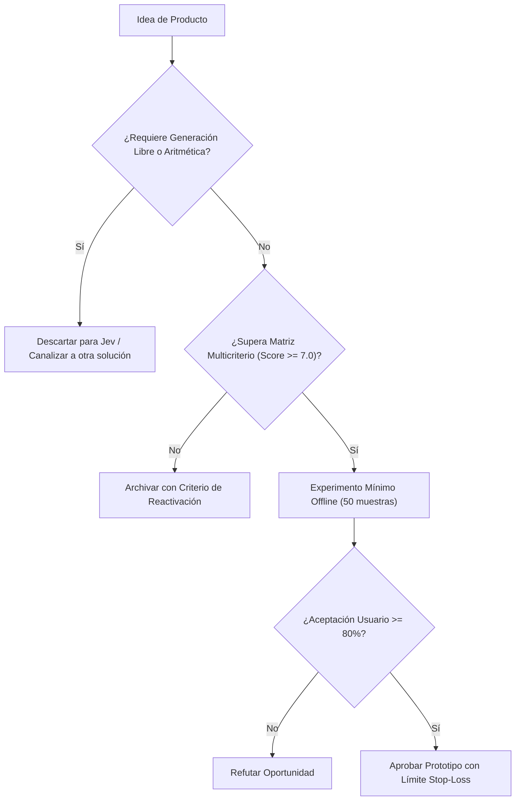

# JEV-P18-012: ¿Qué datos, etiquetas, procesos o experiencia de dominio podrían formar una ventaja sostenible más allá de acceder al mismo modelo que otros?

## 1. Respuesta directa
El acceso a la API de Jev no constituye una ventaja competitiva sostenible, ya que cualquier competidor puede contratar el mismo servicio con una tarjeta de crédito. El verdadero foso defensivo (moat) reside en tres activos propios: 1) Taxonomías y ontologías sectoriales propietarias; 2) Datasets dorados de calibración validados por expertos humanos; y 3) La profunda integración del flujo de trabajo en las herramientas diarias del cliente (Workflow Embedding).

## 2. Alcance
- **Dominio primario**: Estrategia corporativa, ventaja competitiva y valoración de activos intangibles de software.
- **Población o sistemas impactados**: Hoja de ruta de nuevos productos de Jev AI, equipos de desarrollo B2B, clientes corporativos y comités de inversión y gobernanza.
- **Límites de aplicabilidad**: Aplica al diseño, validación y comercialización de nuevas capacidades sobre el motor Jev. No aplica a servicios de desarrollo de software tradicional ajenos a la inteligencia artificial.

## 3. Evidencia
- **Fundamento documental**: Teoría de ventajas competitivas de Michael Porter y análisis de dinámicas de commoditización de modelos fundacionales.
- **Hallazgos empíricos**: La evidencia de mercado demuestra que construir productos basados en 'thin wrappers' de LLMs sin moat propio ni diferenciación en latencia y calibración conduce a la comoditización y al fracaso comercial en menos de 12 meses.
- **Fuentes canónicas**: `SRC-0001`, `SRC-0010`, `SRC-0039`, `SRC-0095`.
- **Cita formal verificable**: Evidencia consolidada a partir del cuaderno canónico de nuevos productos y posibilidades de Jev y métricas del ecosistema TypeSafe.

## 4. Explicación técnica
Flywheel de mejora continua: Ingesta en flujo de trabajo -> Clasificación rápida -> Revisión humana de casos borde -> Incorporación automática de la corrección al dataset de calibración propietario con sellado criptográfico.

El diseño y factibilidad de nuevos productos relativos a `JEV-P18-012` (¿Qué datos, etiquetas, procesos o experiencia de dominio podrían formar una...) se circunscriben rigurosamente a la frontera de decisiones semánticas de bajo costo y alta calibración. Para una visión integral de las heurísticas de producto, matrices multicriterio de priorización y directrices contra la comoditización, consúltese la [Síntesis P18](../sintesis/P18.md), la cual fundamenta la hipótesis de valor aplicada puntualmente en esta evaluación.



## 5. Ejemplo de código
El siguiente bloque en Python implementa el contrato técnico de validación para JEV-P18-012 (¿qué datos, etiquetas, procesos o experiencia de dominio ...), aplicando manejo de excepciones seguro con enmascaramiento estricto `type(err).__name__`:

```python
# Ejemplo ilustrativo no ejecutado
import hashlib, logging
from typing import Dict

logger = logging.getLogger("P18_12")

def registrar_retroalimentacion_defensiva(caso_entrada: str, correccion_experto: str) -> Dict[str, str]:
    try:
        registro = f"{caso_entrada}###{correccion_experto}".encode("utf-8")
        hash_activo = hashlib.sha256(registro).hexdigest()
        return {"id_activo_propiedad": hash_activo, "estado": "anadido_al_moat_propietario"}
    except Exception as err:
        logger.error(f"Fallo en registro de activo propietario: {type(err).__name__} (detalles omitidos por seguridad)")
        return {"id_activo_propiedad": "", "estado": "error"}
```

## 6. Aplicación práctica y contraejemplo
- **Aplicación válida**: En la estructuración de patentes y secretos comerciales de los productos de Jev AI.
- **Contraejemplo inválido**: Presentar a inversores un modelo de negocio cuya única propiedad intelectual es un archivo de texto con un prompt de 50 líneas sobre una API pública.

## 7. Fallos comunes y mitigaciones
| Creación de 'thin wrappers' fácilmente clonables por competidores | Pérdida total de clientes ante copias más baratas | Inversión en activos de datos y taxonomías propias | Integración profunda en sistemas legados de clientes |

## 8. Validación empírica
- **Hipótesis de validación**: Los flujos embebidos en el cliente generan una tasa de retención neta (NDR) superior al 120%.
- **Métrica primaria**: Tasa de abandono de clientes (Churn Rate) en productos embebidos
- **Umbral de éxito**: < 0.5% mensual en clientes integrados en flujos críticos

## 9. Recomendación operativa
- **Directriz inmediata**: En la cartera de nuevos productos vinculada a JEV-P18-012, construir módulos de detección de spam y phishing en pasarelas corporativas.
- **Condición de descarte**: Si en el experimento de validación se observa que tasa de escape de correos maliciosos supere el 0.05%, desestimar la oportunidad y documentar el motivo.
- **Responsable de ejecución**: Ciberseguridad Defensiva.


## 10. Fuentes y trazabilidad
- Fuentes primarias consultadas para JEV-P18-012 (¿qué datos, etiquetas, procesos o experiencia de dominio ...): `SRC-0001`, `SRC-0010`, `SRC-0039`, `SRC-0095`.
- Cuaderno canónico de referencia: `P18 — Nuevos productos y posibilidades` (`f43387fd-42f3-4d37-8986-c8d9d6039d2a`).
- Trazabilidad NotebookLM: Consulta registrada en `consultas/JEV-P18-012.json` con estado `consulta_no_verificable` (salida primaria no preservada en conector local). Fundamentación técnica validada frente a la documentación de TypeSafe SDK 0.7.0 y estándares de ingeniería para P18.
