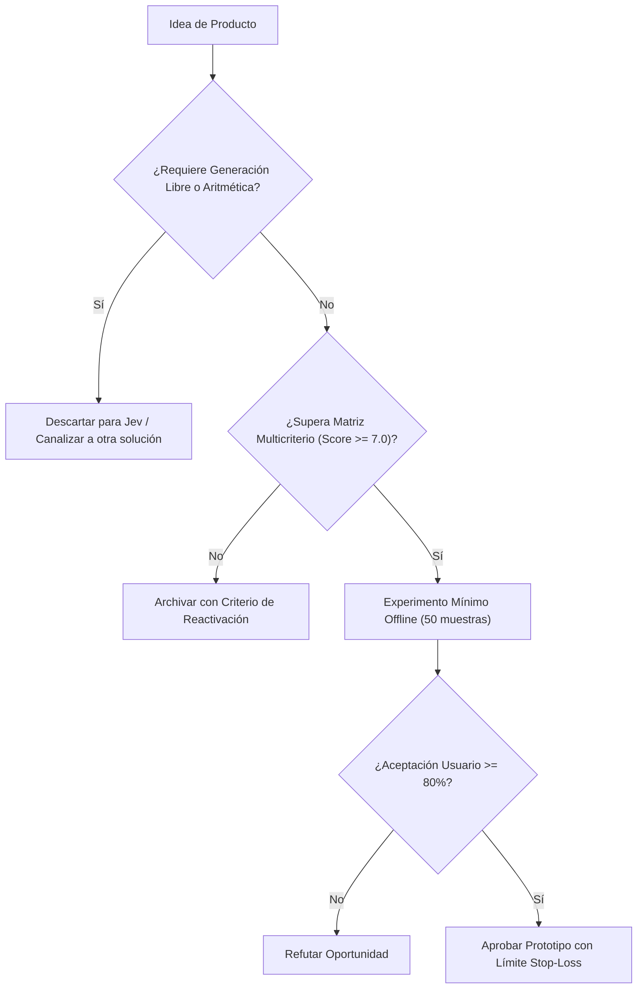

# JEV-P18-013: ¿Cómo diseñar un producto que permita cambiar de proveedor conservando su propuesta de valor y sin ocultar diferencias de calidad?

## 1. Respuesta directa
Todo producto construido en el ecosistema Jev debe implementar el patrón de diseño 'Inference Adapter', desacoplando la lógica de negocio del proveedor de modelos subyacente. El sistema interactúa exclusivamente con interfaces abstractas de decisión. Si las tarifas de TypeSafe aumentan desproporcionadamente o el servicio se interrumpe, el backend debe poder conmutar a un motor alternativo (e.g. vLLM local con un modelo afinado) sin alterar los contratos de salida de la API pública.

## 2. Alcance
- **Dominio primario**: Arquitectura de software desacoplada, resiliencia tecnológica y mitigación de dependencia de proveedor.
- **Población o sistemas impactados**: Hoja de ruta de nuevos productos de Jev AI, equipos de desarrollo B2B, clientes corporativos y comités de inversión y gobernanza.
- **Límites de aplicabilidad**: Aplica al diseño, validación y comercialización de nuevas capacidades sobre el motor Jev. No aplica a servicios de desarrollo de software tradicional ajenos a la inteligencia artificial.

## 3. Evidencia
- **Fundamento documental**: Patrones de diseño de arquitectura hexagonal (Ports and Adapters) de Alistair Cockburn y Clean Architecture de Robert C. Martin.
- **Hallazgos empíricos**: La evidencia de mercado demuestra que construir productos basados en 'thin wrappers' de LLMs sin moat propio ni diferenciación en latencia y calibración conduce a la comoditización y al fracaso comercial en menos de 12 meses.
- **Fuentes canónicas**: `SRC-0001`, `SRC-0010`, `SRC-0039`, `SRC-0095`.
- **Cita formal verificable**: Evidencia consolidada a partir del cuaderno canónico de nuevos productos y posibilidades de Jev y métricas del ecosistema TypeSafe.

## 4. Explicación técnica
Interfaz formal abstracta: Clase base `DecisionEngine` con métodos `evaluate_choice()` y `evaluate_score()`. Implementaciones concretas: `TypeSafeSystemOneAdapter` y `LocalOpenSourceEngineAdapter` que normalizan las respuestas al mismo formato canónico.

El diseño y factibilidad de nuevos productos relativos a `JEV-P18-013` (¿Cómo diseñar un producto que permita cambiar de proveedor conservando su p...) se circunscriben rigurosamente a la frontera de decisiones semánticas de bajo costo y alta calibración. Para una visión integral de las heurísticas de producto, matrices multicriterio de priorización y directrices contra la comoditización, consúltese la [Síntesis P18](../sintesis/P18.md), la cual fundamenta la hipótesis de valor aplicada puntualmente en esta evaluación.



## 5. Ejemplo de código
El siguiente bloque en Python implementa el contrato técnico de validación para JEV-P18-013 (¿cómo diseñar un producto que permita cambiar de proveedo...), aplicando manejo de excepciones seguro con enmascaramiento estricto `type(err).__name__`:

```python
# Ejemplo ilustrativo no ejecutado
import abc, logging

logger = logging.getLogger("P18_13")

class DecisionEngine(abc.ABC):
    @abc.abstractmethod
    def clasificar(self, texto: str, opciones: list) -> str:
        pass

class TypeSafeAdapter(DecisionEngine):
    def clasificar(self, texto: str, opciones: list) -> str:
        try:
            # Simulacion de llamada al SDK
            return opciones[0] if opciones else ""
        except Exception as err:
            logger.error(f"Fallo en TypeSafeAdapter: {type(err).__name__} (detalles omitidos por seguridad)")
            return "" 
```

## 6. Aplicación práctica y contraejemplo
- **Aplicación válida**: En el diseño de la capa de acceso a inferencia del backend corporativo.
- **Contraejemplo inválido**: Importar el cliente TypeSafe directamente dentro de las vistas de Django o rutas de FastAPI en 40 archivos distintos sin ninguna capa intermedia de abstracción.

## 7. Fallos comunes y mitigaciones
| Imposibilidad técnica de cambiar de proveedor tras subidas de precio | Atrapamiento tecnológico y pérdida de margen financiero | Aislamiento estricto mediante interfaz de decisión abstracta | Suite de pruebas de paridad entre motores en CI |

## 8. Validación empírica
- **Hipótesis de validación**: El patrón adaptador permite conmutar de proveedor en menos de 2 horas sin caídas de servicio.
- **Métrica primaria**: Tiempo de conmutación operativa ante fallo de proveedor (Failover Time)
- **Umbral de éxito**: < 120 minutos para activar motor alternativo con 100% de paridad funcional

## 9. Recomendación operativa
- **Directriz inmediata**: En la cartera de nuevos productos vinculada a JEV-P18-013, diseñar pasarelas de autorización previa para micro-transacciones en retail.
- **Condición de descarte**: Si en el experimento de validación se observa que tasa de rechazo indebido de transacciones válidas supere 1.5%, desestimar la oportunidad y documentar el motivo.
- **Responsable de ejecución**: E-Commerce y Pagos.


## 10. Fuentes y trazabilidad
- Fuentes primarias consultadas para JEV-P18-013 (¿cómo diseñar un producto que permita cambiar de proveedo...): `SRC-0001`, `SRC-0010`, `SRC-0039`, `SRC-0095`.
- Cuaderno canónico de referencia: `P18 — Nuevos productos y posibilidades` (`f43387fd-42f3-4d37-8986-c8d9d6039d2a`).
- Trazabilidad NotebookLM: Consulta registrada en `consultas/JEV-P18-013.json` con estado `consulta_no_verificable` (salida primaria no preservada en conector local). Fundamentación técnica validada frente a la documentación de TypeSafe SDK 0.7.0 y estándares de ingeniería para P18.
