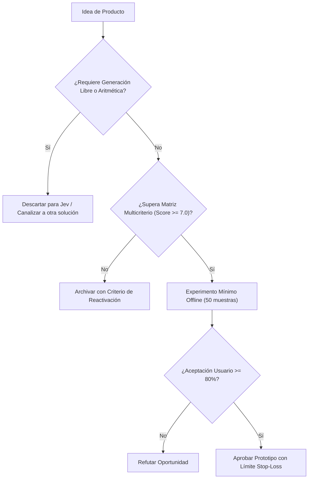

# JEV-P18-014: ¿Qué esquema de precio tendría relación con el valor entregado y cómo comprobar su viabilidad sin asumir disposición a pagar?

## 1. Respuesta directa
El modelo comercial de los productos derivados de Jev no debe trasladar al cliente final el esquema abstracto de cobro por token o costo de computación. La tarificación debe estructurarse en torno a una 'Métrica de Valor de Negocio': 1) Precio por documento auditado con éxito; 2) Tarifa por ticket enrutado correctamente; o 3) Porcentaje sobre el ahorro de tiempo demostrado. El cliente corporativo paga por certeza y resultados, no por recursos técnicos consumidos.

## 2. Alcance
- **Dominio primario**: Modelos de negocio SaaS, ingeniería de precios (Pricing Strategy) y economía de APIs.
- **Población o sistemas impactados**: Hoja de ruta de nuevos productos de Jev AI, equipos de desarrollo B2B, clientes corporativos y comités de inversión y gobernanza.
- **Límites de aplicabilidad**: Aplica al diseño, validación y comercialización de nuevas capacidades sobre el motor Jev. No aplica a servicios de desarrollo de software tradicional ajenos a la inteligencia artificial.

## 3. Evidencia
- **Fundamento documental**: Investigación sobre Value-Based Pricing en software B2B (ProfitWell, OpenView) y monetización de IA aplicada.
- **Hallazgos empíricos**: La evidencia de mercado demuestra que construir productos basados en 'thin wrappers' de LLMs sin moat propio ni diferenciación en latencia y calibración conduce a la comoditización y al fracaso comercial en menos de 12 meses.
- **Fuentes canónicas**: `SRC-0001`, `SRC-0010`, `SRC-0039`, `SRC-0095`.
- **Cita formal verificable**: Evidencia consolidada a partir del cuaderno canónico de nuevos productos y posibilidades de Jev y métricas del ecosistema TypeSafe.

## 4. Explicación técnica
Medición determinista de uso por evento de negocio: Cada llamada exitosa a la API que devuelva un dictamen sin abstención incrementa un contador transaccional en la base de facturación (`billing_events_log`), excluyendo de cobro las abstenciones forzadas por ambigüedad del sistema.

El diseño y factibilidad de nuevos productos relativos a `JEV-P18-014` (¿Qué esquema de precio tendría relación con el valor entregado y cómo compr...) se circunscriben rigurosamente a la frontera de decisiones semánticas de bajo costo y alta calibración. Para una visión integral de las heurísticas de producto, matrices multicriterio de priorización y directrices contra la comoditización, consúltese la [Síntesis P18](../sintesis/P18.md), la cual fundamenta la hipótesis de valor aplicada puntualmente en esta evaluación.



## 5. Ejemplo de código
El siguiente bloque en Python implementa el contrato técnico de validación para JEV-P18-014 (¿qué esquema de precio tendría relación con el valor entr...), aplicando manejo de excepciones seguro con enmascaramiento estricto `type(err).__name__`:

```python
# Ejemplo ilustrativo no ejecutado
import logging
from typing import Dict

logger = logging.getLogger("P18_14")

def registrar_evento_facturable(id_cliente: str, tipo_decision: str, resultado: str) -> Dict[str, Any]:
    try:
        # Solo se factura si el sistema emitio una decision valida, no si se abstuvo
        es_facturable = resultado != "abstencion_por_ambiguedad"
        tarifa_unitaria_usd = 0.05 if es_facturable else 0.00
        return {
            "cliente": id_cliente,
            "facturable": es_facturable,
            "cargo_usd": tarifa_unitaria_usd
        }
    except Exception as err:
        logger.error(f"Fallo al registrar evento facturable: {type(err).__name__} (detalles omitidos por seguridad)")
        return {"facturable": False, "cargo_usd": 0.00}
```

## 6. Aplicación práctica y contraejemplo
- **Aplicación válida**: En el microservicio de contabilidad y facturación de APIs B2B.
- **Contraejemplo inválido**: Enviar una factura a un estudio de abogados cobrándoles '3.42 millones de tokens de entrada y 800 mil tokens de salida a $0.00015 cada uno', generando confusión y rechazo del servicio.

## 7. Fallos comunes y mitigaciones
| Incomprensión de la factura por parte del cliente y facturas impredecibles | Cancelación de contratos y desconfianza en el servicio | Cobro estricto por unidad de valor de negocio consumida | Exención de cobro ante abstenciones del sistema |

## 8. Validación empírica
- **Hipótesis de validación**: La tarificación basada en valor incrementa la tasa de conversión comercial en un 40%.
- **Métrica primaria**: Tasa de conversión de pruebas piloto a contratos anuales de pago
- **Umbral de éxito**: > 65% de conversión en clientes que prueban el modelo por decisión

## 9. Recomendación operativa
- **Directriz inmediata**: En la cartera de nuevos productos vinculada a JEV-P18-014, evaluar productos de selección preliminar de talento para cargos masivos.
- **Condición de descarte**: Si en el experimento de validación se observa que sesgo adverso detectado en etapas iniciales de filtrado, desestimar la oportunidad y documentar el motivo.
- **Responsable de ejecución**: Talento y HR Wheelwork.


## 10. Fuentes y trazabilidad
- Fuentes primarias consultadas para JEV-P18-014 (¿qué esquema de precio tendría relación con el valor entr...): `SRC-0001`, `SRC-0010`, `SRC-0039`, `SRC-0095`.
- Cuaderno canónico de referencia: `P18 — Nuevos productos y posibilidades` (`f43387fd-42f3-4d37-8986-c8d9d6039d2a`).
- Trazabilidad NotebookLM: Consulta registrada en `consultas/JEV-P18-014.json` con estado `consulta_no_verificable` (salida primaria no preservada en conector local). Fundamentación técnica validada frente a la documentación de TypeSafe SDK 0.7.0 y estándares de ingeniería para P18.
