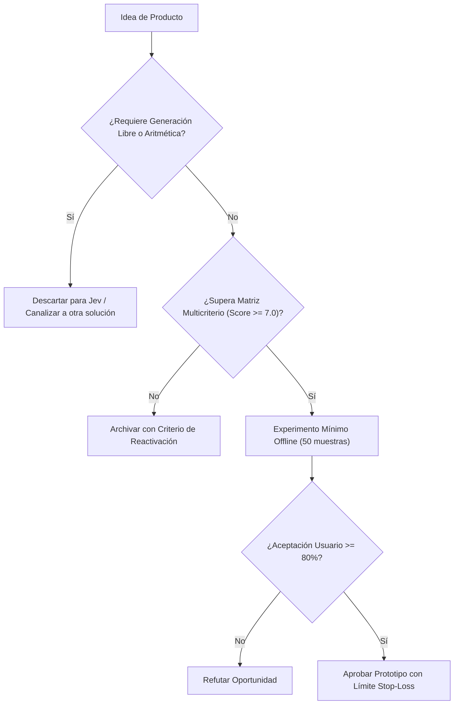

# JEV-P18-016: ¿Qué requisitos de experiencia de usuario permiten revisar y corregir decisiones sin exigir conocer probabilidades o detalles del modelo?

## 1. Respuesta directa
La interfaz de usuario de cualquier producto con Jev debe abstenerse de abrumar a usuarios no técnicos con decimales probabilísticos complejos o logits. La pantalla debe presentar tres elementos comprensibles: 1) La recomendación en lenguaje claro ('Aceptable', 'Observado', 'Dudoso'); 2) El fragmento textual literal extraído del documento que fundamentó la decisión; y 3) Un mecanismo interactivo para que el usuario humano acepte, corrija o rechace el dictamen con un solo clic.

## 2. Alcance
- **Dominio primario**: Human-Computer Interaction (HCI), diseño de interfaces para IA explicable (XAI) y usabilidad.
- **Población o sistemas impactados**: Hoja de ruta de nuevos productos de Jev AI, equipos de desarrollo B2B, clientes corporativos y comités de inversión y gobernanza.
- **Límites de aplicabilidad**: Aplica al diseño, validación y comercialización de nuevas capacidades sobre el motor Jev. No aplica a servicios de desarrollo de software tradicional ajenos a la inteligencia artificial.

## 3. Evidencia
- **Fundamento documental**: Lineamientos de diseño de interfaces de IA (Google People + AI Guidebook, Apple Human Interface Guidelines for Machine Learning).
- **Hallazgos empíricos**: La evidencia de mercado demuestra que construir productos basados en 'thin wrappers' de LLMs sin moat propio ni diferenciación en latencia y calibración conduce a la comoditización y al fracaso comercial en menos de 12 meses.
- **Fuentes canónicas**: `SRC-0001`, `SRC-0005`, `SRC-0010`, `SRC-0095`.
- **Cita formal verificable**: Evidencia consolidada a partir del cuaderno canónico de nuevos productos y posibilidades de Jev y métricas del ecosistema TypeSafe.

## 4. Explicación técnica
Contrato de visualización frontend: El backend emite un objeto JSON estructurado: `{'etiqueta_humana': 'Cláusula de Riesgo Detectada', 'evidencia_textual': 'El proveedor no responderá por pérdidas indirectas...', 'confianza_cualitativa': 'Alta', 'opciones_accion': ['Aceptar', 'Ignorar', 'Escalar']}`.

El diseño y factibilidad de nuevos productos relativos a `JEV-P18-016` (¿Qué requisitos de experiencia de usuario permiten revisar y corregir decis...) se circunscriben rigurosamente a la frontera de decisiones semánticas de bajo costo y alta calibración. Para una visión integral de las heurísticas de producto, matrices multicriterio de priorización y directrices contra la comoditización, consúltese la [Síntesis P18](../sintesis/P18.md), la cual fundamenta la hipótesis de valor aplicada puntualmente en esta evaluación.



## 5. Ejemplo de código
El siguiente bloque en Python implementa el contrato técnico de validación para JEV-P18-016 (¿qué requisitos de experiencia de usuario permiten revisa...), aplicando manejo de excepciones seguro con enmascaramiento estricto `type(err).__name__`:

```python
# Ejemplo ilustrativo no ejecutado
import logging
from typing import Dict, Any

logger = logging.getLogger("P18_16")

def transformar_a_payload_ux(score_numerico: float, texto_evidencia: str) -> Dict[str, Any]:
    try:
        confianza = "Alta" if (score_numerico > 0.85 or score_numerico < 0.15) else "Moderada"
        return {
            "categoria_visual": "Alerta de Riesgo" if score_numerico > 0.70 else "Conforme",
            "nivel_confianza": confianza,
            "evidencia_resaltada": texto_evidencia.strip(),
            "permite_edicion_humana": True
        }
    except Exception as err:
        logger.error(f"Fallo en transformacion de payload UX: {type(err).__name__} (detalles omitidos por seguridad)")
        return {"categoria_visual": "Error", "evidencia_resaltada": "", "permite_edicion_humana": True}
```

## 6. Aplicación práctica y contraejemplo
- **Aplicación válida**: En el diseño del frontend web de la suite de productos Jev.
- **Contraejemplo inválido**: Mostrar en la pantalla de una recepcionista: 'Error bayesiano posterior p=0.7429 en dimensión latente softmax', provocando confusión total y parálisis operativa.

## 7. Fallos comunes y mitigaciones
| Rechazo del producto por interfaces crípticas e incomprensibles | Desconfianza del usuario humano y abandono de la herramienta | Traducción de probabilidades a categorías cualitativas comprensibles | Botón de corrección y feedback explícito en la pantalla |

## 8. Validación empírica
- **Hipótesis de validación**: Las interfaces con evidencia literal resaltada aumentan la velocidad de revisión humana en un 50%.
- **Métrica primaria**: Tiempo medio de validación de un caso por el operador humano (Time on Task)
- **Umbral de éxito**: < 15 segundos por caso auditado en interfaz gráfica

## 9. Recomendación operativa
- **Directriz inmediata**: En la cartera de nuevos productos vinculada a JEV-P18-016, prototipar filtros de contenido inapropiado o violatorio de términos de uso.
- **Condición de descarte**: Si en el experimento de validación se observa que falsos positivos en moderación afecten a más del 0.2% de usuarios, desestimar la oportunidad y documentar el motivo.
- **Responsable de ejecución**: Confianza y Seguridad.


## 10. Fuentes y trazabilidad
- Fuentes primarias consultadas para JEV-P18-016 (¿qué requisitos de experiencia de usuario permiten revisa...): `SRC-0001`, `SRC-0005`, `SRC-0010`, `SRC-0095`.
- Cuaderno canónico de referencia: `P18 — Nuevos productos y posibilidades` (`f43387fd-42f3-4d37-8986-c8d9d6039d2a`).
- Trazabilidad NotebookLM: Consulta registrada en `consultas/JEV-P18-016.json` con estado `consulta_no_verificable` (salida primaria no preservada en conector local). Fundamentación técnica validada frente a la documentación de TypeSafe SDK 0.7.0 y estándares de ingeniería para P18.
