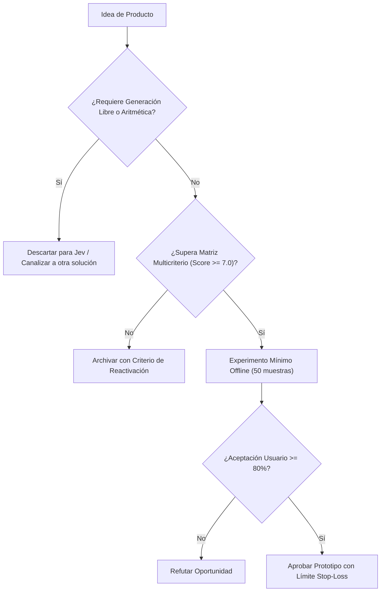

# JEV-P18-020: ¿Qué cambios tecnológicos o resultados nuevos justificarían revisar una oportunidad descartada sin mantenerla indefinidamente por entusiasmo inicial?

## 1. Respuesta directa
Una oportunidad que fue descartada en el pasado no puede revivirse por simple entusiasmo, cambio de humor del equipo o insistencia de un comercial. Su reapertura exige la verificación formal de al menos uno de los tres 'Disparadores de Reactivación': 1) Reducción demostrada de costos de inferencia en más del 70%; 2) Lanzamiento oficial de una nueva versión del SDK que solucione una limitación técnica previa (e.g. soporte de nuevas primitivas); o 3) Disponibilidad de un dataset propietario previamente inaccesible.

## 2. Alcance
- **Dominio primario**: Gobernanza de archivo de proyectos, prevención de ciclos redundantes y rigor estratégico.
- **Población o sistemas impactados**: Hoja de ruta de nuevos productos de Jev AI, equipos de desarrollo B2B, clientes corporativos y comités de inversión y gobernanza.
- **Límites de aplicabilidad**: Aplica al diseño, validación y comercialización de nuevas capacidades sobre el motor Jev. No aplica a servicios de desarrollo de software tradicional ajenos a la inteligencia artificial.

## 3. Evidencia
- **Fundamento documental**: Marcos de Post-Mortem y retrospectivas de ingeniería de software, principios de gestión del conocimiento de NASA.
- **Hallazgos empíricos**: La evidencia de mercado demuestra que construir productos basados en 'thin wrappers' de LLMs sin moat propio ni diferenciación en latencia y calibración conduce a la comoditización y al fracaso comercial en menos de 12 meses.
- **Fuentes canónicas**: `SRC-0001`, `SRC-0010`, `SRC-0039`, `SRC-0095`.
- **Cita formal verificable**: Evidencia consolidada a partir del cuaderno canónico de nuevos productos y posibilidades de Jev y métricas del ecosistema TypeSafe.

## 4. Explicación técnica
Condición de desbloqueo de tickets archivados: Todo ticket en estado `ARCHIVADO_O_DESCARTADO` contiene en sus metadatos el campo `trigger_desbloqueo`. Un script de CI evalúa trimestralmente estos triggers contra el estado tecnológico global para alertar si alguna condición se ha cumplido.

El diseño y factibilidad de nuevos productos relativos a `JEV-P18-020` (¿Qué cambios tecnológicos o resultados nuevos justificarían revisar una opo...) se circunscriben rigurosamente a la frontera de decisiones semánticas de bajo costo y alta calibración. Para una visión integral de las heurísticas de producto, matrices multicriterio de priorización y directrices contra la comoditización, consúltese la [Síntesis P18](../sintesis/P18.md), la cual fundamenta la hipótesis de valor aplicada puntualmente en esta evaluación.



## 5. Ejemplo de código
El siguiente bloque en Python implementa el contrato técnico de validación para JEV-P18-020 (¿qué cambios tecnológicos o resultados nuevos justificarí...), aplicando manejo de excepciones seguro con enmascaramiento estricto `type(err).__name__`:

```python
# Ejemplo ilustrativo no ejecutado
import logging
from typing import Dict, Any

logger = logging.getLogger("P18_20")

def evaluar_condicion_reactivacion(metadatos_archivo: Dict[str, Any], estado_actual_mercado: Dict[str, Any]) -> bool:
    try:
        costo_anterior = metadatos_archivo.get("costo_por_inferencia_usd", 1.0)
        costo_actual = estado_actual_mercado.get("costo_actual_usd", 1.0)
        # Condicion 1: Reduccion de costo > 70%
        if (costo_anterior - costo_actual) / costo_anterior > 0.70:
            return True
        # Condicion 2: Nueva capacidad de SDK soportada
        capacidad_faltante = metadatos_archivo.get("capacidad_requerida", "")
        if capacidad_faltante and capacidad_faltante in estado_actual_mercado.get("capacidades_sdk", []):
            return True
        return False
    except Exception as err:
        logger.error(f"Fallo al evaluar reactivacion: {type(err).__name__} (detalles omitidos por seguridad)")
        return False
```

## 6. Aplicación práctica y contraejemplo
- **Aplicación válida**: En la bitácora de decisiones y registro de oportunidades archivadas de Jev AI.
- **Contraejemplo inválido**: Reabrir la discusión sobre un bot conversacional que ya fue refutado tres veces solo porque un nuevo gerente comercial llegó y sugirió la misma idea sin leer el historial.

## 7. Fallos comunes y mitigaciones
| Discusión cíclica infinita de ideas malas ya descartadas | Desgaste y frustración del equipo de ingeniería | Archivo inmutable de descartes con motivo y condición de reapertura | Rechazo de iniciativas que no cumplan el disparador formal |

## 8. Validación empírica
- **Hipótesis de validación**: Los criterios formales de reactivación ahorran cientos de horas de debate recurrente.
- **Métrica primaria**: Horas dedicadas a discutir propuestas previamente evaluadas y archivadas
- **Umbral de éxito**: < 2 horas anuales en discusiones de proyectos previamente refutados

## 9. Recomendación operativa
- **Directriz inmediata**: En la cartera de nuevos productos vinculada a JEV-P18-020, evaluar la viabilidad económica integral de nuevos lanzamientos antes de codificar.
- **Condición de descarte**: Si en el experimento de validación se observa que proyección de retorno de inversión sea negativa a 12 meses, desestimar la oportunidad y documentar el motivo.
- **Responsable de ejecución**: Dirección de Finanzas y Producto.


## 10. Fuentes y trazabilidad
- Fuentes primarias consultadas para JEV-P18-020 (¿qué cambios tecnológicos o resultados nuevos justificarí...): `SRC-0001`, `SRC-0010`, `SRC-0039`, `SRC-0095`.
- Cuaderno canónico de referencia: `P18 — Nuevos productos y posibilidades` (`f43387fd-42f3-4d37-8986-c8d9d6039d2a`).
- Trazabilidad NotebookLM: Consulta registrada en `consultas/JEV-P18-020.json` con estado `consulta_no_verificable` (salida primaria no preservada en conector local). Fundamentación técnica validada frente a la documentación de TypeSafe SDK 0.7.0 y estándares de ingeniería para P18.
