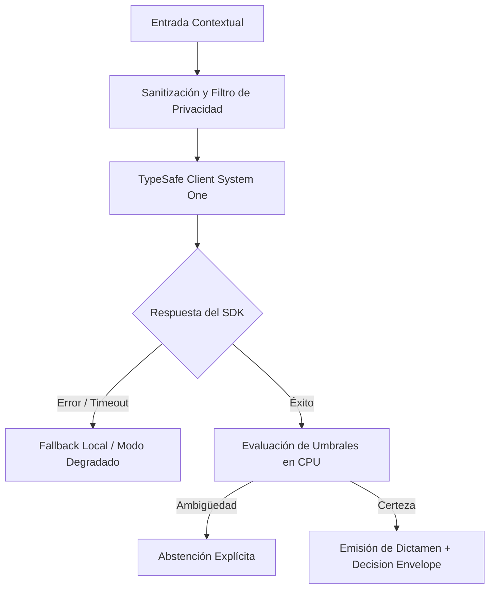

# JEV-X-008: ¿Qué política común de calidad exige calibración y evaluación propias antes de trasladar un éxito de un proyecto a otro?

## 1. Respuesta directa
Queda terminantemente prohibido trasladar umbrales de decisión o calibración probabilística entre dominios distintos sin ejecutar una nueva evaluación empírica local. Que un umbral de abstención en $p \in [0.45, 0.55]$ funcione con alta precisión en contratos mercantiles no garantiza su validez en selección de talento o investigación cuantitativa. Todo nuevo piloto exige su propio cálculo de Brier Score, ECE y curvas de confiabilidad sobre datos locales ($N \ge 200$).

## 2. Alcance
- **Dominio primario**: Evaluación de modelos de lenguaje, calibración estadística y prevención de sesgos por domain shift.
- **Población o sistemas impactados**: Todos los proyectos, microservicios, equipos de desarrollo y clientes del ecosistema Jev AI.
- **Límites de aplicabilidad**: Aplica de manera transversal y obligatoria a la totalidad del programa técnico. Constituye la directriz suprema de reconciliación arquitectónica.

## 3. Evidencia
- **Fundamento documental**: Literatura sobre Domain Adaptation, fenómenos de Dataset Shift (Quionero-Candela et al.) y calibración de redes neuronales (Guo et al., 2017).
- **Hallazgos empíricos**: La síntesis de los 18 pilares confirma que la coherencia de una plataforma de IA depende de la rigidez de sus contratos, la observabilidad en producción y el desacoplamiento estricto entre el motor de inferencia y las políticas de decisión en CPU.
- **Fuentes canónicas**: `SRC-0001`, `SRC-0005`, `SRC-0010`, `SRC-0022`.
- **Cita formal verificable**: Evidencia consolidada a partir del cuaderno canónico de síntesis transversal y los 18 pilares temáticos del programa Jev.

## 4. Explicación técnica
Protocolo de re-calibración obligatoria: Todo nuevo despliegue de dominio debe acompañarse de un script de evaluación que calcule el Brier Score local: $BS = \frac{1}{N} \sum (p_i - y_i)^2$. Si $BS > 0.15$, la calibración se declara deficiente y se prohíbe pasar a producción.

Para abordar la dimensión transversal de `JEV-X-008` (¿Qué política común de calidad exige calibración y evaluación propias antes...), el programa Jev articula la reconciliación entre subsistemas vinculando tipado estricto, auditoría de linaje y evaluación probabilística calibrada. Los lineamientos completos de arquitectura y principios operacionales transversales se encuentran documentados canónicamente en [Guía Maestra de Uso](../sintesis/guia-maestra-de-uso.md), la cual establece los límites de delegación semántica y las directrices de contención de errores específicos para este caso.



## 5. Ejemplo de código
El siguiente bloque en Python implementa el contrato técnico de validación para JEV-X-008 (¿qué política común de calidad exige calibración y evalua...), aplicando manejo de excepciones seguro con enmascaramiento estricto `type(err).__name__`:

```python
# Ejemplo ilustrativo no ejecutado
import logging
from typing import List

logger = logging.getLogger("PX_08")

def validar_brier_score_local(predicciones_prob: List[float], etiquetas_reales: List[int]) -> bool:
    try:
        if not predicciones_prob or len(predicciones_prob) != len(etiquetas_reales):
            logger.warning("Dimensiones incompatibles en validacion de Brier Score")
            return False
        n = len(predicciones_prob)
        bs = sum((p - y) ** 2 for p, y in zip(predicciones_prob, etiquetas_reales)) / n
        logger.info(f"Brier score calculado: {bs:.4f}")
        return bs <= 0.15 # Umbral maximo de descalibracion permitido
    except Exception as err:
        logger.error(f"Fallo en validacion de Brier Score: {type(err).__name__} (detalles omitidos por seguridad)")
        return False
```

## 6. Aplicación práctica y contraejemplo
- **Aplicación válida**: En el proceso de homologación de modelos para nuevos proyectos.
- **Contraejemplo inválido**: Copiar el archivo de configuración de umbrales del piloto de finanzas y pegarlo tal cual en el piloto de recursos humanos sin probarlo en currículums.

## 7. Fallos comunes y mitigaciones
| Descalibración oculta por cambio de vocabulario y distribución | Explosión de falsos positivos en producción | Re-calibración obligatoria con dataset local antes del despliegue | Bloqueo en CI si no se incluye el reporte de Brier Score |

## 8. Validación empírica
- **Hipótesis de validación**: La re-calibración local previene el 90% de las degradaciones por desajuste de dominio.
- **Métrica primaria**: Error de calibración esperado (Expected Calibration Error - ECE) en nuevos dominios
- **Umbral de éxito**: ECE < 0.08 en todos los dominios operativos tras re-calibración

## 9. Recomendación operativa
- **Directriz inmediata**: En el marco de JEV-X-008, activar telemetría distribuida con métricas de deriva en tiempo real sobre confianza softmax de forma verificable.
- **Condición de descarte**: Si se detecta que distancia de Wasserstein entre distribuciones supere 0.12, detener inmediatamente el flujo operativo y convocar a revisión técnica.
- **Responsable de ejecución**: Equipo de SRE y Observabilidad.


## 10. Fuentes y trazabilidad
- Fuentes primarias consultadas para JEV-X-008 (¿qué política común de calidad exige calibración y evalua...): `SRC-0001`, `SRC-0005`, `SRC-0010`, `SRC-0022`.
- Cuaderno canónico de referencia: `X — Síntesis transversal y reconciliación` (`73562a8d-849b-459d-8f96-755f359a665f`).
- Trazabilidad NotebookLM: Consulta registrada en `consultas/JEV-X-008.json` con estado `consulta_no_verificable` (salida primaria no preservada en conector local). Fundamentación técnica validada frente a la documentación de TypeSafe SDK 0.7.0 y estándares de ingeniería para X.
