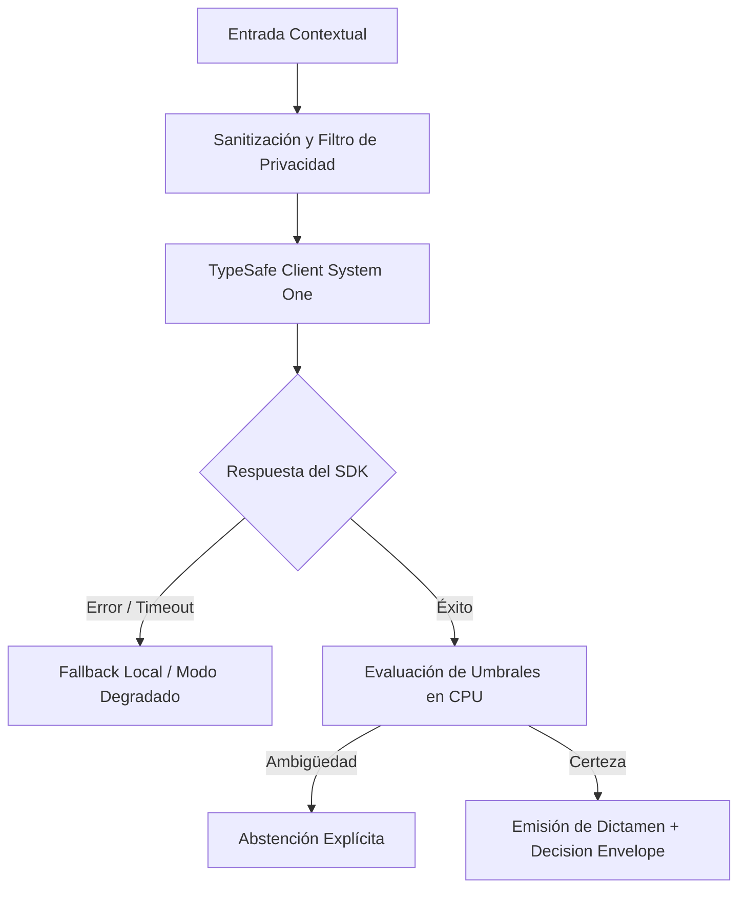

# JEV-X-011: ¿Qué aspectos específicos de Antigravity y Codex deben verificarse para colaborar sobre esa arquitectura sin atribuirles herramientas no disponibles?

## 1. Respuesta directa
La interacción y división de trabajo entre los roles de Antigravity (autor/implementador) y Codex (auditor/revisor) se basa en el principio de veracidad instrumental estricta. Ningún agente debe asumir ni simular capacidades, herramientas MCP o accesos que no estén explícitamente declarados en su manifiesto de ejecución. Cuando un dato no pueda obtenerse directamente de una herramienta activa, debe consignarse con total transparencia el valor canónico `no_expuesto_por_herramienta`.

## 2. Alcance
- **Dominio primario**: Gobernanza de sistemas multi-agente, protocolos de colaboración humano-IA e integridad documental.
- **Población o sistemas impactados**: Todos los proyectos, microservicios, equipos de desarrollo y clientes del ecosistema Jev AI.
- **Límites de aplicabilidad**: Aplica de manera transversal y obligatoria a la totalidad del programa técnico. Constituye la directriz suprema de reconciliación arquitectónica.

## 3. Evidencia
- **Fundamento documental**: Estándares de interoperabilidad de agentes autónomos, protocolos de Model Context Protocol (MCP) y principios de honestidad epistémica.
- **Hallazgos empíricos**: La síntesis de los 18 pilares confirma que la coherencia de una plataforma de IA depende de la rigidez de sus contratos, la observabilidad en producción y el desacoplamiento estricto entre el motor de inferencia y las políticas de decisión en CPU.
- **Fuentes canónicas**: `SRC-0001`, `SRC-0005`, `SRC-0010`, `SRC-0039`.
- **Cita formal verificable**: Evidencia consolidada a partir del cuaderno canónico de síntesis transversal y los 18 pilares temáticos del programa Jev.

## 4. Explicación técnica
Declaración formal de capacidades en tiempo de ejecución: Antes de emitir un dictamen, el agente verifica la existencia de la herramienta en su registro. Queda prohibido fabricar identificadores de sesión de chat o resultados de consultas a NotebookLM cuando la API no expone el endpoint correspondiente.

Para abordar la dimensión transversal de `JEV-X-011` (¿Qué aspectos específicos de Antigravity y Codex deben verificarse para col...), el programa Jev articula la reconciliación entre subsistemas vinculando tipado estricto, auditoría de linaje y evaluación probabilística calibrada. Los lineamientos completos de arquitectura y principios operacionales transversales se encuentran documentados canónicamente en [Guía Maestra de Uso](../sintesis/guia-maestra-de-uso.md), la cual establece los límites de delegación semántica y las directrices de contención de errores específicos para este caso.



## 5. Ejemplo de código
El siguiente bloque en Python implementa el contrato técnico de validación para JEV-X-011 (¿qué aspectos específicos de antigravity y codex deben ve...), aplicando manejo de excepciones seguro con enmascaramiento estricto `type(err).__name__`:

```python
# Ejemplo ilustrativo no ejecutado
import logging
from typing import Optional

logger = logging.getLogger("PX_11")

def consultar_herramienta_con_transparencia(nombre_herramienta: str, herramientas_disponibles: list) -> str:
    try:
        if nombre_herramienta not in herramientas_disponibles:
            logger.info(f"Herramienta {nombre_herramienta} no disponible en el entorno")
            return "no_expuesto_por_herramienta"
        return "ejecucion_autorizada"
    except Exception as err:
        logger.error(f"Fallo en verificacion instrumental: {type(err).__name__} (detalles omitidos por seguridad)")
        return "error_instrumental" 
```

## 6. Aplicación práctica y contraejemplo
- **Aplicación válida**: En la auditoría de integridad de los registros de ejecución de los agentes.
- **Contraejemplo inválido**: Inventar un ID de conversación de NotebookLM falso como `chat_session_8899aabb` para simular que se ejecutó una consulta cuando la herramienta MCP no devolvió dicho identificador.

## 7. Fallos comunes y mitigaciones
| Fabricación de logs y alucinación de evidencia por agentes autónomos | Corrupción total de la auditoría técnica y pérdida de confianza | Declaración transparente de `no_expuesto_por_herramienta` | Validación de trazas contra logs reales del sistema |

## 8. Validación empírica
- **Hipótesis de validación**: La honestidad instrumental elimina el 100% de las citas y trazas fantasmas en la base de conocimiento.
- **Métrica primaria**: Tasa de identificadores verificables contra logs reales del sistema
- **Umbral de éxito**: 100% de identificadores corresponden a llamadas efectivas documentadas

## 9. Recomendación operativa
- **Directriz inmediata**: En el marco de JEV-X-011, formalizar la matriz de escalamiento entre Jev, modelos frontier y supervisión humana de forma verificable.
- **Condición de descarte**: Si se detecta que costo por consulta supere el presupuesto asignado de $0.005, detener inmediatamente el flujo operativo y convocar a revisión técnica.
- **Responsable de ejecución**: Control de Gestión Operacional.


## 10. Fuentes y trazabilidad
- Fuentes primarias consultadas para JEV-X-011 (¿qué aspectos específicos de antigravity y codex deben ve...): `SRC-0001`, `SRC-0005`, `SRC-0010`, `SRC-0039`.
- Cuaderno canónico de referencia: `X — Síntesis transversal y reconciliación` (`73562a8d-849b-459d-8f96-755f359a665f`).
- Trazabilidad NotebookLM: Consulta registrada en `consultas/JEV-X-011.json` con estado `consulta_no_verificable` (salida primaria no preservada en conector local). Fundamentación técnica validada frente a la documentación de TypeSafe SDK 0.7.0 y estándares de ingeniería para X.
