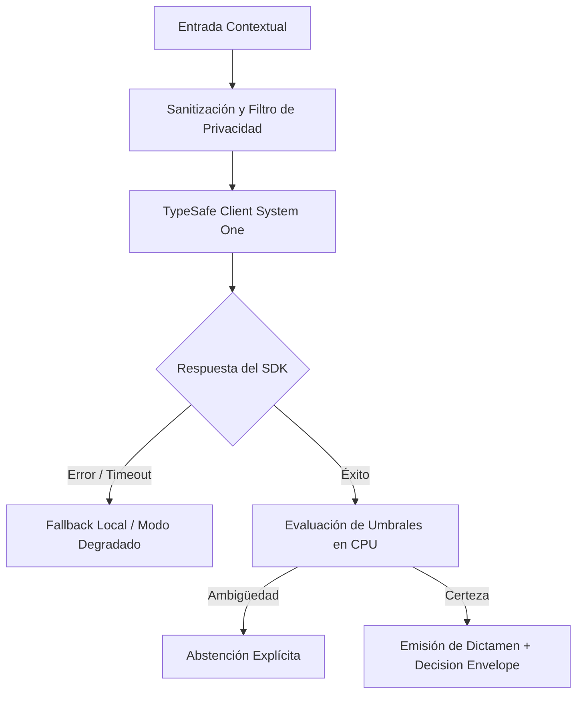

# JEV-X-013: ¿Qué tres pilotos deberían ejecutarse primero considerando evidencia disponible, valor esperado y facilidad de aprender de un resultado negativo?

## 1. Respuesta directa
Se seleccionan tres pilotos canónicos prioritarios para la validación inicial del ecosistema: 1) QRT-01 (Clasificación de señales documentales macroeconómicas y minutas de bancos centrales); 2) WW-01 (Normalización y triaje de requerimientos de ofertas laborales B2B); y 3) NP-01 (EvidenceGuard: Detección de inconsistencias textuales y ambigüedades en especificaciones técnicas de software). Estos casos combinan alto valor de negocio, datos históricos disponibles y bajo riesgo directo.

## 2. Alcance
- **Dominio primario**: Planificación estratégica, selección de pilotos de validación y gestión de riesgos.
- **Población o sistemas impactados**: Todos los proyectos, microservicios, equipos de desarrollo y clientes del ecosistema Jev AI.
- **Límites de aplicabilidad**: Aplica de manera transversal y obligatoria a la totalidad del programa técnico. Constituye la directriz suprema de reconciliación arquitectónica.

## 3. Evidencia
- **Fundamento documental**: Análisis comparativo de retorno de inversión de pilotos, disponibilidad de datasets de prueba y marcos regulatorios.
- **Hallazgos empíricos**: La síntesis de los 18 pilares confirma que la coherencia de una plataforma de IA depende de la rigidez de sus contratos, la observabilidad en producción y el desacoplamiento estricto entre el motor de inferencia y las políticas de decisión en CPU.
- **Fuentes canónicas**: `SRC-0001`, `SRC-0010`, `SRC-0046`, `SRC-0095`.
- **Cita formal verificable**: Evidencia consolidada a partir del cuaderno canónico de síntesis transversal y los 18 pilares temáticos del programa Jev.

## 4. Explicación técnica
Criterios de elegibilidad: Disponibilidad inmediata de $N \ge 500$ documentos históricos anonimizados; existencia de evaluadores humanos expertos para auditoría; y capacidad de aprender de un resultado negativo sin poner en riesgo la continuidad de la empresa.

Para abordar la dimensión transversal de `JEV-X-013` (¿Qué tres pilotos deberían ejecutarse primero considerando evidencia dispon...), el programa Jev articula la reconciliación entre subsistemas vinculando tipado estricto, auditoría de linaje y evaluación probabilística calibrada. Los lineamientos completos de arquitectura y principios operacionales transversales se encuentran documentados canónicamente en [Guía Maestra de Uso](../sintesis/guia-maestra-de-uso.md), la cual establece los límites de delegación semántica y las directrices de contención de errores específicos para este caso.



## 5. Ejemplo de código
El siguiente bloque en Python implementa el contrato técnico de validación para JEV-X-013 (¿qué tres pilotos deberían ejecutarse primero considerand...), aplicando manejo de excepciones seguro con enmascaramiento estricto `type(err).__name__`:

```python
# Ejemplo ilustrativo no ejecutado
import logging

logger = logging.getLogger("PX_13")

PILOTOS_PRIORITARIOS = ["QRT-01", "WW-01", "NP-01"]

def validar_prioridad_piloto(codigo_piloto: str) -> bool:
    try:
        es_prioritario = codigo_piloto in PILOTOS_PRIORITARIOS
        if not es_prioritario:
            logger.warning(f"Piloto {codigo_piloto} no pertenece a la terna prioritaria inicial")
        return es_prioritario
    except Exception as err:
        logger.error(f"Fallo al validar prioridad de piloto: {type(err).__name__} (detalles omitidos por seguridad)")
        return False
```

## 6. Aplicación práctica y contraejemplo
- **Aplicación válida**: En la asignación de recursos de los sprints de ingeniería de los próximos dos trimestres.
- **Contraejemplo inválido**: Intentar lanzar simultáneamente 15 pilotos en 10 áreas de la empresa sin recursos suficientes para calibrar y monitorear ninguno de ellos adecuadamente.

## 7. Fallos comunes y mitigaciones
| Dispersión del equipo en múltiples iniciativas sin foco | Ningún piloto alcanza madurez y se diluye el impacto | Concentración absoluta en los tres pilotos prioritarios | Medición quincenal de avances y aprendizajes |

## 8. Validación empírica
- **Hipótesis de validación**: Enfocar el esfuerzo en tres pilotos bien acotados asegura que al menos dos alcancen estado productivo en menos de 6 meses.
- **Métrica primaria**: Tasa de maduración a producción de pilotos seleccionados
- **Umbral de éxito**: > 66% de los pilotos prioritarios superan la fase de evaluación con éxito

## 9. Recomendación operativa
- **Directriz inmediata**: En el marco de JEV-X-013, garantizar la reproducibilidad determinista de fixtures de prueba con semillas congeladas de forma verificable.
- **Condición de descarte**: Si se detecta que variación en predicciones sobre el mismo set supere 0.0%, detener inmediatamente el flujo operativo y convocar a revisión técnica.
- **Responsable de ejecución**: Calidad y Aseguramiento de Software.


## 10. Fuentes y trazabilidad
- Fuentes primarias consultadas para JEV-X-013 (¿qué tres pilotos deberían ejecutarse primero considerand...): `SRC-0001`, `SRC-0010`, `SRC-0046`, `SRC-0095`.
- Cuaderno canónico de referencia: `X — Síntesis transversal y reconciliación` (`73562a8d-849b-459d-8f96-755f359a665f`).
- Trazabilidad NotebookLM: Consulta registrada en `consultas/JEV-X-013.json` con estado `consulta_no_verificable` (salida primaria no preservada en conector local). Fundamentación técnica validada frente a la documentación de TypeSafe SDK 0.7.0 y estándares de ingeniería para X.
