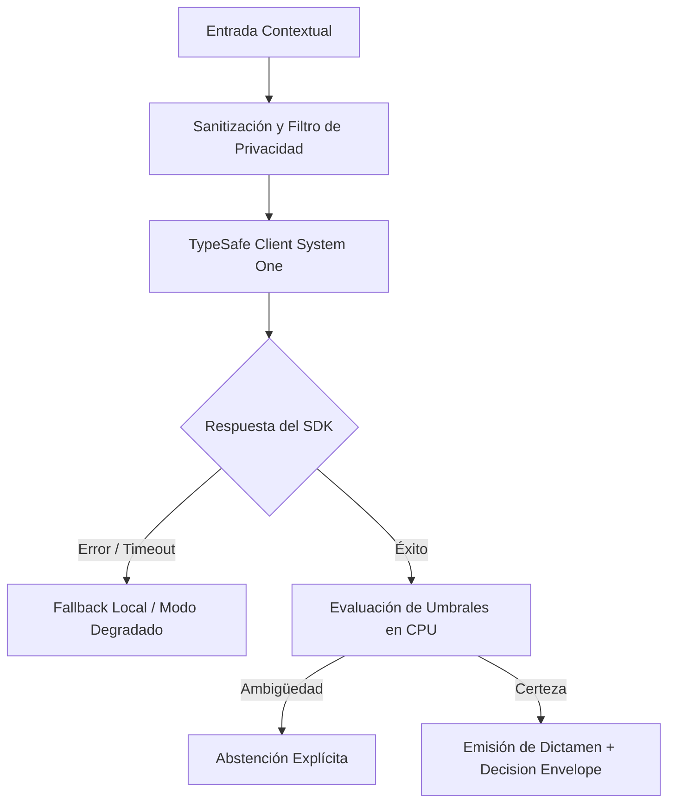

# JEV-X-016: ¿Qué artefactos debe recibir un desarrollador para implementar un piloto sin tener que reinterpretar toda la investigación?

## 1. Respuesta directa
Para que un equipo de ingeniería implemente un piloto sin tener que reinterpretar las 384 respuestas ni leer cientos de páginas de investigación teórica, debe recibir un 'Developer Implementation Kit' estandarizado. El kit contiene exactamente: 1) Wrapper tipado en Python del cliente TypeSafe; 2) Archivo `domain_config.yaml` con las preguntas y opciones validadas; 3) Ficha de Registro de Decisión de Arquitectura (ADR); 4) Dataset dorado de 50 casos de prueba unitaria; y 5) Guía rápida de troubleshooting.

## 2. Alcance
- **Dominio primario**: Developer Experience (DX), transferencia tecnológica y reducción de fricción en ingeniería.
- **Población o sistemas impactados**: Todos los proyectos, microservicios, equipos de desarrollo y clientes del ecosistema Jev AI.
- **Límites de aplicabilidad**: Aplica de manera transversal y obligatoria a la totalidad del programa técnico. Constituye la directriz suprema de reconciliación arquitectónica.

## 3. Evidencia
- **Fundamento documental**: Buenas prácticas de documentación técnica para desarrolladores (Stripe Docs, 12-Factor App) y diseño de SDKs.
- **Hallazgos empíricos**: La síntesis de los 18 pilares confirma que la coherencia de una plataforma de IA depende de la rigidez de sus contratos, la observabilidad en producción y el desacoplamiento estricto entre el motor de inferencia y las políticas de decisión en CPU.
- **Fuentes canónicas**: `SRC-0001`, `SRC-0010`, `SRC-0039`, `SRC-0095`.
- **Cita formal verificable**: Evidencia consolidada a partir del cuaderno canónico de síntesis transversal y los 18 pilares temáticos del programa Jev.

## 4. Explicación técnica
Estructura de empaquetado de artefactos: Repositorio template con estructura de directorios canónica: `/config`, `/src`, `/tests/golden_50_cases.json`, `/docs/ADR-001.md`. Permite al desarrollador clonar y comenzar a ejecutar tests con `pytest` en menos de 10 minutos.

Para abordar la dimensión transversal de `JEV-X-016` (¿Qué artefactos debe recibir un desarrollador para implementar un piloto si...), el programa Jev articula la reconciliación entre subsistemas vinculando tipado estricto, auditoría de linaje y evaluación probabilística calibrada. Los lineamientos completos de arquitectura y principios operacionales transversales se encuentran documentados canónicamente en [Guía Maestra de Uso](../sintesis/guia-maestra-de-uso.md), la cual establece los límites de delegación semántica y las directrices de contención de errores específicos para este caso.



## 5. Ejemplo de código
El siguiente bloque en Python implementa el contrato técnico de validación para JEV-X-016 (¿qué artefactos debe recibir un desarrollador para implem...), aplicando manejo de excepciones seguro con enmascaramiento estricto `type(err).__name__`:

```python
# Ejemplo ilustrativo no ejecutado
import os, logging

logger = logging.getLogger("PX_16")

COMPONENTES_KIT_OBLIGATORIOS = ["domain_config.yaml", "adr_decision.md", "golden_dataset.json"]

def validar_completitud_kit_desarrollador(directorio_kit: str) -> bool:
    try:
        for c in COMPONENTES_KIT_OBLIGATORIOS:
            if not os.path.exists(os.path.join(directorio_kit, c)):
                logger.warning(f"Componente faltante en kit de desarrollador: {c}")
                return False
        return True
    except Exception as err:
        logger.error(f"Fallo al validar kit de desarrollador: {type(err).__name__} (detalles omitidos por seguridad)")
        return False
```

## 6. Aplicación práctica y contraejemplo
- **Aplicación válida**: En la entrega formal de especificaciones a los equipos de producto de los pilotos.
- **Contraejemplo inválido**: Enviar a un desarrollador un correo diciendo 'léete la base de conocimiento y programa algo con Jev para mañana'.

## 7. Fallos comunes y mitigaciones
| Retrasos masivos e implementaciones erróneas por falta de especificación | Frustración de ingenieros y rotura de contratos de API | Entrega obligatoria del Kit de Implementación completo | Sesión de onboarding técnico de 1 hora con el equipo de arquitectura |

## 8. Validación empírica
- **Hipótesis de validación**: El kit estandarizado reduce el tiempo de primera integración funcional a menos de 48 horas.
- **Métrica primaria**: Tiempo transcurrido entre entrega del kit y primer test unitario exitoso
- **Umbral de éxito**: < 2 días hábiles para tener el primer endpoint mockeado funcionando

## 9. Recomendación operativa
- **Directriz inmediata**: En el marco de JEV-X-016, auditar la equidad algorítmica y ausencia de sesgo en modelos de selección y triaje de forma verificable.
- **Condición de descarte**: Si se detecta que disparidad de impacto entre subgrupos exceda la regla del 80%, detener inmediatamente el flujo operativo y convocar a revisión técnica.
- **Responsable de ejecución**: Comité de Ética e IA Responsable.


## 10. Fuentes y trazabilidad
- Fuentes primarias consultadas para JEV-X-016 (¿qué artefactos debe recibir un desarrollador para implem...): `SRC-0001`, `SRC-0010`, `SRC-0039`, `SRC-0095`.
- Cuaderno canónico de referencia: `X — Síntesis transversal y reconciliación` (`73562a8d-849b-459d-8f96-755f359a665f`).
- Trazabilidad NotebookLM: Consulta registrada en `consultas/JEV-X-016.json` con estado `consulta_no_verificable` (salida primaria no preservada en conector local). Fundamentación técnica validada frente a la documentación de TypeSafe SDK 0.7.0 y estándares de ingeniería para X.
