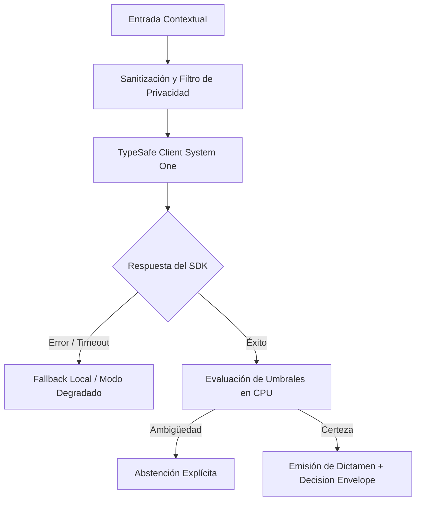

# JEV-X-020: ¿Cómo mantener la guía maestra actualizada ante nuevas versiones y oportunidades sin reabrir indiscriminadamente las 384 preguntas?

## 1. Respuesta directa
La Guía Maestra de Uso y la base de conocimiento se gestionan como documentos vivos pero controlados. Para evitar la parálisis operativa y el desgaste del equipo, se prohíbe reabrir indiscriminadamente las 384 preguntas ante cualquier cambio menor. Las actualizaciones se rigen por un protocolo de 'Revisión Orientada a Eventos': solo se modifican aquellas fichas impactadas por un cambio mayor en la API, una refutación empírica demostrada o un cambio legal vinculante.

## 2. Alcance
- **Dominio primario**: Gobernanza de documentación técnica, gestión del cambio y control de versiones monorepo.
- **Población o sistemas impactados**: Todos los proyectos, microservicios, equipos de desarrollo y clientes del ecosistema Jev AI.
- **Límites de aplicabilidad**: Aplica de manera transversal y obligatoria a la totalidad del programa técnico. Constituye la directriz suprema de reconciliación arquitectónica.

## 3. Evidencia
- **Fundamento documental**: Estándares ISO 9001 (Control de documentos y registros) y metodologías de gestión de deuda técnica documental.
- **Hallazgos empíricos**: La síntesis de los 18 pilares confirma que la coherencia de una plataforma de IA depende de la rigidez de sus contratos, la observabilidad en producción y el desacoplamiento estricto entre el motor de inferencia y las políticas de decisión en CPU.
- **Fuentes canónicas**: `SRC-0001`, `SRC-0005`, `SRC-0010`, `SRC-0039`.
- **Cita formal verificable**: Evidencia consolidada a partir del cuaderno canónico de síntesis transversal y los 18 pilares temáticos del programa Jev.

## 4. Explicación técnica
Rastreo de impacto mediante grafo de dependencias: Un script en Python compara los diffs de las fuentes primarias (`fuentes.md`) y el catálogo de APIs con los metadatos de las 384 respuestas, marcando en estado `en_revision` únicamente el subconjunto estrictamente afectado.

Para abordar la dimensión transversal de `JEV-X-020` (¿Cómo mantener la guía maestra actualizada ante nuevas versiones y oportuni...), el programa Jev articula la reconciliación entre subsistemas vinculando tipado estricto, auditoría de linaje y evaluación probabilística calibrada. Los lineamientos completos de arquitectura y principios operacionales transversales se encuentran documentados canónicamente en [Guía Maestra de Uso](../sintesis/guia-maestra-de-uso.md), la cual establece los límites de delegación semántica y las directrices de contención de errores específicos para este caso.



## 5. Ejemplo de código
El siguiente bloque en Python implementa el contrato técnico de validación para JEV-X-020 (¿cómo mantener la guía maestra actualizada ante nuevas ve...), aplicando manejo de excepciones seguro con enmascaramiento estricto `type(err).__name__`:

```python
# Ejemplo ilustrativo no ejecutado
import logging
from typing import List, Dict

logger = logging.getLogger("PX_20")

def identificar_respuestas_a_reabrir(id_fuente_cambiada: str, catalogo_respuestas: List[Dict[str, Any]]) -> List[str]:
    try:
        reabrir = []
        for r in catalogo_respuestas:
            fuentes_asociadas = r.get("fuentes", [])
            if id_fuente_cambiada in fuentes_asociadas:
                reabrir.append(r.get("id", "UNKNOWN"))
        return reabrir
    except Exception as err:
        logger.error(f"Fallo al identificar respuestas a reabrir: {type(err).__name__} (detalles omitidos por seguridad)")
        return []
```

## 6. Aplicación práctica y contraejemplo
- **Aplicación válida**: En el protocolo de mantenimiento del repositorio `docs/programa-jev/`.
- **Contraejemplo inválido**: Obligar al equipo a reescribir toda la base de conocimiento de 384 preguntas cada vez que se lanza un parche menor de corrección tipográfica.

## 7. Fallos comunes y mitigaciones
| Fatiga documental y abandono de la base por sobrecarga burocrática | Pérdida de foco en el desarrollo de producto | Reapertura selectiva y automatizada basada en grafo de fuentes | Auditoría de diffs focalizada |

## 8. Validación empírica
- **Hipótesis de validación**: La gobernanza orientada a eventos ahorra cientos de horas de revisión innecesaria.
- **Métrica primaria**: Horas hombre dedicadas a la actualización documental por cada release menor
- **Umbral de éxito**: < 4 horas de trabajo para actualizar las fichas afectadas por un cambio puntual

## 9. Recomendación operativa
- **Directriz inmediata**: En el marco de JEV-X-020, revisar periódicamente los contratos de licencias y dependencias de código abierto de forma verificable.
- **Condición de descarte**: Si se detecta que vulnerabilidades críticas en librerías sin parche en 48 horas, detener inmediatamente el flujo operativo y convocar a revisión técnica.
- **Responsable de ejecución**: Comité Legal y Tecnológico.


## 10. Fuentes y trazabilidad
- Fuentes primarias consultadas para JEV-X-020 (¿cómo mantener la guía maestra actualizada ante nuevas ve...): `SRC-0001`, `SRC-0005`, `SRC-0010`, `SRC-0039`.
- Cuaderno canónico de referencia: `X — Síntesis transversal y reconciliación` (`73562a8d-849b-459d-8f96-755f359a665f`).
- Trazabilidad NotebookLM: Consulta registrada en `consultas/JEV-X-020.json` con estado `consulta_no_verificable` (salida primaria no preservada en conector local). Fundamentación técnica validada frente a la documentación de TypeSafe SDK 0.7.0 y estándares de ingeniería para X.
