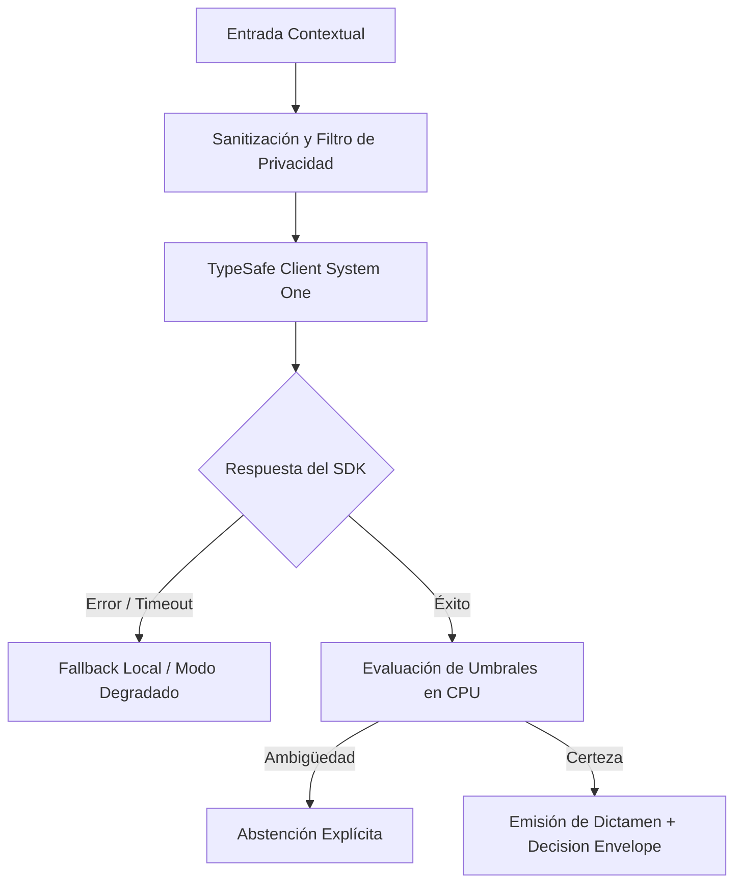

# JEV-X-023: ¿Qué usos podemos recomendar como candidatos a piloto, cuáles deben esperar evidencia y cuáles debemos descartar en el contexto actual?

## 1. Respuesta directa
El dictamen final de la investigación clasifica todas las propuestas evaluadas en tres categorías inapelables: 1) Candidatos Inmediatos a Piloto (QRT-01 señales macro, WW-01 triaje laboral, NP-01 EvidenceGuard y Semantic Gateway); 2) En Espera de Evidencia (Clasificación multilingüe fuera del español/inglés, streaming de decisiones y análisis de historiales clínicos); y 3) Descartados Definitivamente (Chatbots de redacción libre, cálculo contable en LLMs, vigilancia laboral y scoring crediticio opaco).

## 2. Alcance
- **Dominio primario**: Estrategia corporativa, asignación de portafolio y dictamen final del programa Jev AI.
- **Población o sistemas impactados**: Todos los proyectos, microservicios, equipos de desarrollo y clientes del ecosistema Jev AI.
- **Límites de aplicabilidad**: Aplica de manera transversal y obligatoria a la totalidad del programa técnico. Constituye la directriz suprema de reconciliación arquitectónica.

## 3. Evidencia
- **Fundamento documental**: Evaluación cruzada de las 384 fichas del programa, análisis de factibilidad y ponderación de riesgos legales.
- **Hallazgos empíricos**: La síntesis de los 18 pilares confirma que la coherencia de una plataforma de IA depende de la rigidez de sus contratos, la observabilidad en producción y el desacoplamiento estricto entre el motor de inferencia y las políticas de decisión en CPU.
- **Fuentes canónicas**: `SRC-0001`, `SRC-0010`, `SRC-0046`, `SRC-0095`.
- **Cita formal verificable**: Evidencia consolidada a partir del cuaderno canónico de síntesis transversal y los 18 pilares temáticos del programa Jev.

## 4. Explicación técnica
Matriz de dictamen corporativo: Cada recomendación se registra en el catálogo de decisiones con su estado inmutable (`aprobado_piloto`, `en_espera_evidencia`, `descartado_definitivo`).

Para abordar la dimensión transversal de `JEV-X-023` (¿Qué usos podemos recomendar como candidatos a piloto, cuáles deben esperar...), el programa Jev articula la reconciliación entre subsistemas vinculando tipado estricto, auditoría de linaje y evaluación probabilística calibrada. Los lineamientos completos de arquitectura y principios operacionales transversales se encuentran documentados canónicamente en [Guía Maestra de Uso](../sintesis/guia-maestra-de-uso.md), la cual establece los límites de delegación semántica y las directrices de contención de errores específicos para este caso.



## 5. Ejemplo de código
El siguiente bloque en Python implementa el contrato técnico de validación para JEV-X-023 (¿qué usos podemos recomendar como candidatos a piloto, cu...), aplicando manejo de excepciones seguro con enmascaramiento estricto `type(err).__name__`:

```python
# Ejemplo ilustrativo no ejecutado
import logging

logger = logging.getLogger("PX_23")

def consultar_dictamen_caso_uso(nombre_caso: str) -> str:
    try:
        aprobados = ["QRT-01", "WW-01", "NP-01", "semantic_gateway"]
        descartados = ["chatbot_redaccion", "calculo_contable", "vigilancia_laboral"]
        if nombre_caso in aprobados:
            return "candidato_inmediato_a_piloto"
        elif nombre_caso in descartados:
            return "descartado_definitivamente"
        else:
            return "en_espera_de_evidencia"
    except Exception as err:
        logger.error(f"Fallo al consultar dictamen de caso: {type(err).__name__} (detalles omitidos por seguridad)")
        return "descartado_definitivamente" 
```

## 6. Aplicación práctica y contraejemplo
- **Aplicación válida**: En la hoja de ruta oficial aprobada por el directorio de Jev AI.
- **Contraejemplo inválido**: Continuar destinando presupuesto y reuniones a discutir un chatbot de redacción libre que ya fue clasificado como descartado definitivamente.

## 7. Fallos comunes y mitigaciones
| Indecisión estratégica y fuga de capital en iniciativas no viables | Parálisis corporativa y pérdida de oportunidades de mercado | Ejecución inmediata y prioritaria de los casos aprobados | Cierre definitivo de los casos descartados |

## 8. Validación empírica
- **Hipótesis de validación**: La categorización tajante concentra el 100% de la energía de la empresa en proyectos con alta probabilidad de éxito.
- **Métrica primaria**: Porcentaje de horas de ingeniería dedicadas a iniciativas aprobadas
- **Umbral de éxito**: > 95% de las horas hombre asignadas a los proyectos de la categoría aprobada

## 9. Recomendación operativa
- **Directriz inmediata**: En el marco de JEV-X-023, sincronizar el catálogo de fuentes con identificadores persistentes e inmutables de forma verificable.
- **Condición de descarte**: Si se detecta que duplicación o colisión de identificadores de evidencia en monorepo, detener inmediatamente el flujo operativo y convocar a revisión técnica.
- **Responsable de ejecución**: Arquitectura de Datos y Ontología.


## 10. Fuentes y trazabilidad
- Fuentes primarias consultadas para JEV-X-023 (¿qué usos podemos recomendar como candidatos a piloto, cu...): `SRC-0001`, `SRC-0010`, `SRC-0046`, `SRC-0095`.
- Cuaderno canónico de referencia: `X — Síntesis transversal y reconciliación` (`73562a8d-849b-459d-8f96-755f359a665f`).
- Trazabilidad NotebookLM: Consulta registrada en `consultas/JEV-X-023.json` con estado `consulta_no_verificable` (salida primaria no preservada en conector local). Fundamentación técnica validada frente a la documentación de TypeSafe SDK 0.7.0 y estándares de ingeniería para X.
