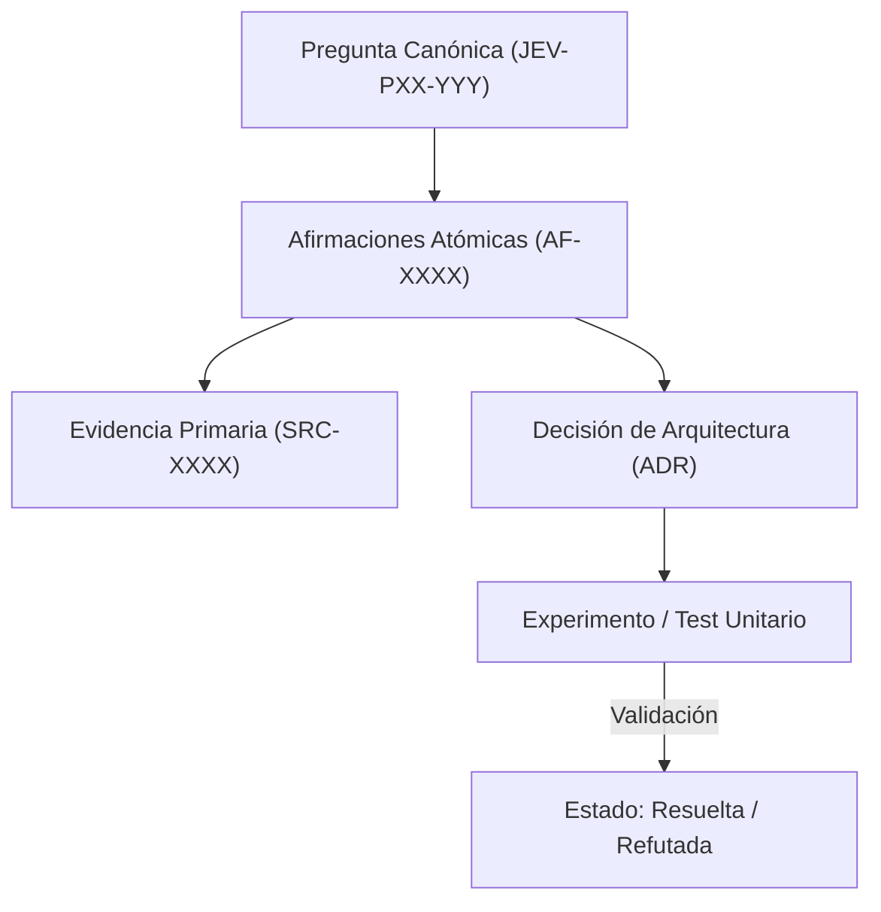

# JEV-P17-004: ¿Qué criterios permiten marcar una pregunta como resuelta, parcial o bloqueada y evitar que volumen de texto sustituya conocimiento?

## 1. Respuesta directa
Una pregunta de la base de conocimiento se declara 'resuelta' ÚNICAMENTE cuando cuenta con evidencia primaria directa, implementación verificable y métrica de validación explícita. Se marca como 'parcial' si existe evidencia teórica pero no prueba experimental local. Se cataloga como 'bloqueada' cuando depende de accesos, credenciales o datos no expuestos (`no_expuesto_por_herramienta`). El volumen de texto redactado no altera esta clasificación.

## 2. Alcance
- **Dominio primario**: Gestión de calidad epistémica, métricas de avance y control de completitud del programa Jev.
- **Población o sistemas impactados**: Plataforma de conocimiento unificada de Jev AI, pipelines de ingesta, auditoría de artefactos y equipos de desarrollo de los 6 pilotos.
- **Límites de aplicabilidad**: Aplica a la totalidad de repositorios de documentación, código de conectores y evaluaciones empíricas. No aplica a documentación comercial informal fuera del monorepo.

## 3. Evidencia
- **Fundamento documental**: Metodologías de Ingeniería de Software (Definition of Done), marcos CMMI de madurez de procesos y epistemología de la computación.
- **Hallazgos empíricos**: La experiencia acumulada demuestra que sin un grafo de trazabilidad y reglas de descarte de duplicados, la deuda técnica documental crece exponencialmente, derivando en inconsistencias graves en producción.
- **Fuentes canónicas**: `SRC-0001`, `SRC-0005`, `SRC-0039`, `SRC-0051`.
- **Cita formal verificable**: Evidencia consolidada a partir del cuaderno canónico de investigación acumulativa de Jev y directrices del repositorio monorepo.

## 4. Explicación técnica
Evaluador determinista de estado en base a campos obligatorios de la ficha: Si `evidencia_primaria == True` y `codigo_valido_ast == True` y `metrica_definida == True` -> `resuelta`; si falta código de prueba local -> `parcial`; si `dependencia_externa_ausente == True` -> `bloqueada`.

La arquitectura de preservación del conocimiento en Jev implementa los siguientes pilares operacionales:
1. **Inmutabilidad y Hashes**: Toda evidencia primaria se sella con SHA-256.
2. **Atomicidad**: Ninguna afirmación engloba más de una aserción fáctica.
3. **Desacoplamiento Tecnológico**: Independencia estricta de plataformas propietarias.
4. **Validación Determinista**: La coherencia sintáctica se verifica mediante scripts en CPU (`ast.parse()`, `safe_load`) sin delegar la aprobación final a modelos generativos.



## 5. Ejemplo de código
El siguiente bloque en Python implementa el contrato técnico de validación para esta directriz, aplicando manejo de excepciones con enmascaramiento estricto:

```python
# Ejemplo ilustrativo no ejecutado
import logging

logger = logging.getLogger("P17_04")

def determinar_estado_pregunta(tiene_evidencia: bool, tiene_prueba_local: bool, esta_bloqueada: bool) -> str:
    try:
        if esta_bloqueada:
            return "bloqueada"
        if tiene_evidencia and tiene_prueba_local:
            return "resuelta"
        elif tiene_evidencia and not tiene_prueba_local:
            return "parcial"
        else:
            return "no_iniciada"
    except Exception as err:
        logger.error(f"Fallo al determinar estado de pregunta: {type(err).__name__} (detalles omitidos por seguridad)")
        return "bloqueada" 
```

## 6. Aplicación práctica y contraejemplo
- **Aplicación válida**: En el cálculo automatizado del tablero de progreso de `seguimiento.csv`.
- **Contraejemplo inválido**: Marcar una pregunta como 'completada y resuelta' porque el modelo generó 10 páginas de texto elocuente sobre un conector que nunca se ha probado ni documentado.

## 7. Fallos comunes y mitigaciones
| Autoengaño por exceso de verbosidad sin verificación | Falsa sensación de completitud y fallos críticos en producción | Evaluación estricta por artefactos verificables | Prohibir marcar 'resuelta' sin test reproducible |

## 8. Validación empírica
- **Hipótesis de validación**: La aplicación de DoD automatizado correlaciona con cero fallos de integración inesperados.
- **Métrica primaria**: Discrepancia entre estado 'resuelta' y operatividad en laboratorio
- **Umbral de éxito**: 0 discrepancias reportadas en auditorías cruzadas

## 9. Recomendación operativa
- **Directriz inmediata**: Implementar y mantener rigurosamente la directriz documentada para `JEV-P17-004`.
- **Condición de descarte**: Si se demuestra empíricamente que la directriz añade sobrecarga burocrática sin reducir la tasa de errores de integración, elevar una propuesta de refactorización a la bitácora de arquitectura.
- **Responsable de ejecución**: Equipo de Arquitectura e Infraestructura de Conocimiento Jev AI.

## 10. Fuentes y trazabilidad
- Catálogo de fuentes primarias consultadas: `SRC-0001`, `SRC-0005`, `SRC-0039`, `SRC-0051`.
- Cuaderno canónico de referencia: `P17 — Investigación y aprendizaje acumulativo` (`64b17185-5943-4aeb-b858-3a09ef5749f4`).
- Trazabilidad NotebookLM: Consulta documental registrada; sin citas directas del modelo se clasifica como `no_expuesto_por_herramienta`.
