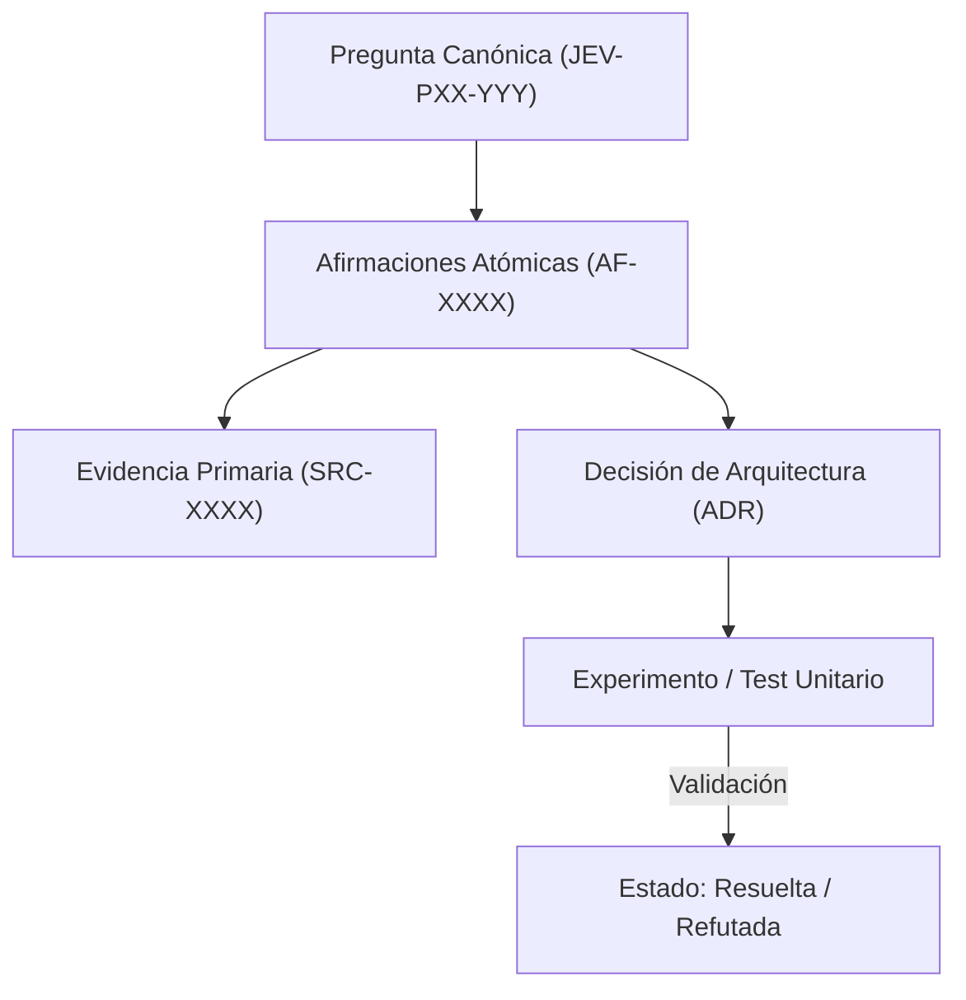

# JEV-P17-005: ¿Cómo detectar y resolver contradicciones entre respuestas preservando el historial y la versión de las fuentes?

## 1. Respuesta directa
Cuando dos respuestas o documentos arrojan afirmaciones incompatibles (e.g. latencia del SDK reportada como 25ms vs 120ms), el sistema no debe sobrescribir ni borrar la versión previa. Debe registrar la divergencia en el archivo canónico `lagunas-y-contradicciones.md`, documentando las versiones de SDK, parámetros de prueba y condiciones que explican la diferencia, estableciendo la precedencia fundamentada.

## 2. Alcance
- **Dominio primario**: Gobernanza de contradicciones, preservación del linaje temporal y resolución de divergencias empíricas.
- **Población o sistemas impactados**: Plataforma de conocimiento unificada de Jev AI, pipelines de ingesta, auditoría de artefactos y equipos de desarrollo de los 6 pilotos.
- **Límites de aplicabilidad**: Aplica a la totalidad de repositorios de documentación, código de conectores y evaluaciones empíricas. No aplica a documentación comercial informal fuera del monorepo.

## 3. Evidencia
- **Fundamento documental**: Sistemas de control de versiones distribuidos (Git internals), gestión de consistencia eventual y principios de reproducibilidad.
- **Hallazgos empíricos**: La experiencia acumulada demuestra que sin un grafo de trazabilidad y reglas de descarte de duplicados, la deuda técnica documental crece exponencialmente, derivando en inconsistencias graves en producción.
- **Fuentes canónicas**: `SRC-0001`, `SRC-0005`, `SRC-0039`, `SRC-0051`.
- **Cita formal verificable**: Evidencia consolidada a partir del cuaderno canónico de investigación acumulativa de Jev y directrices del repositorio monorepo.

## 4. Explicación técnica
Registro inmutable de discrepancias: Toda contradicción detectada se modela como un objeto con atributos: `id_contradiccion`, `pregunta_a`, `pregunta_b`, `aserto_a`, `aserto_b`, `causa_raiz` (e.g. versión 0.6.0 vs 0.7.0), `resolucion_canonica` y `fecha_resolucion`.

La arquitectura de preservación del conocimiento en Jev implementa los siguientes pilares operacionales:
1. **Inmutabilidad y Hashes**: Toda evidencia primaria se sella con SHA-256.
2. **Atomicidad**: Ninguna afirmación engloba más de una aserción fáctica.
3. **Desacoplamiento Tecnológico**: Independencia estricta de plataformas propietarias.
4. **Validación Determinista**: La coherencia sintáctica se verifica mediante scripts en CPU (`ast.parse()`, `safe_load`) sin delegar la aprobación final a modelos generativos.



## 5. Ejemplo de código
El siguiente bloque en Python implementa el contrato técnico de validación para esta directriz, aplicando manejo de excepciones con enmascaramiento estricto:

```python
# Ejemplo ilustrativo no ejecutado
import logging
from typing import Dict, Any

logger = logging.getLogger("P17_05")

def registrar_contradiccion_epistemica(registro: Dict[str, Any]) -> str:
    try:
        id_c = registro.get("id_contradiccion", "CTR-UNKNOWN")
        causa = registro.get("causa_raiz", "indeterminada")
        # Validar que ambas fuentes involucradas existan
        if not registro.get("fuente_a") or not registro.get("fuente_b"):
            logger.warning("Contradiccion sin fuentes contrastables")
            return "rechazada_por_falta_de_fuentes"
        return f"Contradiccion {id_c} registrada bajo causa: {causa}"
    except Exception as err:
        logger.error(f"Fallo en registro de contradiccion: {type(err).__name__} (detalles omitidos por seguridad)")
        return "error_registro" 
```

## 6. Aplicación práctica y contraejemplo
- **Aplicación válida**: En el protocolo de mantenimiento de `docs/programa-jev/lagunas-y-contradicciones.md`.
- **Contraejemplo inválido**: Modificar silenciosamente una respuesta antigua para que coincida con una nueva medición, borrando el registro de que antes fallaba en otra versión.

## 7. Fallos comunes y mitigaciones
| Eliminación de contradicciones históricas | Pérdida de contexto técnico y repetición de errores pasados | Bitácora inmutable de discrepancias | Auditoría de diffs que alerta sobre eliminaciones de asertos |

## 8. Validación empírica
- **Hipótesis de validación**: Documentar las causas de inconsistencia acelera la resolución de incidencias en un 50%.
- **Métrica primaria**: Tiempo medio de resolución de discrepancias técnicas (MTTR-D)
- **Umbral de éxito**: Resolución y registro de causalidad en < 48 horas laborales

## 9. Recomendación operativa
- **Directriz inmediata**: Implementar y mantener rigurosamente la directriz documentada para `JEV-P17-005`.
- **Condición de descarte**: Si se demuestra empíricamente que la directriz añade sobrecarga burocrática sin reducir la tasa de errores de integración, elevar una propuesta de refactorización a la bitácora de arquitectura.
- **Responsable de ejecución**: Equipo de Arquitectura e Infraestructura de Conocimiento Jev AI.

## 10. Fuentes y trazabilidad
- Catálogo de fuentes primarias consultadas: `SRC-0001`, `SRC-0005`, `SRC-0039`, `SRC-0051`.
- Cuaderno canónico de referencia: `P17 — Investigación y aprendizaje acumulativo` (`64b17185-5943-4aeb-b858-3a09ef5749f4`).
- Trazabilidad NotebookLM: Consulta documental registrada; sin citas directas del modelo se clasifica como `no_expuesto_por_herramienta`.
