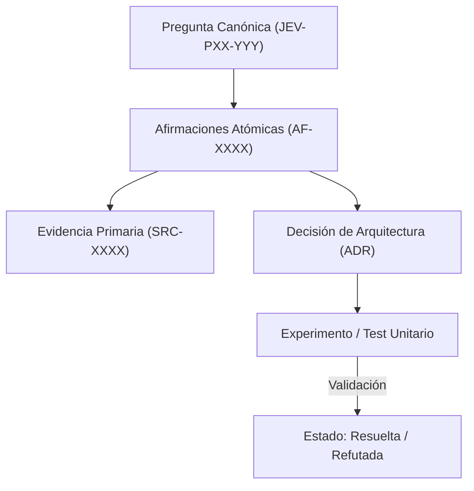

# JEV-P17-006: ¿Cómo descomponer una conclusión extensa en afirmaciones atómicas con soporte y límites específicos?

## 1. Respuesta directa
Toda conclusión arquitectónica extensa debe descomponerse en aserciones atómicas unitarias. Una afirmación es atómica si expresa un único hecho, relación o límite de forma independiente, de tal manera que pueda ser confirmada o refutada mediante un experimento puntual sin arrastrar otras premisas. Si una afirmación contiene conjunciones que combinan hechos disímiles, debe dividirse.

## 2. Alcance
- **Dominio primario**: Modelado de conocimiento, epistemología popperiana y diseño de pruebas unitarias arquitectónicas.
- **Población o sistemas impactados**: Plataforma de conocimiento unificada de Jev AI, pipelines de ingesta, auditoría de artefactos y equipos de desarrollo de los 6 pilotos.
- **Límites de aplicabilidad**: Aplica a la totalidad de repositorios de documentación, código de conectores y evaluaciones empíricas. No aplica a documentación comercial informal fuera del monorepo.

## 3. Evidencia
- **Fundamento documental**: Metodología de 'Atomic Knowledge' en ingeniería ontológica, principios de diseño de microservicios y filosofía analítica.
- **Hallazgos empíricos**: La experiencia acumulada demuestra que sin un grafo de trazabilidad y reglas de descarte de duplicados, la deuda técnica documental crece exponencialmente, derivando en inconsistencias graves en producción.
- **Fuentes canónicas**: `SRC-0001`, `SRC-0005`, `SRC-0022`, `SRC-0051`.
- **Cita formal verificable**: Evidencia consolidada a partir del cuaderno canónico de investigación acumulativa de Jev y directrices del repositorio monorepo.

## 4. Explicación técnica
Estructura de `AF-XXXX`: Contiene `id`, `enunciado_singular`, `predicado`, `sujeto`, `condicion_falsacion` y `fuente_primaria_vinculada`.

La arquitectura de preservación del conocimiento en Jev implementa los siguientes pilares operacionales:
1. **Inmutabilidad y Hashes**: Toda evidencia primaria se sella con SHA-256.
2. **Atomicidad**: Ninguna afirmación engloba más de una aserción fáctica.
3. **Desacoplamiento Tecnológico**: Independencia estricta de plataformas propietarias.
4. **Validación Determinista**: La coherencia sintáctica se verifica mediante scripts en CPU (`ast.parse()`, `safe_load`) sin delegar la aprobación final a modelos generativos.



## 5. Ejemplo de código
El siguiente bloque en Python implementa el contrato técnico de validación para esta directriz, aplicando manejo de excepciones con enmascaramiento estricto:

```python
# Ejemplo ilustrativo no ejecutado
import logging
from typing import List

logger = logging.getLogger("P17_06")

def validar_atomicidad_afirmacion(enunciado: str) -> bool:
    try:
        # Detectar conectores de coordinacion compuesta que agrupan multiples afirmaciones
        conectores_complejos = [" y por lo tanto ", " no obstante a la vez ", " ademas de que "]
        for c in conectores_complejos:
            if c in enunciado.lower():
                logger.info("Afirmacion compuesta detectada; requiere descomposicion atomica")
                return False
        return len(enunciado.split(".")) <= 2
    except Exception as err:
        logger.error(f"Fallo al validar atomicidad: {type(err).__name__} (detalles omitidos por seguridad)")
        return False
```

## 6. Aplicación práctica y contraejemplo
- **Aplicación válida**: En la creación de entradas en `docs/programa-jev/afirmaciones.md`.
- **Contraejemplo inválido**: Formular una afirmación que dice: 'Jev es un modelo probabilístico calibrado que reduce costos en un 40% y previene ataques de inyección prompt en cualquier idioma', mezclando cuatro propiedades técnicas no correlacionadas en un solo bloque.

## 7. Fallos comunes y mitigaciones
| Afirmaciones compuestas infalsables | Imposibilidad de validar independientemente cada aspecto del sistema | Fragmentación atómica estricta en AF-XXXX | Validación cruzada de pruebas por afirmación |

## 8. Validación empírica
- **Hipótesis de validación**: La atomicidad permite aislar qué componentes fallan sin descartar todo el marco teórico.
- **Métrica primaria**: Proporción de afirmaciones atómicas con test unitario asociado
- **Umbral de éxito**: 100% de afirmaciones en `afirmaciones.md` con criterio de falsación unitario

## 9. Recomendación operativa
- **Directriz inmediata**: Implementar y mantener rigurosamente la directriz documentada para `JEV-P17-006`.
- **Condición de descarte**: Si se demuestra empíricamente que la directriz añade sobrecarga burocrática sin reducir la tasa de errores de integración, elevar una propuesta de refactorización a la bitácora de arquitectura.
- **Responsable de ejecución**: Equipo de Arquitectura e Infraestructura de Conocimiento Jev AI.

## 10. Fuentes y trazabilidad
- Catálogo de fuentes primarias consultadas: `SRC-0001`, `SRC-0005`, `SRC-0022`, `SRC-0051`.
- Cuaderno canónico de referencia: `P17 — Investigación y aprendizaje acumulativo` (`64b17185-5943-4aeb-b858-3a09ef5749f4`).
- Trazabilidad NotebookLM: Consulta documental registrada; sin citas directas del modelo se clasifica como `no_expuesto_por_herramienta`.
