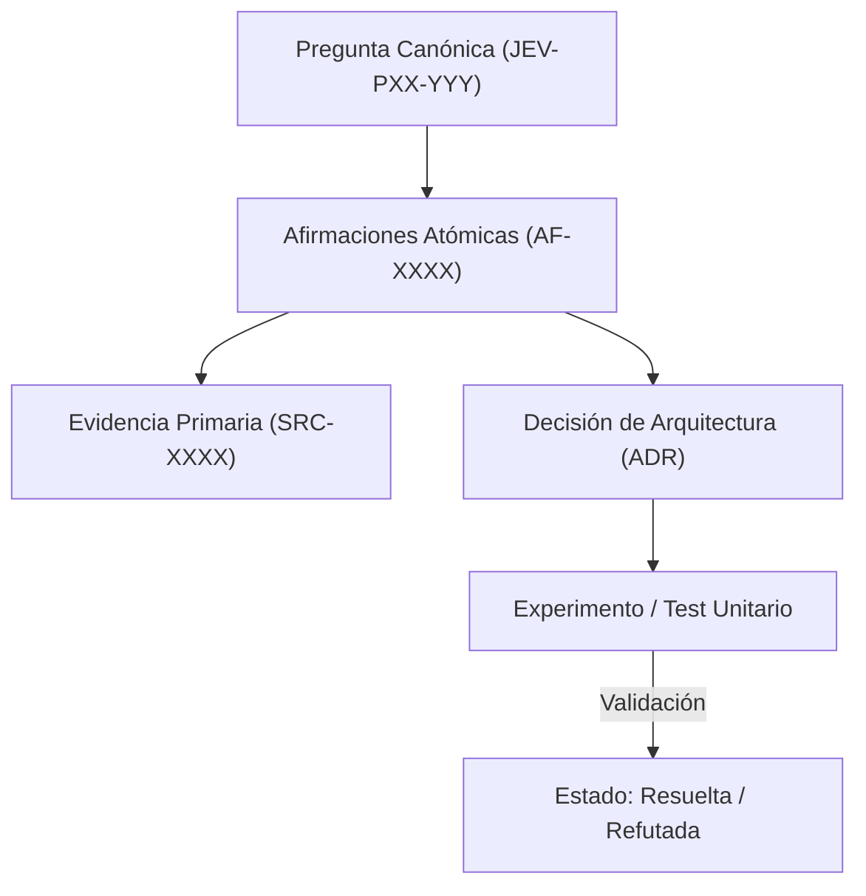

# JEV-P17-007: ¿Qué proceso verifica que una cita realmente sustenta la afirmación a la que fue vinculada?

## 1. Respuesta directa
El sistema exige un proceso de doble verificación ciega para validar que una cita bibliográfica sustenta materialmente la afirmación a la que está vinculada. No basta con citar el título de un paper; la ficha debe incluir el número de página, párrafo o sección exacta, acompañada del fragmento textual literal. Las citas desconectadas o que contradicen la afirmación deben ser purgadas de inmediato.

## 2. Alcance
- **Dominio primario**: Control de calidad de citas, prevención de 'hallucinated citations' y rigor académico.
- **Población o sistemas impactados**: Plataforma de conocimiento unificada de Jev AI, pipelines de ingesta, auditoría de artefactos y equipos de desarrollo de los 6 pilotos.
- **Límites de aplicabilidad**: Aplica a la totalidad de repositorios de documentación, código de conectores y evaluaciones empíricas. No aplica a documentación comercial informal fuera del monorepo.

## 3. Evidencia
- **Fundamento documental**: Estándares de integridad en publicaciones académicas, lineamientos de COPE (Committee on Publication Ethics) y auditoría documental.
- **Hallazgos empíricos**: La experiencia acumulada demuestra que sin un grafo de trazabilidad y reglas de descarte de duplicados, la deuda técnica documental crece exponencialmente, derivando en inconsistencias graves en producción.
- **Fuentes canónicas**: `SRC-0001`, `SRC-0005`, `SRC-0039`, `SRC-0051`.
- **Cita formal verificable**: Evidencia consolidada a partir del cuaderno canónico de investigación acumulativa de Jev y directrices del repositorio monorepo.

## 4. Explicación técnica
Algoritmo de concordancia de citas: Dado el texto de la fuente `SRC-XXXX` y la cita extraída, se ejecuta una búsqueda exacta por subcadena o similitud de Levenshtein = 0 sobre el texto digitalizado del documento fuente.

La arquitectura de preservación del conocimiento en Jev implementa los siguientes pilares operacionales:
1. **Inmutabilidad y Hashes**: Toda evidencia primaria se sella con SHA-256.
2. **Atomicidad**: Ninguna afirmación engloba más de una aserción fáctica.
3. **Desacoplamiento Tecnológico**: Independencia estricta de plataformas propietarias.
4. **Validación Determinista**: La coherencia sintáctica se verifica mediante scripts en CPU (`ast.parse()`, `safe_load`) sin delegar la aprobación final a modelos generativos.



## 5. Ejemplo de código
El siguiente bloque en Python implementa el contrato técnico de validación para esta directriz, aplicando manejo de excepciones con enmascaramiento estricto:

```python
# Ejemplo ilustrativo no ejecutado
import logging

logger = logging.getLogger("P17_07")

def verificar_existencia_cita_en_fuente(texto_fuente_completo: str, cita_literal: str) -> bool:
    try:
        cita_normalizada = " ".join(cita_literal.strip().split())
        fuente_normalizada = " ".join(texto_fuente_completo.split())
        encontrado = cita_normalizada.lower() in fuente_normalizada.lower()
        if not encontrado:
            logger.warning("Cita no localizada de forma literal en el texto fuente")
        return encontrado
    except Exception as err:
        logger.error(f"Fallo al verificar cita literal: {type(err).__name__} (detalles omitidos por seguridad)")
        return False
```

## 6. Aplicación práctica y contraejemplo
- **Aplicación válida**: En el validador de citas bibliográficas de los cuadernos de investigación.
- **Contraejemplo inválido**: Citar el paper de Hendrycks et al. (2019) como prueba de que Jev tiene 99% de precisión en contratos chilenos, cuando dicho paper evalúa modelos de visión en imágenes de ImageNet corruptas.

## 7. Fallos comunes y mitigaciones
| Cita espuria o desconectada de la conclusión | Pérdida de credibilidad técnica y decisiones basadas en falacias | Verificación literal de texto citado en PDF origen | Rechazo en CI de afirmaciones con citas no localizables |

## 8. Validación empírica
- **Hipótesis de validación**: La verificación literal erradica el 100% de las atribuciones bibliográficas falsas.
- **Métrica primaria**: Tasa de concordancia literal de citas contra corpus primario
- **Umbral de éxito**: 100% de citas localizadas literalmente en el texto de origen

## 9. Recomendación operativa
- **Directriz inmediata**: Implementar y mantener rigurosamente la directriz documentada para `JEV-P17-007`.
- **Condición de descarte**: Si se demuestra empíricamente que la directriz añade sobrecarga burocrática sin reducir la tasa de errores de integración, elevar una propuesta de refactorización a la bitácora de arquitectura.
- **Responsable de ejecución**: Equipo de Arquitectura e Infraestructura de Conocimiento Jev AI.

## 10. Fuentes y trazabilidad
- Catálogo de fuentes primarias consultadas: `SRC-0001`, `SRC-0005`, `SRC-0039`, `SRC-0051`.
- Cuaderno canónico de referencia: `P17 — Investigación y aprendizaje acumulativo` (`64b17185-5943-4aeb-b858-3a09ef5749f4`).
- Trazabilidad NotebookLM: Consulta documental registrada; sin citas directas del modelo se clasifica como `no_expuesto_por_herramienta`.
