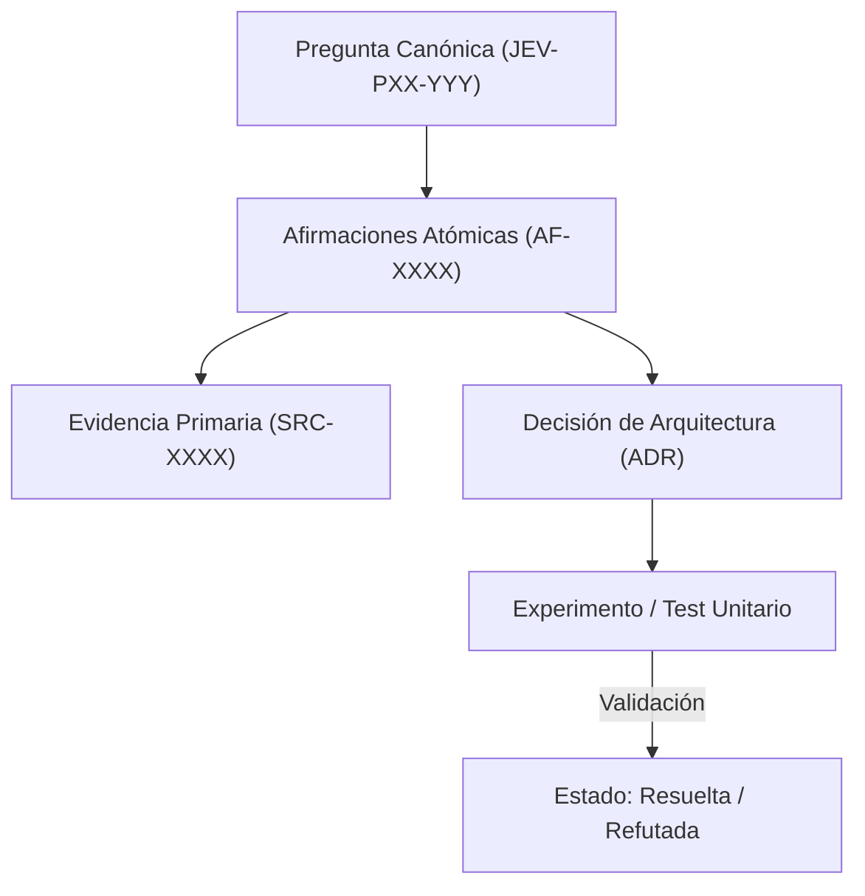

# JEV-P17-011: ¿Cómo priorizar nuevas búsquedas por el valor de la información para una decisión y no por facilidad de producir más documentos?

## 1. Respuesta directa
Las nuevas investigaciones documentales y experimentos de laboratorio deben priorizarse exclusivamente por el Valor de la Información (Value of Information, VoI) que aportan a una decisión crítica de ingeniería o de negocio. Queda prohibido iniciar tareas de investigación guiadas únicamente por la facilidad de recopilar más textos o por el afán de abultar el repositorio con información irrelevante.

## 2. Alcance
- **Dominio primario**: Economía de la investigación, teoría de decisiones bajo incertidumbre y eficiencia de ingeniería.
- **Población o sistemas impactados**: Plataforma de conocimiento unificada de Jev AI, pipelines de ingesta, auditoría de artefactos y equipos de desarrollo de los 6 pilotos.
- **Límites de aplicabilidad**: Aplica a la totalidad de repositorios de documentación, código de conectores y evaluaciones empíricas. No aplica a documentación comercial informal fuera del monorepo.

## 3. Evidencia
- **Fundamento documental**: Teoría de la Decisión Estadística de Howard Raiffa, análisis de VoI en investigación operativa y principios Lean.
- **Hallazgos empíricos**: La experiencia acumulada demuestra que sin un grafo de trazabilidad y reglas de descarte de duplicados, la deuda técnica documental crece exponencialmente, derivando en inconsistencias graves en producción.
- **Fuentes canónicas**: `SRC-0001`, `SRC-0005`, `SRC-0022`, `SRC-0051`.
- **Cita formal verificable**: Evidencia consolidada a partir del cuaderno canónico de investigación acumulativa de Jev y directrices del repositorio monorepo.

## 4. Explicación técnica
Cálculo del Valor Esperado de la Información: $VoI = E_{x}[\max_a U(a, x)] - \max_a E_x[U(a, x)]$. Solo si el costo de adquirir la información $C < VoI$, se aprueba la tarea de investigación en el sprint.

La arquitectura de preservación del conocimiento en Jev implementa los siguientes pilares operacionales:
1. **Inmutabilidad y Hashes**: Toda evidencia primaria se sella con SHA-256.
2. **Atomicidad**: Ninguna afirmación engloba más de una aserción fáctica.
3. **Desacoplamiento Tecnológico**: Independencia estricta de plataformas propietarias.
4. **Validación Determinista**: La coherencia sintáctica se verifica mediante scripts en CPU (`ast.parse()`, `safe_load`) sin delegar la aprobación final a modelos generativos.



## 5. Ejemplo de código
El siguiente bloque en Python implementa el contrato técnico de validación para esta directriz, aplicando manejo de excepciones con enmascaramiento estricto:

```python
# Ejemplo ilustrativo no ejecutado
import logging

logger = logging.getLogger("P17_11")

def evaluar_conveniencia_investigacion(voi_estimado_usd: float, costo_investigacion_usd: float) -> bool:
    try:
        # Solo investigar si el valor neto de la informacion es positivo y supera umbral minimo
        roi_informacion = voi_estimado_usd - costo_investigacion_usd
        return roi_informacion > 500.0 # Umbral de justificacion economica
    except Exception as err:
        logger.error(f"Fallo en evaluacion de VoI: {type(err).__name__} (detalles omitidos por seguridad)")
        return False
```

## 6. Aplicación práctica y contraejemplo
- **Aplicación válida**: En el comité de planificación técnica de nuevos experimentos de Jev.
- **Contraejemplo inválido**: Dedicar 40 horas de un ingeniero a investigar el rendimiento de Jev en esperanto cuando ningún cliente ni producto de la empresa opera fuera del español y el inglés.

## 7. Fallos comunes y mitigaciones
| Dilución del esfuerzo en temas marginales irrelevantes | Retraso en hitos críticos de QRT o Wheelwork | Justificación formal de VoI antes de aprobar tareas | Descarte de investigaciones sin impacto en decisiones |

## 8. Validación empírica
- **Hipótesis de validación**: El filtro por VoI incrementa el impacto operativo de cada hora de investigación en un 40%.
- **Métrica primaria**: Porcentaje de investigaciones completadas que modificaron una decisión de diseño
- **Umbral de éxito**: > 75% de las investigaciones culminan en un cambio de ADR o código

## 9. Recomendación operativa
- **Directriz inmediata**: Implementar y mantener rigurosamente la directriz documentada para `JEV-P17-011`.
- **Condición de descarte**: Si se demuestra empíricamente que la directriz añade sobrecarga burocrática sin reducir la tasa de errores de integración, elevar una propuesta de refactorización a la bitácora de arquitectura.
- **Responsable de ejecución**: Equipo de Arquitectura e Infraestructura de Conocimiento Jev AI.

## 10. Fuentes y trazabilidad
- Catálogo de fuentes primarias consultadas: `SRC-0001`, `SRC-0005`, `SRC-0022`, `SRC-0051`.
- Cuaderno canónico de referencia: `P17 — Investigación y aprendizaje acumulativo` (`64b17185-5943-4aeb-b858-3a09ef5749f4`).
- Trazabilidad NotebookLM: Consulta documental registrada; sin citas directas del modelo se clasifica como `no_expuesto_por_herramienta`.
