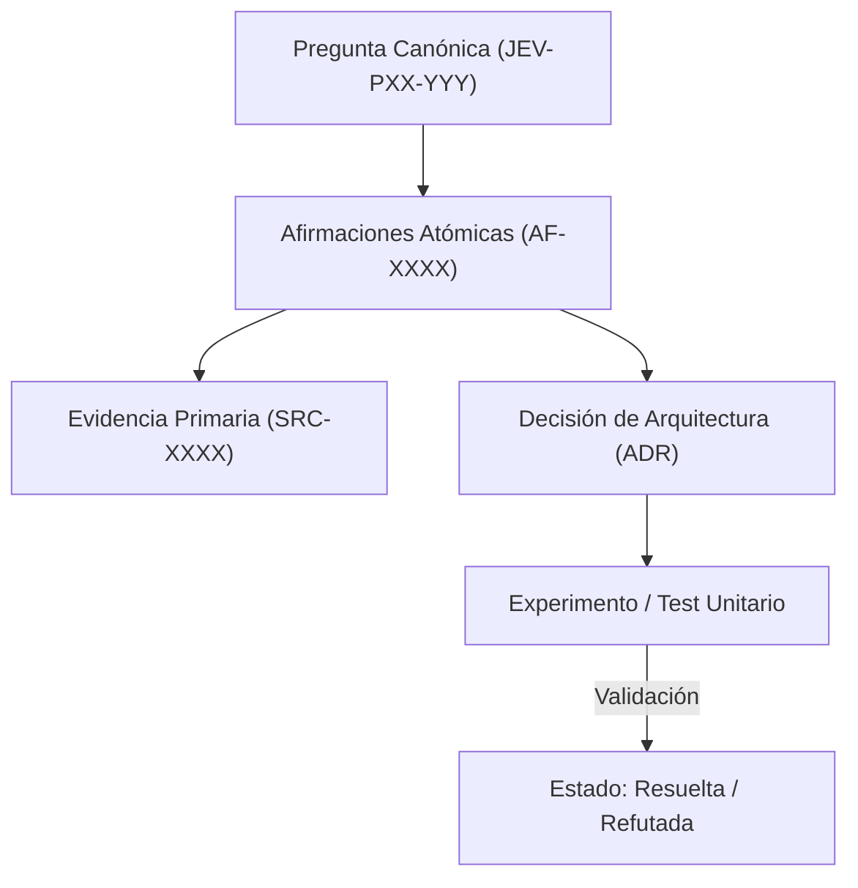

# JEV-P17-013: ¿Cómo integrar retroalimentación de pilotos conservando la diferencia entre un caso anecdótico y evidencia generalizable?

## 1. Respuesta directa
El feedback obtenido de los 6 pilotos canónicos (QRT-01, QRT-02, WW-01, WW-02, FP-01, NP-01) debe integrarse a la base de conocimiento bajo estrictos criterios estadísticos. Una queja o felicitación aislada de un usuario se clasifica como 'Caso Anecdótico ($N=1$)' y no autoriza cambios arquitectónicos globales. Solo patrones agregados con significancia estadística ($N \ge 100$, $p < 0.05$) fundamentan nuevas directrices generales.

## 2. Alcance
- **Dominio primario**: Evaluación de pilotos, telemetría de campo y distinción entre anécdota y evidencia cuantitativa.
- **Población o sistemas impactados**: Plataforma de conocimiento unificada de Jev AI, pipelines de ingesta, auditoría de artefactos y equipos de desarrollo de los 6 pilotos.
- **Límites de aplicabilidad**: Aplica a la totalidad de repositorios de documentación, código de conectores y evaluaciones empíricas. No aplica a documentación comercial informal fuera del monorepo.

## 3. Evidencia
- **Fundamento documental**: Inferencia estadística clásica, pruebas de hipótesis y metodología de Lean Analytics.
- **Hallazgos empíricos**: La experiencia acumulada demuestra que sin un grafo de trazabilidad y reglas de descarte de duplicados, la deuda técnica documental crece exponencialmente, derivando en inconsistencias graves en producción.
- **Fuentes canónicas**: `SRC-0001`, `SRC-0005`, `SRC-0022`, `SRC-0051`.
- **Cita formal verificable**: Evidencia consolidada a partir del cuaderno canónico de investigación acumulativa de Jev y directrices del repositorio monorepo.

## 4. Explicación técnica
Filtro de ingestión de telemetría: Toda retroalimentación se estructura en una tupla: `(id_piloto, tipo_evento, N_muestras, p_valor, intervalo_confianza)`. Si $N < 100$, se etiqueta como `telemetria_cualitativa_exploratoria`; si $N \ge 100$ con significancia demostrada, se promueve a `evidencia_empirica_generalizable`.

La arquitectura de preservación del conocimiento en Jev implementa los siguientes pilares operacionales:
1. **Inmutabilidad y Hashes**: Toda evidencia primaria se sella con SHA-256.
2. **Atomicidad**: Ninguna afirmación engloba más de una aserción fáctica.
3. **Desacoplamiento Tecnológico**: Independencia estricta de plataformas propietarias.
4. **Validación Determinista**: La coherencia sintáctica se verifica mediante scripts en CPU (`ast.parse()`, `safe_load`) sin delegar la aprobación final a modelos generativos.



## 5. Ejemplo de código
El siguiente bloque en Python implementa el contrato técnico de validación para esta directriz, aplicando manejo de excepciones con enmascaramiento estricto:

```python
# Ejemplo ilustrativo no ejecutado
import logging

logger = logging.getLogger("P17_13")

def calificar_evidencia_piloto(n_muestras: int, p_valor: float) -> str:
    try:
        if n_muestras < 100:
            return "caso_anecdotico_no_generalizable"
        if p_valor <= 0.05:
            return "evidencia_estadistica_robusta"
        return "evidencia_no_concluyente"
    except Exception as err:
        logger.error(f"Fallo en calificacion de evidencia de piloto: {type(err).__name__} (detalles omitidos por seguridad)")
        return "error_calificacion" 
```

## 6. Aplicación práctica y contraejemplo
- **Aplicación válida**: En el procesamiento de logs de retroalimentación de los pilotos en ejecución.
- **Contraejemplo inválido**: Reescribir todo el prompt de triaje laboral de Wheelwork porque un reclutador comentó en un pasillo que 'no le gustó cómo resumió a un contador'.

## 7. Fallos comunes y mitigaciones
| Modificaciones reactivas de código basadas en quejas aisladas | Degeneración de casos esquina previamente calibrados y regresión | Exigencia de $N \ge 100$ antes de alterar reglas | Canalización de feedback cualitativo hacia backlog de análisis |

## 8. Validación empírica
- **Hipótesis de validación**: Filtrar por significancia estadística previene oscilaciones destructivas en los prompts.
- **Métrica primaria**: Tasa de regresión en benchmarks globales tras incorporar feedback de pilotos
- **Umbral de éxito**: < 1% de regresiones tras ajustes de prompts fundamentados en telemetría

## 9. Recomendación operativa
- **Directriz inmediata**: Implementar y mantener rigurosamente la directriz documentada para `JEV-P17-013`.
- **Condición de descarte**: Si se demuestra empíricamente que la directriz añade sobrecarga burocrática sin reducir la tasa de errores de integración, elevar una propuesta de refactorización a la bitácora de arquitectura.
- **Responsable de ejecución**: Equipo de Arquitectura e Infraestructura de Conocimiento Jev AI.

## 10. Fuentes y trazabilidad
- Catálogo de fuentes primarias consultadas: `SRC-0001`, `SRC-0005`, `SRC-0022`, `SRC-0051`.
- Cuaderno canónico de referencia: `P17 — Investigación y aprendizaje acumulativo` (`64b17185-5943-4aeb-b858-3a09ef5749f4`).
- Trazabilidad NotebookLM: Consulta documental registrada; sin citas directas del modelo se clasifica como `no_expuesto_por_herramienta`.
