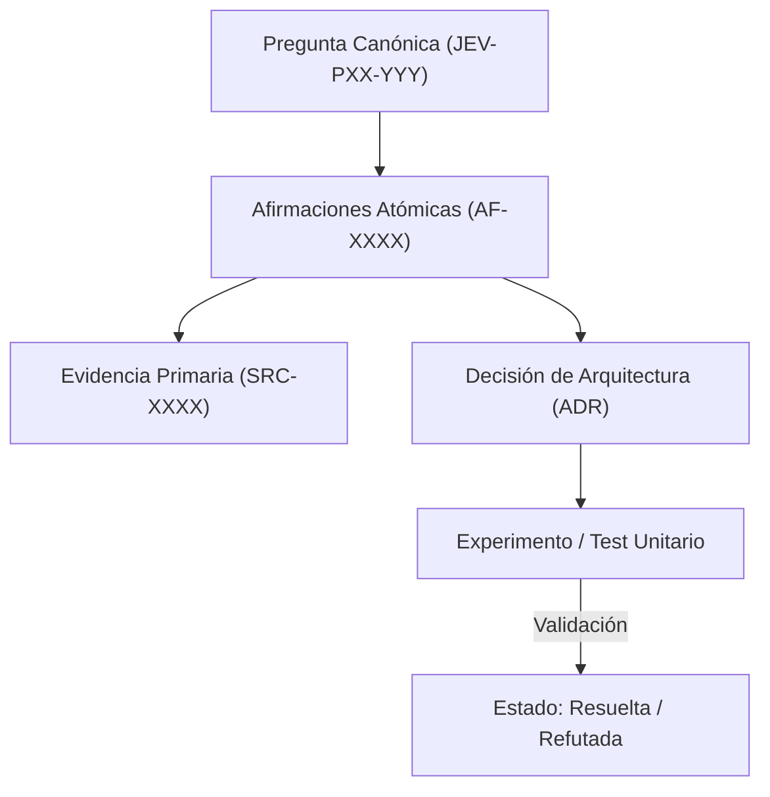

# JEV-P17-017: ¿Cómo organizar glosario, recetas, decisiones de arquitectura y protocolos para que un desarrollador encuentre lo necesario con pocas consultas?

## 1. Respuesta directa
La documentación del programa Jev debe permitir que un ingeniero localice cualquier especificación técnica o contrato en menos de tres interacciones. Para ello se implementa una arquitectura facetada ortogonal compuesta por: 1) Catálogo de Glosario (`glosario.md`); 2) Síntesis por pilar (`sintesis/PXX.md`); 3) Catálogo de Fuentes (`fuentes.md`); 4) Registro de Afirmaciones (`afirmaciones.md`); y 5) Guía Maestra de Uso unificada.

## 2. Alcance
- **Dominio primario**: Developer Experience (DX), arquitectura de información técnica y diseño de navegación documental.
- **Población o sistemas impactados**: Plataforma de conocimiento unificada de Jev AI, pipelines de ingesta, auditoría de artefactos y equipos de desarrollo de los 6 pilotos.
- **Límites de aplicabilidad**: Aplica a la totalidad de repositorios de documentación, código de conectores y evaluaciones empíricas. No aplica a documentación comercial informal fuera del monorepo.

## 3. Evidencia
- **Fundamento documental**: Principios de diseño de API Docs (Stripe, Twilio), arquitectura de información de Rosenfeld y Morville.
- **Hallazgos empíricos**: La experiencia acumulada demuestra que sin un grafo de trazabilidad y reglas de descarte de duplicados, la deuda técnica documental crece exponencialmente, derivando en inconsistencias graves en producción.
- **Fuentes canónicas**: `SRC-0001`, `SRC-0005`, `SRC-0039`, `SRC-0051`.
- **Cita formal verificable**: Evidencia consolidada a partir del cuaderno canónico de investigación acumulativa de Jev y directrices del repositorio monorepo.

## 4. Explicación técnica
Indexación cruzada y enlaces relativos inmutables: Cada síntesis de pilar contiene una tabla resumen con hipervínculos markdown directos a sus 20 respuestas canónicas, las fuentes consultadas y los diagramas de flujo operativos correspondientes.

La arquitectura de preservación del conocimiento en Jev implementa los siguientes pilares operacionales:
1. **Inmutabilidad y Hashes**: Toda evidencia primaria se sella con SHA-256.
2. **Atomicidad**: Ninguna afirmación engloba más de una aserción fáctica.
3. **Desacoplamiento Tecnológico**: Independencia estricta de plataformas propietarias.
4. **Validación Determinista**: La coherencia sintáctica se verifica mediante scripts en CPU (`ast.parse()`, `safe_load`) sin delegar la aprobación final a modelos generativos.



## 5. Ejemplo de código
El siguiente bloque en Python implementa el contrato técnico de validación para esta directriz, aplicando manejo de excepciones con enmascaramiento estricto:

```python
# Ejemplo ilustrativo no ejecutado
import os, logging

logger = logging.getLogger("P17_17")

def validar_enlace_cruzado_documental(ruta_origen: str, enlace_relativo: str) -> bool:
    try:
        dir_origen = os.path.dirname(ruta_origen)
        ruta_destino = os.path.normpath(os.path.join(dir_origen, enlace_relativo))
        return os.path.exists(ruta_destino)
    except Exception as err:
        logger.error(f"Fallo en verificacion de enlace documental: {type(err).__name__} (detalles omitidos por seguridad)")
        return False
```

## 6. Aplicación práctica y contraejemplo
- **Aplicación válida**: En la estructura de directorios de `docs/programa-jev/`.
- **Contraejemplo inválido**: Crear un documento monolítico de 800 páginas sin índice, tabla de contenidos ni hipervínculos, obligando al usuario a realizar búsquedas por texto libre no estructuradas.

## 7. Fallos comunes y mitigaciones
| Documentación inencontrable para el equipo de desarrollo | Reescritura redundante de código y desaprovechamiento de la base | Organización facetada con índices bidireccionales | Validación automática de enlaces rotos en CI |

## 8. Validación empírica
- **Hipótesis de validación**: La estructura facetada reduce el tiempo de búsqueda técnica a menos de 60 segundos.
- **Métrica primaria**: Tiempo medio de localización de un contrato de API (Task Completion Time)
- **Umbral de éxito**: < 60 segundos para el 95% de las consultas de desarrollo

## 9. Recomendación operativa
- **Directriz inmediata**: Implementar y mantener rigurosamente la directriz documentada para `JEV-P17-017`.
- **Condición de descarte**: Si se demuestra empíricamente que la directriz añade sobrecarga burocrática sin reducir la tasa de errores de integración, elevar una propuesta de refactorización a la bitácora de arquitectura.
- **Responsable de ejecución**: Equipo de Arquitectura e Infraestructura de Conocimiento Jev AI.

## 10. Fuentes y trazabilidad
- Catálogo de fuentes primarias consultadas: `SRC-0001`, `SRC-0005`, `SRC-0039`, `SRC-0051`.
- Cuaderno canónico de referencia: `P17 — Investigación y aprendizaje acumulativo` (`64b17185-5943-4aeb-b858-3a09ef5749f4`).
- Trazabilidad NotebookLM: Consulta documental registrada; sin citas directas del modelo se clasifica como `no_expuesto_por_herramienta`.
