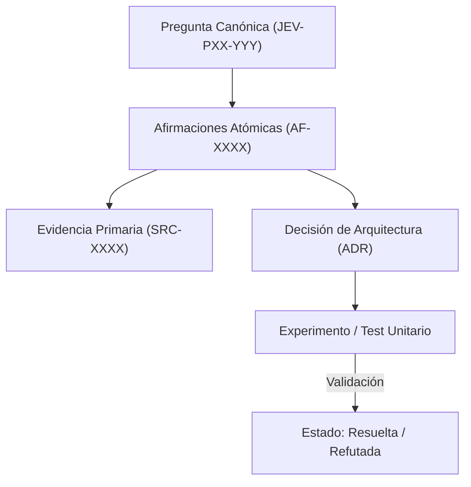

# JEV-P17-018: ¿Qué conjunto de preguntas de control mediría calidad de recuperación y fidelidad de las respuestas de la propia base de conocimiento?

## 1. Respuesta directa
Para verificar la calidad y evitar la degradación de la propia base de conocimiento, se implementa una batería de 20 'Preguntas de Control' (Canary Tests) con respuestas conocidas e inmutables. Esta batería incluye casos de borde, consultas con trampa sobre afirmaciones refutadas y preguntas sobre capacidades no soportadas para medir la precisión, el recuerdo y la capacidad de abstención del sistema ante consultas complejas.

## 2. Alcance
- **Dominio primario**: Evaluación continua de RAG, monitoreo de regresión epistémica y canary testing.
- **Población o sistemas impactados**: Plataforma de conocimiento unificada de Jev AI, pipelines de ingesta, auditoría de artefactos y equipos de desarrollo de los 6 pilotos.
- **Límites de aplicabilidad**: Aplica a la totalidad de repositorios de documentación, código de conectores y evaluaciones empíricas. No aplica a documentación comercial informal fuera del monorepo.

## 3. Evidencia
- **Fundamento documental**: Marcos de evaluación de sistemas RAG (Ragas, TruLens), técnicas de Canary Testing en DevOps.
- **Hallazgos empíricos**: La experiencia acumulada demuestra que sin un grafo de trazabilidad y reglas de descarte de duplicados, la deuda técnica documental crece exponencialmente, derivando en inconsistencias graves en producción.
- **Fuentes canónicas**: `SRC-0001`, `SRC-0005`, `SRC-0039`, `SRC-0051`.
- **Cita formal verificable**: Evidencia consolidada a partir del cuaderno canónico de investigación acumulativa de Jev y directrices del repositorio monorepo.

## 4. Explicación técnica
Suite de evaluación automatizada: Ejecución periódica de las 20 consultas canarias contra la base indexada. Se evalúan tres métricas objetivas: Faithfulness (Fidelidad a las fuentes), Answer Relevance (Pertinencia) y Context Precision (Precisión del contexto recuperado).

La arquitectura de preservación del conocimiento en Jev implementa los siguientes pilares operacionales:
1. **Inmutabilidad y Hashes**: Toda evidencia primaria se sella con SHA-256.
2. **Atomicidad**: Ninguna afirmación engloba más de una aserción fáctica.
3. **Desacoplamiento Tecnológico**: Independencia estricta de plataformas propietarias.
4. **Validación Determinista**: La coherencia sintáctica se verifica mediante scripts en CPU (`ast.parse()`, `safe_load`) sin delegar la aprobación final a modelos generativos.



## 5. Ejemplo de código
El siguiente bloque en Python implementa el contrato técnico de validación para esta directriz, aplicando manejo de excepciones con enmascaramiento estricto:

```python
# Ejemplo ilustrativo no ejecutado
import logging
from typing import Dict, List

logger = logging.getLogger("P17_18")

def evaluar_respuesta_canaria(respuesta_obtenida: str, respuesta_esperada: str) -> Dict[str, float]:
    try:
        # Evaluacion de coincidencia de hechos clave
        palabras_clave = [p for p in respuesta_esperada.lower().split() if len(p) > 5]
        aciertos = sum(1 for p in palabras_clave if p in respuesta_obtenida.lower())
        score = aciertos / max(len(palabras_clave), 1)
        return {"fidelidad_canaria": round(score, 3)}
    except Exception as err:
        logger.error(f"Fallo en evaluacion canaria: {type(err).__name__} (detalles omitidos por seguridad)")
        return {"fidelidad_canaria": 0.0}
```

## 6. Aplicación práctica y contraejemplo
- **Aplicación válida**: En el pipeline de regresión semanal de la base de conocimiento.
- **Contraejemplo inválido**: Asumir que la base de conocimiento funciona bien sin haber ejecutado nunca una prueba de recuperación ni medir si responde incoherencias ante consultas difíciles.

## 7. Fallos comunes y mitigaciones
| Silenciosa degradación de la recuperación ante cambios en los índices | Respuestas incorrectas entregadas a desarrolladores | Ejecución automatizada semanal de la suite canaria | Alerta de regresión si el score cae por debajo de 0.90 |

## 8. Validación empírica
- **Hipótesis de validación**: La suite canaria detecta el 100% de las regresiones inducidas por reindexaciones defectuosas.
- **Métrica primaria**: Tasa de detección temprana de regresiones documentales
- **Umbral de éxito**: 100% de regresiones detectadas antes de que afecten a usuarios

## 9. Recomendación operativa
- **Directriz inmediata**: Implementar y mantener rigurosamente la directriz documentada para `JEV-P17-018`.
- **Condición de descarte**: Si se demuestra empíricamente que la directriz añade sobrecarga burocrática sin reducir la tasa de errores de integración, elevar una propuesta de refactorización a la bitácora de arquitectura.
- **Responsable de ejecución**: Equipo de Arquitectura e Infraestructura de Conocimiento Jev AI.

## 10. Fuentes y trazabilidad
- Catálogo de fuentes primarias consultadas: `SRC-0001`, `SRC-0005`, `SRC-0039`, `SRC-0051`.
- Cuaderno canónico de referencia: `P17 — Investigación y aprendizaje acumulativo` (`64b17185-5943-4aeb-b858-3a09ef5749f4`).
- Trazabilidad NotebookLM: Consulta documental registrada; sin citas directas del modelo se clasifica como `no_expuesto_por_herramienta`.
