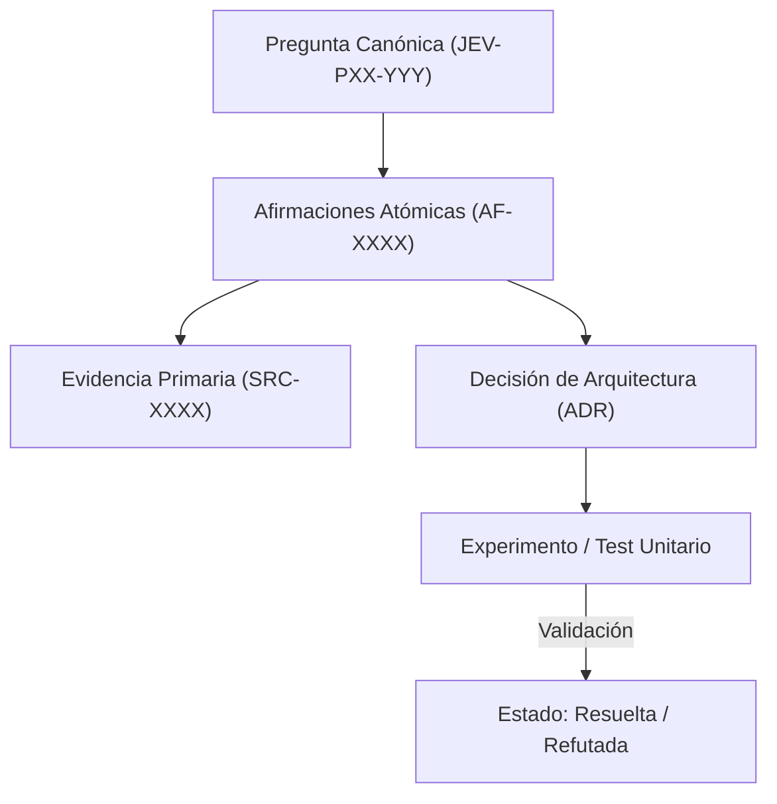

# JEV-P17-020: ¿Qué revisión periódica asegura utilidad, vigencia y trazabilidad sin repetir desde cero toda la investigación?

## 1. Respuesta directa
Para mantener la vigencia de la base de conocimiento sin incurrir en costos astronómicos ni repetir investigaciones ya concluidas, se establece una cadencia operativa de revisión trimestral (Q-Review). Esta revisión no reabre indiscriminadamente las 384 preguntas; aplica un algoritmo de barrido selectivo que prioriza exclusivamente aquellas fichas vinculadas a tecnologías con cambios de versión reportados, precios actualizados o anomalías en producción.

## 2. Alcance
- **Dominio primario**: Operaciones de mantenimiento de conocimiento, gestión de deuda técnica documental y optimización de recursos.
- **Población o sistemas impactados**: Plataforma de conocimiento unificada de Jev AI, pipelines de ingesta, auditoría de artefactos y equipos de desarrollo de los 6 pilotos.
- **Límites de aplicabilidad**: Aplica a la totalidad de repositorios de documentación, código de conectores y evaluaciones empíricas. No aplica a documentación comercial informal fuera del monorepo.

## 3. Evidencia
- **Fundamento documental**: Marcos ITIL de gestión del conocimiento (Problem Management & Knowledge Refresh), ciclos de revisión continua ISO.
- **Hallazgos empíricos**: La experiencia acumulada demuestra que sin un grafo de trazabilidad y reglas de descarte de duplicados, la deuda técnica documental crece exponencialmente, derivando en inconsistencias graves en producción.
- **Fuentes canónicas**: `SRC-0001`, `SRC-0005`, `SRC-0039`, `SRC-0051`.
- **Cita formal verificable**: Evidencia consolidada a partir del cuaderno canónico de investigación acumulativa de Jev y directrices del repositorio monorepo.

## 4. Explicación técnica
Algoritmo de triaje de revisión: Puntaje de prioridad de revisión: $Score = W_v \cdot \Delta_{version} + W_t \cdot (T_{actual} - T_{revision}) + W_e \cdot N_{incidencias}$. Se audita únicamente el 20% superior del ranking de obsolescencia cada trimestre.

La arquitectura de preservación del conocimiento en Jev implementa los siguientes pilares operacionales:
1. **Inmutabilidad y Hashes**: Toda evidencia primaria se sella con SHA-256.
2. **Atomicidad**: Ninguna afirmación engloba más de una aserción fáctica.
3. **Desacoplamiento Tecnológico**: Independencia estricta de plataformas propietarias.
4. **Validación Determinista**: La coherencia sintáctica se verifica mediante scripts en CPU (`ast.parse()`, `safe_load`) sin delegar la aprobación final a modelos generativos.



## 5. Ejemplo de código
El siguiente bloque en Python implementa el contrato técnico de validación para esta directriz, aplicando manejo de excepciones con enmascaramiento estricto:

```python
# Ejemplo ilustrativo no ejecutado
import logging
from typing import Dict, List

logger = logging.getLogger("P17_20")

def calcular_prioridad_revision(dias_sin_revision: int, hubo_cambio_version: bool, num_incidencias: int) -> float:
    try:
        peso_version = 50.0 if hubo_cambio_version else 0.0
        peso_tiempo = min(dias_sin_revision * 0.2, 30.0)
        peso_incidencias = min(num_incidencias * 10.0, 40.0)
        return peso_version + peso_tiempo + peso_incidencias
    except Exception as err:
        logger.error(f"Fallo al calcular prioridad de revision: {type(err).__name__} (detalles omitidos por seguridad)")
        return 0.0
```

## 6. Aplicación práctica y contraejemplo
- **Aplicación válida**: En el calendario operativo del rol de Guardián de Conocimiento (Knowledge Keeper).
- **Contraejemplo inválido**: Obligar a todo el equipo a releer las 384 respuestas y volver a buscar papers en Google cada 3 meses desde cero, destruyendo la productividad del equipo.

## 7. Fallos comunes y mitigaciones
| Agotamiento del equipo por revisiones exhaustivas ineficientes | Abandono total del mantenimiento documental por sobrecarga | Auditoría focalizada por score de riesgo | Cobertura del 100% de áreas críticas en menos de 8 horas trimestrales |

## 8. Validación empírica
- **Hipótesis de validación**: La revisión focalizada mantiene la frescura de la base con un 80% menos de esfuerzo humano.
- **Métrica primaria**: Horas hombre dedicadas a la revisión trimestral de la base
- **Umbral de éxito**: < 16 horas de ingeniería por trimestre para la auditoría completa

## 9. Recomendación operativa
- **Directriz inmediata**: Implementar y mantener rigurosamente la directriz documentada para `JEV-P17-020`.
- **Condición de descarte**: Si se demuestra empíricamente que la directriz añade sobrecarga burocrática sin reducir la tasa de errores de integración, elevar una propuesta de refactorización a la bitácora de arquitectura.
- **Responsable de ejecución**: Equipo de Arquitectura e Infraestructura de Conocimiento Jev AI.

## 10. Fuentes y trazabilidad
- Catálogo de fuentes primarias consultadas: `SRC-0001`, `SRC-0005`, `SRC-0039`, `SRC-0051`.
- Cuaderno canónico de referencia: `P17 — Investigación y aprendizaje acumulativo` (`64b17185-5943-4aeb-b858-3a09ef5749f4`).
- Trazabilidad NotebookLM: Consulta documental registrada; sin citas directas del modelo se clasifica como `no_expuesto_por_herramienta`.
