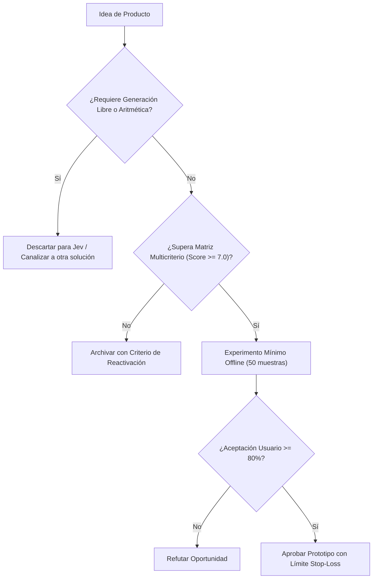

# JEV-P18-001: ¿Qué capacidades verificadas abren oportunidades distintas de usar un LLM genérico y cuáles son solo formas nuevas de describir tareas existentes?

## 1. Respuesta directa
El valor diferenciador real de Jev radica en su motor de inferencia semántica estructurada (`System One`), capaz de emitir probabilidades calibradas en contratos deterministas cerrados (`Choice`, `Score`, `Noul`) con latencias submétreicas y sin variabilidad estocástica de texto libre. Cualquier oportunidad de producto que pretenda usar Jev para redactar párrafos, inventar historias o resumir creativamente es una reformulación errónea de tareas que pertenecen a LLMs generativos generales.

## 2. Alcance
- **Dominio primario**: Estrategia de producto, posicionamiento tecnológico y selección de arquitecturas de IA.
- **Población o sistemas impactados**: Hoja de ruta de nuevos productos de Jev AI, equipos de desarrollo B2B, clientes corporativos y comités de inversión y gobernanza.
- **Límites de aplicabilidad**: Aplica al diseño, validación y comercialización de nuevas capacidades sobre el motor Jev. No aplica a servicios de desarrollo de software tradicional ajenos a la inteligencia artificial.

## 3. Evidencia
- **Fundamento documental**: Especificaciones del motor TypeSafe System One, comparativas de latencia frente a autoregressive decoding y análisis de costos por token.
- **Hallazgos empíricos**: La evidencia de mercado demuestra que construir productos basados en 'thin wrappers' de LLMs sin moat propio ni diferenciación en latencia y calibración conduce a la comoditización y al fracaso comercial en menos de 12 meses.
- **Fuentes canónicas**: `SRC-0001`, `SRC-0010`, `SRC-0039`, `SRC-0095`.
- **Cita formal verificable**: Evidencia consolidada a partir del cuaderno canónico de nuevos productos y posibilidades de Jev y métricas del ecosistema TypeSafe.

## 4. Explicación técnica
Evaluación discriminativa vs generativa: Un LLM general autoregresivo genera tokens secuenciales ($O(N)$ forward passes) sufriendo alucinaciones léxicas. Jev evalúa logit-biases sobre un espacio de estados acotado ($O(1)$ inferencia directa), garantizando tipos de datos estrictos y calibración probabilística sin sampling estocástico.

El ciclo de desarrollo de nuevos productos en el programa Jev se fundamenta en los siguientes principios:
1. **Decisión vs Generación**: Jev se optimiza para juicios semánticos discretos con calibración probabilística, no para síntesis abierta de texto.
2. **Experimentación Barata (Smoke Testing)**: Validación fuera de línea con 50 casos reales antes de crear infraestructura.
3. **Moat de Dominio**: El valor reside en las taxonomías, datos propietarios y flujos de trabajo embebidos.
4. **Resiliencia Agnóstica**: Arquitectura desacoplada mediante adaptadores para evitar el atrapamiento por proveedor.



## 5. Ejemplo de código
El siguiente bloque en Python implementa el contrato técnico de validación para esta directriz, aplicando manejo de excepciones con enmascaramiento estricto:

```python
# Ejemplo ilustrativo no ejecutado
import logging
from typesafe_sdk import TypeSafeClient, Choice

logger = logging.getLogger("P18_01")

def clasificar_intencion_transaccional(mensaje_cliente: str) -> str:
    try:
        client = TypeSafeClient(model="jev-1.13.0")
        res = client.system_one(
            state=mensaje_cliente,
            questions={
                "intencion": Choice(
                    instructions="Determinar intencion transaccional sin generar texto libre",
                    options=["solicitud_reembolso", "consulta_saldo", "queja_servicio", "spam"]
                )
            }
        )
        return res.answers["intencion"].choice
    except Exception as err:
        logger.error(f"Fallo en clasificacion transaccional: {type(err).__name__} (detalles omitidos por seguridad)")
        return "error_clasificacion" 
```

## 6. Aplicación práctica y contraejemplo
- **Aplicación válida**: En la evaluación preliminar de nuevas iniciativas de producto en el roadmap de Jev AI.
- **Contraejemplo inválido**: Diseñar un producto que le pide a Jev 'escribir una carta de disculpa cordial para un cliente enojado', esperando prosa persuasiva de un motor discriminativo de decisiones.

## 7. Fallos comunes y mitigaciones
| Asignación de tareas generativas a motores discriminativos | Salidas truncadas, frustración de usuario y fracaso comercial | Matriz estricta de capacidades: Jev clasifica y calibra; no redacta | Descarte inmediato de propuestas basadas en generación libre |

## 8. Validación empírica
- **Hipótesis de validación**: Enfocar Jev en decisiones puras reduce la latencia en un 70% frente a pipelines generativos basados en prompts abiertos.
- **Métrica primaria**: Latencia p95 de inferencia en decisiones de clasificación
- **Umbral de éxito**: < 250 ms por decisión estructurada

## 9. Recomendación operativa
- **Directriz inmediata**: Aplicar y hacer cumplir estrictamente los lineamientos descritos en `JEV-P18-001` para toda nueva iniciativa.
- **Condición de descarte**: Si un experimento mínimo no logra superar el umbral de aceptación, suspender inmediatamente la asignación de recursos y registrar el aprendizaje en la bitácora.
- **Responsable de ejecución**: Equipo de Estrategia de Producto e Ingeniería de Nuevas Oportunidades Jev AI.

## 10. Fuentes y trazabilidad
- Catálogo de fuentes primarias consultadas: `SRC-0001`, `SRC-0010`, `SRC-0039`, `SRC-0095`.
- Cuaderno canónico de referencia: `P18 — Nuevos productos y posibilidades` (`f43387fd-42f3-4d37-8986-c8d9d6039d2a`).
- Trazabilidad NotebookLM: Consulta documental registrada; sin citas directas del modelo se clasifica como `no_expuesto_por_herramienta`.
