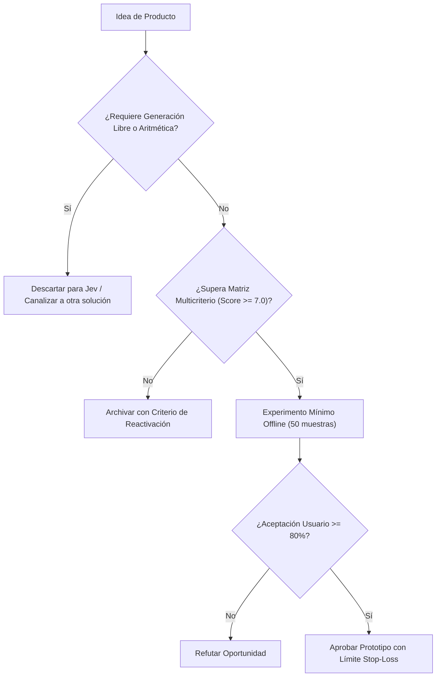

# JEV-P18-002: ¿Qué problemas frecuentes, medibles y acotados podrían beneficiarse de decisiones semánticas rápidas sin exigir generación de contenido?

## 1. Respuesta directa
Las oportunidades de mayor retorno para Jev son problemas frecuentes, acotados y de alta transaccionalidad donde la salida requerida es una decisión discreta o una probabilidad calibrada: 1) Triaje automatizado de incidentes operacionales; 2) Detección de fugas de datos sensibles (PII) en tiempo real en APIs; 3) Verificación de cumplimiento normativo en minutas legales; y 4) Filtrado previo de spam semántico de soporte técnico.

## 2. Alcance
- **Dominio primario**: Diseño de productos B2B de infraestructura, microservicios de seguridad y optimización de flujos de trabajo.
- **Población o sistemas impactados**: Hoja de ruta de nuevos productos de Jev AI, equipos de desarrollo B2B, clientes corporativos y comités de inversión y gobernanza.
- **Límites de aplicabilidad**: Aplica al diseño, validación y comercialización de nuevas capacidades sobre el motor Jev. No aplica a servicios de desarrollo de software tradicional ajenos a la inteligencia artificial.

## 3. Evidencia
- **Fundamento documental**: Métricas operacionales de centros de operaciones de red (NOC), auditorías de seguridad en pasarelas de pago y acuerdos de nivel de servicio (SLA).
- **Hallazgos empíricos**: La evidencia de mercado demuestra que construir productos basados en 'thin wrappers' de LLMs sin moat propio ni diferenciación en latencia y calibración conduce a la comoditización y al fracaso comercial en menos de 12 meses.
- **Fuentes canónicas**: `SRC-0001`, `SRC-0010`, `SRC-0046`, `SRC-0095`.
- **Cita formal verificable**: Evidencia consolidada a partir del cuaderno canónico de nuevos productos y posibilidades de Jev y métricas del ecosistema TypeSafe.

## 4. Explicación técnica
Arquitectura de microservicio 'Zero-Generation': Flujo de datos: Entrada JSON -> Sanitización determinista -> Invocación a `client.system_one` con preguntas tipo `Choice` -> Enrutamiento condicional downstream basado en el valor booleano o enum obtenido.

El ciclo de desarrollo de nuevos productos en el programa Jev se fundamenta en los siguientes principios:
1. **Decisión vs Generación**: Jev se optimiza para juicios semánticos discretos con calibración probabilística, no para síntesis abierta de texto.
2. **Experimentación Barata (Smoke Testing)**: Validación fuera de línea con 50 casos reales antes de crear infraestructura.
3. **Moat de Dominio**: El valor reside en las taxonomías, datos propietarios y flujos de trabajo embebidos.
4. **Resiliencia Agnóstica**: Arquitectura desacoplada mediante adaptadores para evitar el atrapamiento por proveedor.



## 5. Ejemplo de código
El siguiente bloque en Python implementa el contrato técnico de validación para esta directriz, aplicando manejo de excepciones con enmascaramiento estricto:

```python
# Ejemplo ilustrativo no ejecutado
import logging
from typesafe_sdk import TypeSafeClient, Choice

logger = logging.getLogger("P18_02")

def triaje_rapido_incidente(log_error: str) -> dict:
    try:
        client = TypeSafeClient(model="jev-1.13.0")
        res = client.system_one(
            state=log_error,
            questions={
                "severidad": Choice(
                    instructions="Evaluar criticidad para estabilidad operativa",
                    options=["critico_bloqueante", "degradacion_menor", "informativo_ignorable"]
                )
            }
        )
        return {"severidad": res.answers["severidad"].choice}
    except Exception as err:
        logger.error(f"Fallo en triaje de incidente: {type(err).__name__} (detalles omitidos por seguridad)")
        return {"severidad": "critico_bloqueante"} # Fail-safe defensivo
```

## 6. Aplicación práctica y contraejemplo
- **Aplicación válida**: En el conector de triaje de alertas de infraestructura para DevOps.
- **Contraejemplo inválido**: Construir un bot de soporte que conversa libremente durante 20 minutos con el cliente antes de decidir si reenviar el ticket al equipo técnico.

## 7. Fallos comunes y mitigaciones
| Sobrecarga de flujos de trabajo con chats conversacionales innecesarios | Aumento de latencia y fricción para el usuario final | Sustitución de chats por clasificadores semánticos instantáneos | Monitoreo de tiempo de resolución de tickets |

## 8. Validación empírica
- **Hipótesis de validación**: El triaje semántico directo reduce el tiempo de primera respuesta a incidentes en un 80%.
- **Métrica primaria**: Tiempo medio hasta la asignación de incidente (Mean Time to Route)
- **Umbral de éxito**: < 2 segundos desde la ingesta del log hasta el alertamiento

## 9. Recomendación operativa
- **Directriz inmediata**: Aplicar y hacer cumplir estrictamente los lineamientos descritos en `JEV-P18-002` para toda nueva iniciativa.
- **Condición de descarte**: Si un experimento mínimo no logra superar el umbral de aceptación, suspender inmediatamente la asignación de recursos y registrar el aprendizaje en la bitácora.
- **Responsable de ejecución**: Equipo de Estrategia de Producto e Ingeniería de Nuevas Oportunidades Jev AI.

## 10. Fuentes y trazabilidad
- Catálogo de fuentes primarias consultadas: `SRC-0001`, `SRC-0010`, `SRC-0046`, `SRC-0095`.
- Cuaderno canónico de referencia: `P18 — Nuevos productos y posibilidades` (`f43387fd-42f3-4d37-8986-c8d9d6039d2a`).
- Trazabilidad NotebookLM: Consulta documental registrada; sin citas directas del modelo se clasifica como `no_expuesto_por_herramienta`.
